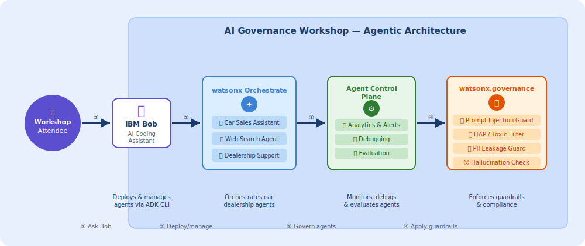
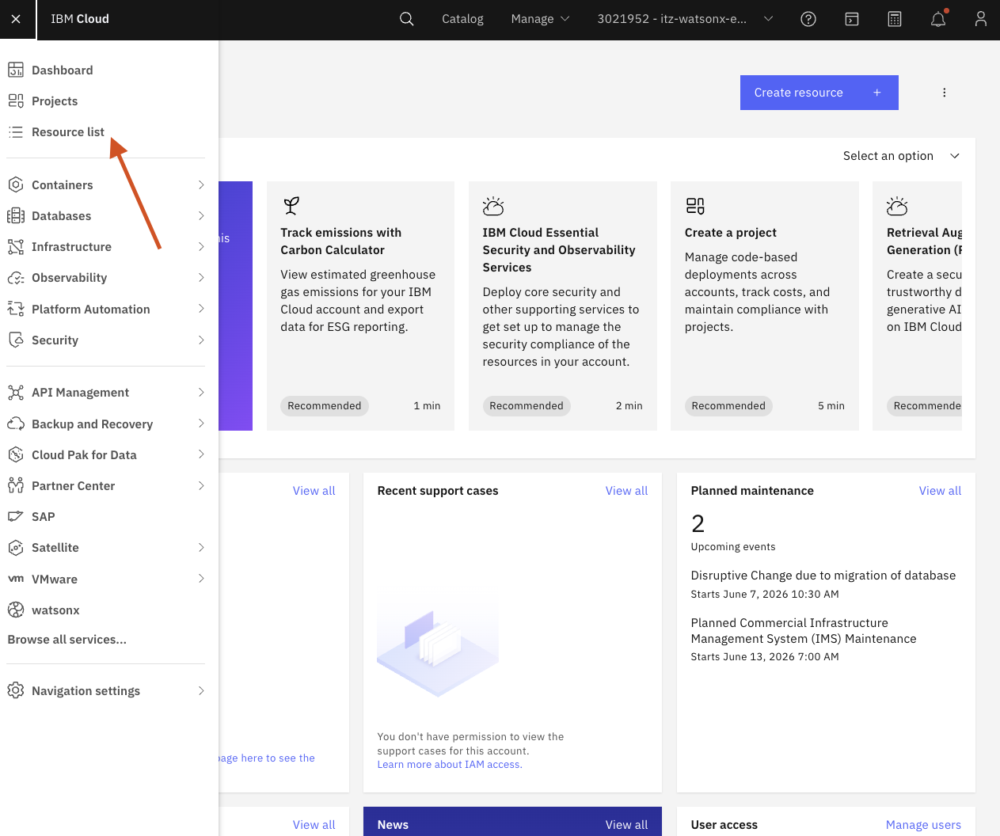
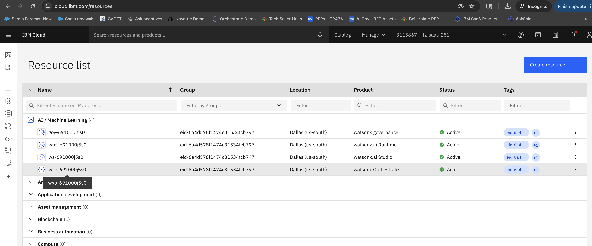
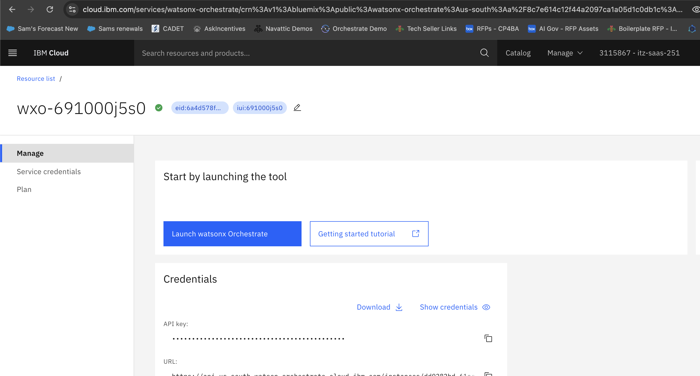
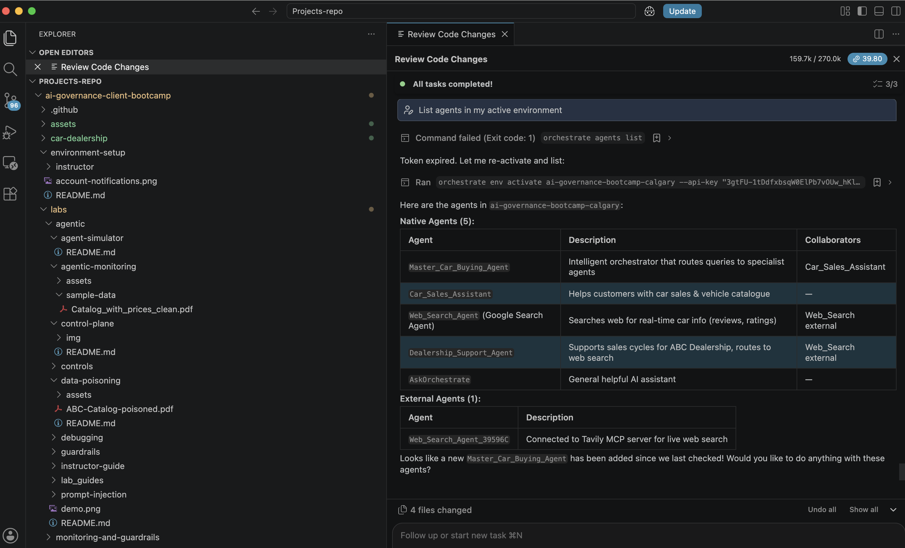

# AI Governance Track


## 🤖 Bob — Your AI Coding Assistant for Lab Tasks


[IBM Bob](https://bob.ibm.com) is available throughout this bootcamp to help you move faster through the hands-on labs. Below are examples of how Bob can assist with each lab.

### 🏛️ Architecture Overview



> **Flow:** The attendee asks **Bob** to deploy and manage agents → **watsonx Orchestrate** orchestrates the car dealership agents → the **Agent Control Plane** monitors, debugs, and evaluates → **watsonx.governance** enforces guardrails (prompt injection, HAP, PII, hallucination checks).

> [!TIP]
> Open this repo in Bob and ask questions or request code changes directly in context. Bob can read your files, run terminal commands, and interact with the watsonx Orchestrate ADK — all from your editor.

### 🛠️ Environment Setup
Bob can help you configure your local environment, including:
- Cloning and organizing repos
- Creating and activating watsonx Orchestrate environments via `orchestrate env add`
- Connecting the **watsonx Orchestrate MCP server** so Bob can interact with your WXO instance directly

For example, ask Bob to clone this repo:
```
Clone the repo https://github.ibm.com/samg-ibm/ai-governance-client-bootcamp
```


You can also ask Bob to connect the **watsonx Orchestrate MCP server** so it can interact with your WXO instance directly:


> Type your prompt in the **input box at the bottom right** of the Bob panel (highlighted with the red arrow above).

---

#### 🔧 Create a new watsonx Orchestrate environment
Use this when you've provisioned a new WXO instance and want to register it locally with the ADK CLI so you can deploy agents to it.

**Step 1:** Log in to [cloud.ibm.com](https://cloud.ibm.com) and click **Resource list** in the left navigation menu.



Expand **AI / Machine Learning** and click on your **watsonx Orchestrate** instance.



**Step 2:** On the instance page, scroll down to **Credentials** to find your **URL** and **API key**.



**Step 3:** Ask Bob to create the environment using the URL you copied:
```
Create a new orchestrate env called my-bootcamp pointing to https://api.us-south.watson-orchestrate.cloud.ibm.com/instances/<your-instance-id>
```


> Bob will run `orchestrate env add --name my-bootcamp --url <url>` and prompt you for your API key to activate it.

---

#### 📋 List agents in your active environment
Use this to see all agents (native, external, and assistant) currently deployed in your active WXO environment.
```
List agents in my active environment
```
> Bob will run `orchestrate agents list` and display a table of all agents with their names, descriptions, LLMs, and IDs.

> [!NOTE]
> **First time?** If you haven't built any agents yet, the table will come back empty — that's expected! Work through the labs to create and deploy agents, then run this prompt again to see them listed here.



---
### ⛑️ Hands-on Labs ([`labs/agentic/`](labs/agentic/README.md))

Bob can help with all 8 lab steps in the car dealership agentic governance scenario:

| Step | Bob can help you… |
|------|-------------------|
| **Data Poisoning** | Write and validate agent guidelines that block malicious catalog injections |
| **Importing External Agents** | Debug A2A agent connection configs and YAML definitions |
| **PII Leakage Controls** | Scaffold PII guardrail scripts in Python |
| **Debugging** | Trace tool/agent failures, read error logs, and suggest fixes |
| **Automatic Evaluation** | Generate evaluation test cases and interpret eval results |
| **Real-time Monitoring** | Explain dashboard metrics and alert thresholds |
| **Dashboard & Agent Analytics** | Query agent analytics via the ADK CLI |
| **Custom Guardrails** | Write, test, and deploy custom Python guardrail scripts |

