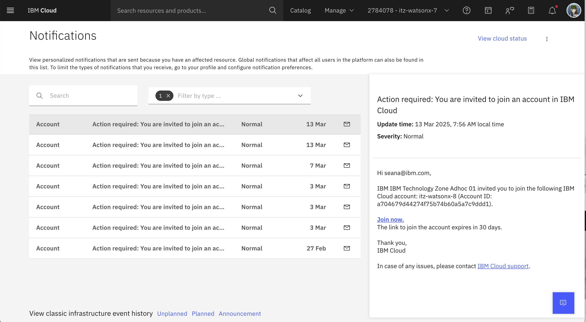

# 🚀 Instructor's Guide: Customize your Own Bootcamp!

## 🤖 What is the AI Governance Bootcamp?

The **AI Governance Bootcamp** is a hands-on, modular learning experience designed by **IBM Client Engineering** for Clients and Business Partners. The goal is for the Client or Business Partner team to learn and implement AI Governance capabilities to deploy AI systems with trust and compliance.

### 🚀 Customize it!
🔨 **Build your own bootcamp** curriculum: pick your learning materials, hands-on labs, demos, and other resources, and tailor the bootcamp to your Client or Business Partner, depending on their interests and skill levels.

> [!IMPORTANT]
> This repo contains instructions and materials to help you **customize** and run your own AI Governance bootcamp for clients. However, you're welcome to bring your own resources as well!
> Since each client has different skill levels, expectations, and interests, it's essential to tailor the material to their needs before the bootcamp.

## 🎯 What's the goal?
🚀 Show the value of AI Governance technology quickly with lower commitment from the client.

🚀 Get clients excited with a tangible outcome and learning experience, generate a pilot, or progress a deal.

🚀 **Audience:** Clients or Business Partners interested in AI Governance.

🚀 **Run by:** AI Engineers, BTLs, Designers from CE, Brand Technical Specialists, CSMs (as applicable), and more!

## 🚗💨 Get started in 5 steps!

## 📚 0. Go to the instructor's enablement
Review [these materials](https://ibm.box.com/s/godlfj0rrfyrgkoav88o99hp1atzvgrq)

## 📚 1. Client facing presentations
Study the [client facing presentations](https://ibm.box.com/s/iizjxnzjhysduut51si2v3e3nju6q2uy). You can pick and choose the topics that resonate the most to the client depending on their maturity and interests.

## 🎬 2. Run the demos
You're welcome to include [live demos](https://ibm.box.com/s/0hbl3a71f8b1mmxw1ipl51ugyoa4110q) of the product in your bootcamp.

## 🌍 3. Set up your environment

Set up your environment with [these instructions](#-environment-setup).

## 🧪 4. Run the labs

> [!IMPORTANT]
> Make sure you have completed **Step 3** before running the labs.

Once you have set up your environment, run the [client-facing hands-on use case labs](../labs).

## 🎨 5. Study the murals

[Mural templates](https://ibm.box.com/s/76ip0j3pqtr7bg23nq0uqcp283kxo7a4) have been built specifically for AI Governance. They might be used in two scenarios:

⚙️ Pitch the bootcamp to your client using the external facing [one pager](https://ibm.box.com/s/5qlswdg1ydevgrbya1q93wexcail4g32).

## ‼️ Important Pre-requisites

⚙️ Review the latest [bootcamp planning and environment provisioning recommendations](https://ibm.box.com/s/s38n58bu1wi6o28bs8b3gi15m83q7fai)

⚙️ Make sure to register your bootcamp so that we have adequate SME, SRE, Product, and TechZone support:

- [Create an ISC Project](https://ibm.seismic.com/Link/Content/DCG3CHFBgFJM68Q2HG9cqgD7ThH8) for your Agentic AI Bootcamp and tag it as a "Hackathon".

---

# 🌎 Environment setup

## Instructor Setup

Instructors can [follow these steps](./instructor/README.md) to reserve and configure the environment to run an AI Governance bootcamp.  Once this is done, you can inform the attendees to follow the client setup steps below...

## Client Setup
   
 1. Before your bootcamp, your instructor will set up an IBM Cloud environment with all the tools yo will need. Then, they will invite you to such environment.
    You'll receive an email from IBM Cloud (no-reply@cloud.ibm.com) inviting you to join the corresponding account. Look for the link **Join Now** in the email,
    (highlighted in the screenshot below.) 
      
   
     

**Option:** If you miss the email or don't receive it for any reason! 

You can find the invitation on your IBM Cloud account:
[https://cloud.ibm.com/notifications?type=account](https://cloud.ibm.com/notifications?type=account)

Please select the **Join Now** link. 

   
2. Proceed to watsonx by going to [this link](https://dataplatform.cloud.ibm.com/wx/home?context=wx)
3. Make sure you select the right IBM Cloud account if you have multiple ones. Check with your instructor to make sure you have the correct account 

5. Create a project using your name for the labs.  For example, ***Jane Doe Governance***.  This will allow students to have their own projects to experiment in. 

6. You are now ready to [begin your labs](../labs/monitoring-and-guardrails/README.md)!
