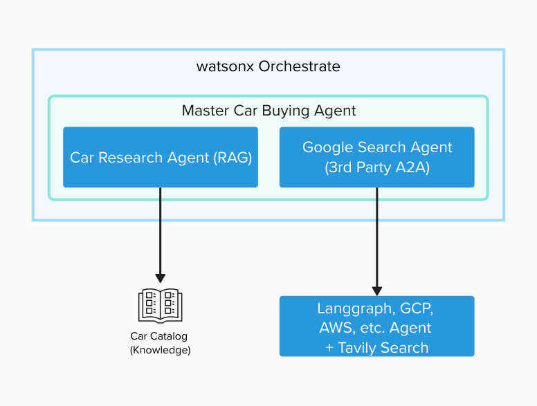

 # 🚨 Control and Govern AI Agents with watsonx Orchestrate

In this lab, you will learn how to govern and control AI Agents, including putting guardrails, monitoring, debugging, and evaluation AI agents to mitigate a number of risks including hallucinations, data poisoning, tool invocation errors, PII leakage, among others.

## 🎬 The Scenario

Imani is an AI Engineer working for **ABC Car Dealership**. She is building an Agentic AI application to help customers answer questions on their catalog of vehicles. However, she's afraid of many potential risks related to Generative AI, namely _generation of harmful contents, hallucinations, agent sprawl, prompt injection_, among other risks. She's aware that malicious users have successfully attacked AI systems to trick them into promotions or sales deals against the company policy.

The **ABC Car Dealership** catalog of vehicles can be found below:

## 🎯 Objective

In this lab, you will help Imani implement **Agentic AI Controls and Governance** capabilities to address:

💉 **Prompt injection**: a malicious user interacting with the system could instruct the LLM to generate harmful contents, change its behavior, or perform dangerous actions.

😵‍💫 **Hallucinations**: in some cases, an LLM might generate false statements called hallucinations.

🤢 **Toxic output (HAP)**: in some cases, the system might generate hateful, abusive, or profane output (HAP). IBM's HAP filter uses AI to prevent harmful contents generation.

💧  **PII Leakage**: personal identifiable information might be present in knowledge bases or might be generated by agent tools. 

🕸️ **Agent Sprawl**: how to manage and govern a large number of agents in an organization

✅ **Quality evaluation**: it's always a good practice to measure the quality of an AI system's output before going to production. 

📊 **Monitor**: provide real-time metrics to ensure agents have high performance and low risk.

🚨 **Alerts**: notify when there's breaches in quality metrics, model, or system performance.

🚨 **Debugging**: notify when there's breaches in quality metrics, model, or system performance.

## 📈 Business Value

🕸️ **Prevent Agent sprawl**: uncontrolled proliferation of agents increases complexity, computation cost, and increases risks, hence the need to manage and govern a large number of agents in an organization.

🛡️ **Reputation protection**: Imani is very concerned that her organization's reputation might be affected if the AI systems she and her team are subject to attacks, authorizing deals against the companiy policy, or generating harmful, toxic, or unreliable outputs.

🚫 **Regulatory infractions and legal issues**: many AI risks are addressed by laws and regulations in many jurisdictions. Though Lab 2 will address them in greater detail, risk management tools addressed in this lab also help reduce potential legal and regulatory compliance issues.

📈 **Productivity**: Imani's team will save time doing manual evaluations and quality checks, as well as manually monitoring her team's models and AI systems.

## 🏛 Architecture

Let's get started!

## 🧪 Step-by-step Hands-on-Lab
<!--
> [!TIP]
> If you are only interested in a agent evaluation and/or monitoring, complete Lab 1 **Agent creation** then you can jump directly to section 4 and/or 5. Otherwise begin with Lab 2 **Guardrails**.
-->
You can find step-by-step instructions here :

<!-- ### 🏛️ Track 1: Full Governance & Controls Track -->
<!--1. Agent creation - clean](lab_guides/0_agent_creation_clean.md): Build a simple RAG car sales assistant that answers questions using a car catalog knowledge base.-->
### 1. 🤢 [**Data Poisoning**](data-poisoning/README.md)
Protect AI agents from data poisoning attacks by implementing guidelines that validate outputs and prevent malicious information from reaching users.

### 2. 🤖 [**Importing external agents**](lab_guides/4_adding_external_agents.md)
Enable the integration of external agents living in IBM Cloud, Google Cloud, or AWS.
 
### 3. 👁️‍🗨️ [**PII Leakage**](controls/README.md) 
Protect Personal Identifable Information that might be present in knowledge bases or generated by agent tools. 

### 4. 🐞 [**Debugging**](debugging/README.md)
Diagnose tool/agent failures, find root cause, and quickly fix issues.

### 5. 🔎 [**Automatic Evaluation**](lab_guides/5_automatic_evaluation.md)
Systematically test and debug agents using automated test cases, performance metrics, and debugging tools to ensure reliability before deployment.

### 6. 👀 [**Real-time Monitoring**](lab_guides/6_real_time_monitoring.md)
Track agent performance in production through analytics dashboards that monitor success rates, user feedback, and content safety indicators.

### 7. 📊 [**Dashboard and Agent Analytics**](control-plane/README.md)
Have a 360 degree view of your entire agentic system including analytics, alerts, incidents, and more.

### 8. 🚧 [**Custom Guardrails (Optional)**](guardrails/README.md)
Create fully customizable guardrails via Python scripts that can be executed before or after the agent invocation. This lab requires development/technical skills.

---

## 📚 Additional Labs (Optional — Not Required for This Workshop)

> [!NOTE]
> The following labs are **not part of this workshop**. They are provided as optional references for those who want to explore further on their own time.

### ⚠️ Lab 2 — Risk and Compliance ([`labs/risk-and-compliance/`](../risk-and-compliance/README.md))

Explore how to govern AI models end-to-end using IBM OpenPages — from inception to incident remediation.

Bob can help business and compliance teams by:
- Explaining risk frameworks and how they map to IBM OpenPages
- Generating compliance documentation drafts
- Helping navigate the UI steps with contextual explanations

### ⛑️ Lab 3 — Guardrails and Monitoring for LLMs ([`labs/monitoring-and-guardrails/`](../monitoring-and-guardrails/README.md))

Explore how to build guardrails and evaluation pipelines for LLM-based applications.

Bob can help AI engineers with:
- Writing and testing prompt injection defences
- Configuring HAP (Hateful, Abusive, Profane) filters
- Setting up evaluation pipelines and interpreting results
- Comparing LLMs across different prompts and techniques

<!--
### 🎛️ Track 2: Control Plane Track

1. [**Agent creation**](lab_guides/0_agent_creation_clean.md): Build a simple RAG car sales assistant that answers questions using a car catalog knowledge base.
2. [**Importing external agents**](lab_guides/4_adding_external_agents.md): enable the integration of external agents living in IBM Cloud, Google Cloud, or AWS.
3. [**PII Leakage**](controls/README.md)
4. [**Debugging**](debugging/README.md)
5. [**Real-time Monitoring**](lab_guides/6_real_time_monitoring.md): Track agent performance in production through analytics dashboards that monitor success rates, user feedback, and content safety indicators.
6. [**Control plane**](control-plane/README.md)

## Key Takeaways

You've successfully built, deployed, and monitored an intelligent car buying assistant using watsonx Orchestrate. By completing this lab, you've learned:

✅ **Agent Creation**: How to build specialized agents in watsonx Orchestrate  
✅ **Knowledge Integration**: How to use RAG with uploaded documents  
✅ **A2A Protocol**: How to connect third-party agents using Agent-to-Agent protocol  
✅ **Agent Orchestration**: How to create a master agent that routes to specialized agents  
✅ **Evaluation**: How to test agents systematically before deployment  
✅ **Monitoring**: How to track agent performance and identify issues in production  
-->

