# 🎛️ Agentic Control Plane Lab

## Overview

The **Agentic Control Plane** gives enterprises a centralized way to manage, observe, and optimize agents across teams, tools, models, and runtimes, whether they’re built in watsonx Orchestrate or running elsewhere.

After having seen your instructor's demo of the **Agentic Control Plane**, hopefully by now you are starting to see how organizations can bring consistency, visibility, and trust to their entire agentic ecosystem.

In this lab we will experiment first-hand with the **Agentic Control Plane** (ACP) in watsonx Orchestrate.  Keep in mind that ACP benefits are easiest to see the more agents and tools you have built and deployed, on watsonx Orchestrate and externally, and the more you have interacted with them already to obtain some real data. 

If in this bootcamp you are likely working on a shared watsonx Orchestrate tenant, so you should be able to at least see a number of different agents that you and your colleagues have created in other parts of the bootcamp.  Otherwise, if you have your own dedicated watsonx Orchestrate environment, you might only see a couple agents in the ACP dashboard.  Either way, you will be able to experiment and learn about the benefits of the Agentic Control Plane first hand! Let's get started!

> [!NOTE]
> We are working on an update to this lab to include scripts for instructors to import agents and tools, so that the dashboard includes a variety of data to make it possible to run this Agentic Control Plane lab standalone.

## Pre-requisites

Double check with your instructor that you have: 
* watsonx Orchestrate (Agentic Control Plane version)
* Administrator rights to wxO tenant (required to be able to access all the ACP functionalities)

## 🔍 Explore the Control Plane

Now that you and your team have built and experimented with a number of agents, we can explore the Agentic Control Plane in watsonx Orchestrate.  

Let's take a closer look at how the Agentic Control Plane in watsonx Orchestrate can help you govern, control, debug, and protect AI agents and models.

## The Dashboard

Click on **IBM watsonx Orchestrate** in the top left corner to go to the welcome screen/dashboard, if you aren't already there. The dashboard is the Control Plane home experience — the starting point for managing your agentic ecosystem.

From here, we can quickly see key performance metrics and the general health of the AI Agent environment.

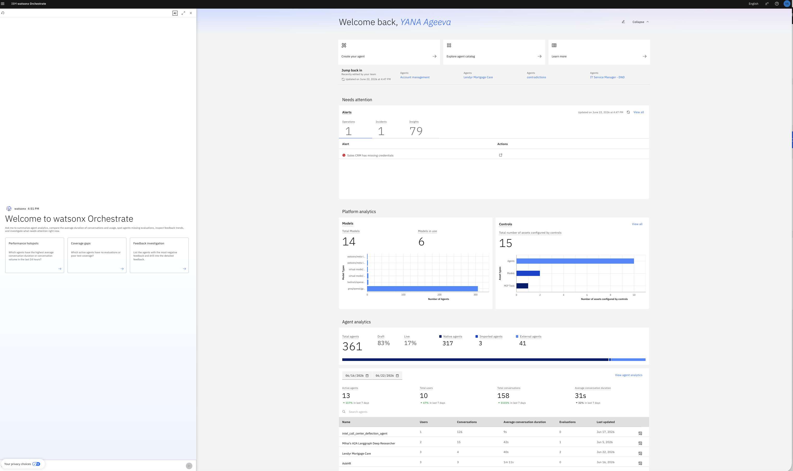

At the top we can create new agents, explore the agent catalog, or jump back into recent work: 

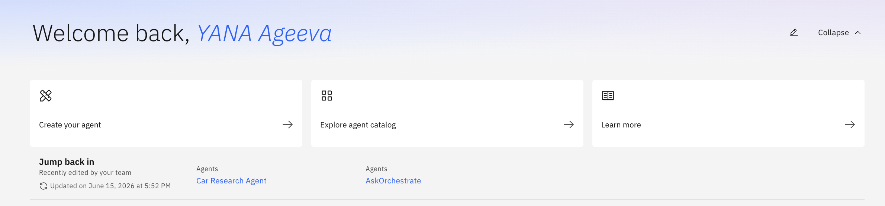

The **Needs Attention** section highlights issues across the AI agent environment that may require follow-up: 

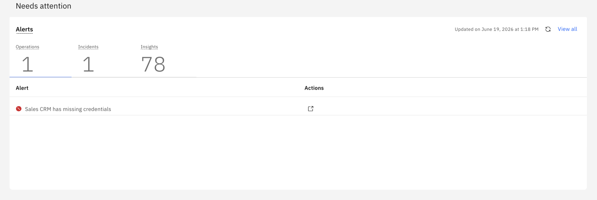

Here we can monitor operational alerts, incidents, and insights such as missing credentials, performance hotspots, or evaluation gaps, and quickly drill into the actions needed to keep agents healthy and reliable.

In the **Platform Analytics** section, you can inspect model and controls summaries: total models, models in use, and controls per asset. 

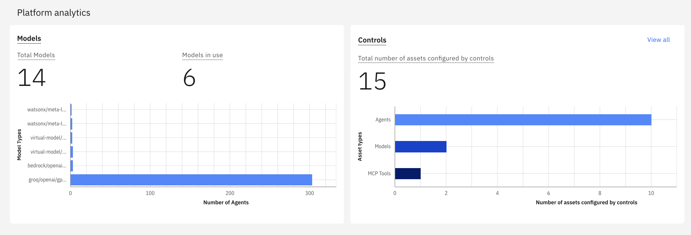

You can also view all existing controls for your models, agents, and tools, as well as add new controls. We will look at how to add controls [later in this lab](#enterprise-and-asset-controls).

The **Agent Analytics** section lets you review active agents, messages, failed messages, and latency metrics to identify recent regressions or spikes:

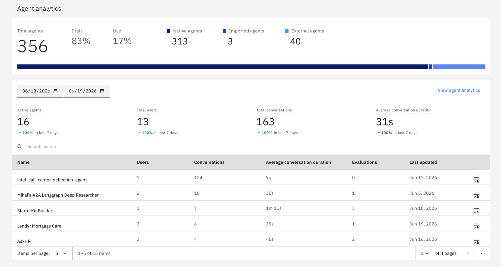

Let's go back to the **Needs Attention** section to look at the different types of alerts. 

## Needs Attention

Let's look at the different types of alerts available in the **Needs Attention** section - Operations, Incidents, and Insights.

First, we have _Operations_ alerts. These are operational blockers with a known fix, for example missing connection credentials:

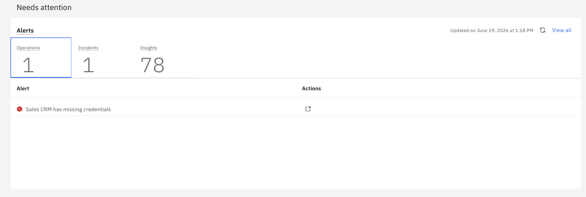

Next, we have _Incidents_ alerts. These are alerts from production that require investigation.  Select the Incidents count tile to filter the alert list to incident-level items:

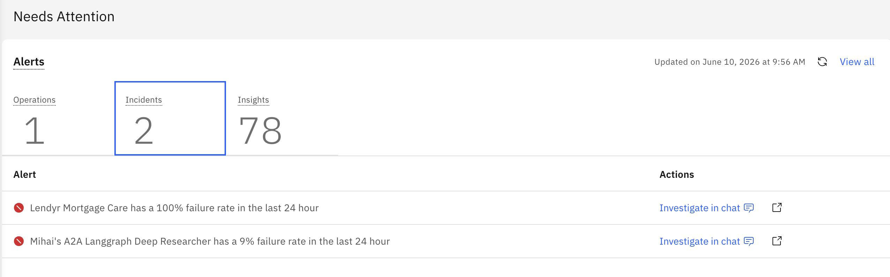

Notice how the list of alerts has changed. You can now see that we have an alert indicating one of our AI agents has a 9% failure rate in the last 24 hours.

Next, we have the _Insights_ alerts. These are recommendations to improve agent quality and readiness.  Click the Insights count now to see them: 

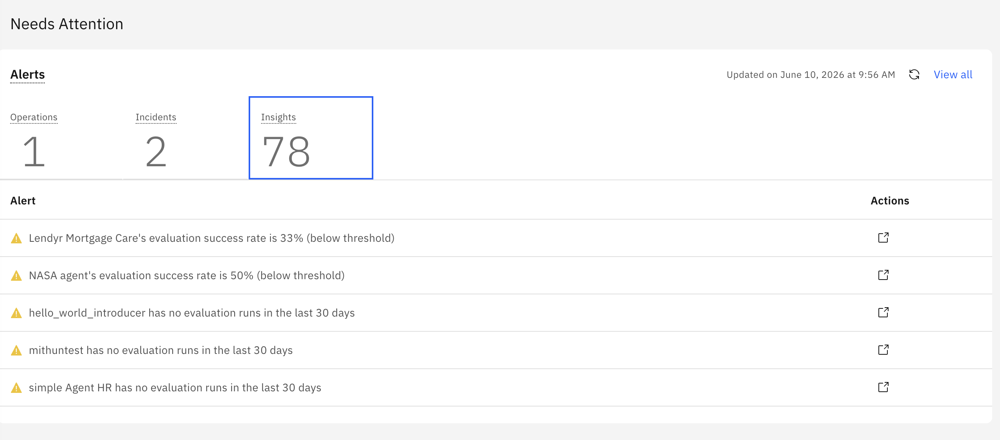

Insights help you understand root causes and evidence tied to failing agents and tools.

### Explore operational alerts

Let's try opening one of the alerts to see what happens. Select the **Operations** metric to review operational warnings again.  If we had any operations alerts, they would show up here on the list. 

Click on the link in the Actions column to drill into the issue: 

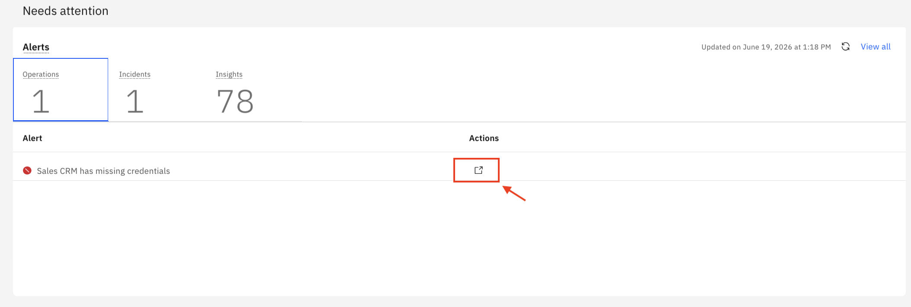

Notice watsonx Orchestrate opened the Connections page where we can inspect the credentials.

Click on the **watsonx Orchestrate** logo on the top left to go back to the Control Plane home screen: 

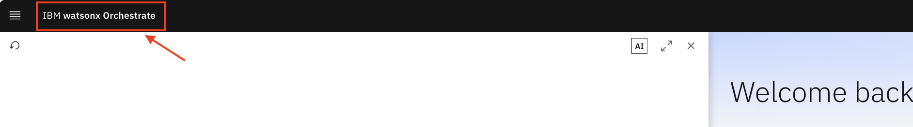

## Agent Analytics

From the **Agent Analytics** section, we can move from environment-level insights into agent-specific investigation.

This table shows key metrics for each agent, including users, conversations, messages, failed messages, evaluations, and last updated date.  From this table, we can drill into any agent for a deeper look: 

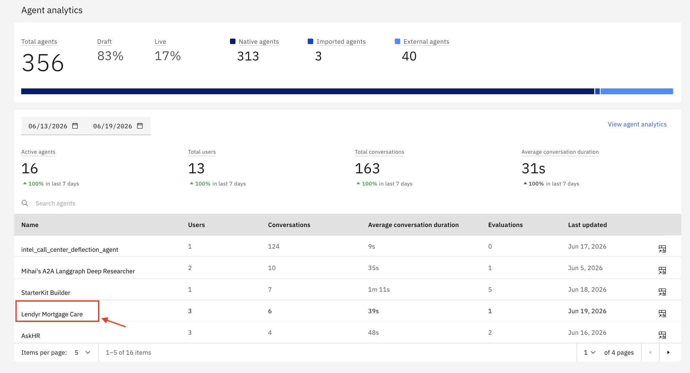

If you select a specific agent, you will open the agent builder view and inspect its configuration.  By doing so we move from Control Plane insights into the agent itself.  Here, we can explore its model, instructions, tools, and behavior to investigate issues more deeply, connecting signals to action. Go back to the **watsonx Orchestrate** Control Plane dashboard.

 Back in **Agent Analytics** click the analytics icon for a specific agent row to open that agent’s detailed analytics page and move from platform-level views to agent-level diagnostics: 

 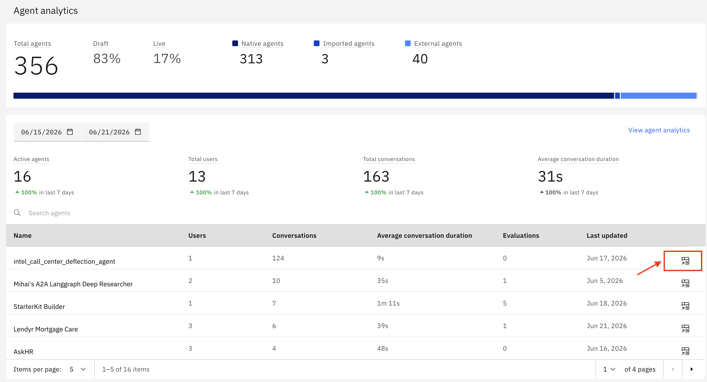

In the **Agent Analytics** page, you can view agent statistics, such as total number of conversations, input and output token count, number of unique users, and average conversation duration and message latency:

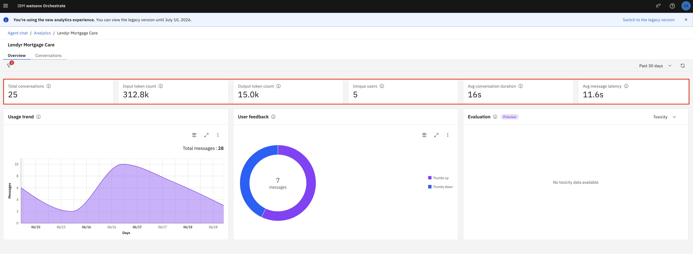

You can also inspect the agent's usage trend chart to spot message volume and failure spikes over time, view the user feedback ratings for the agent in question, as well as Toxicity, Helpfulness, and Halluciation scores:

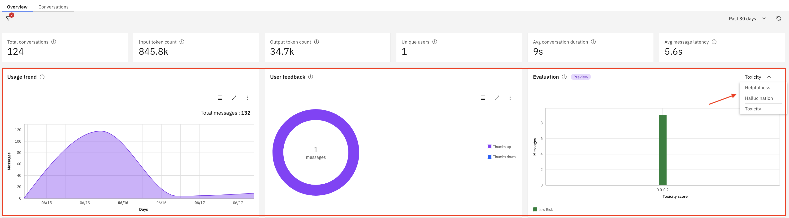

Now, let's switch to the **Conversations** tab to see a list of the agent's sessions with users in production; this is where analytics meet evidence, so you can examine exact user exchanges:

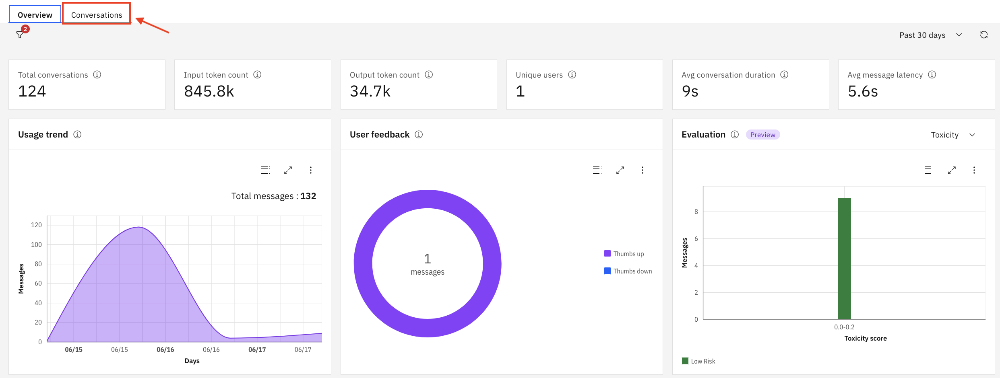

On this screen, you can see a list of the agent's interactions with users. Let's click on a conversation thread from the left column to load that session’s transcript, metadata, and user identifiers:

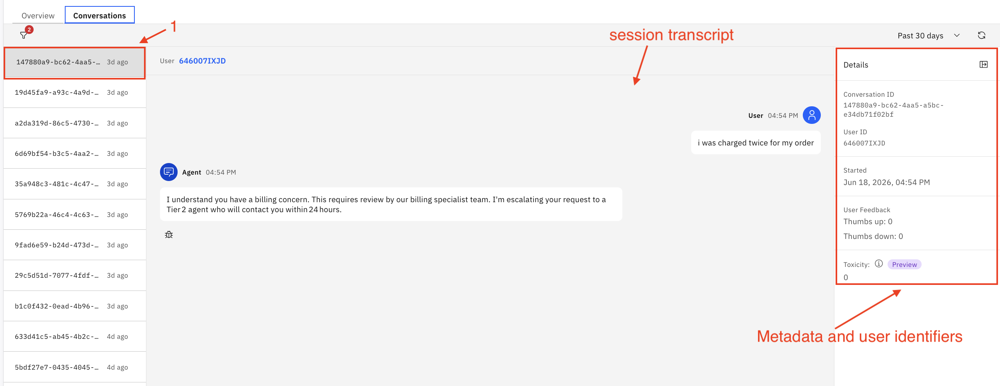

When you select a conversation from the list, you can see its details on the right side of the screen, including the conversation ID, the ID of the user who had this conversation with the agent, when the conversation started, among other pieces of data.

You can inspect the agent's response and click the debug icon next to the reply to open the **Debug view** and trace the execution path taken for this conversation:

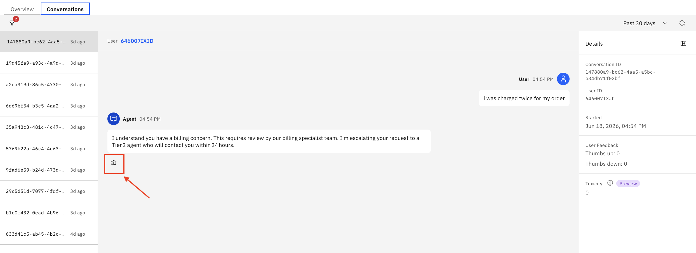

### Debugging agents

Once the debug view opens, you should see something similar to: 

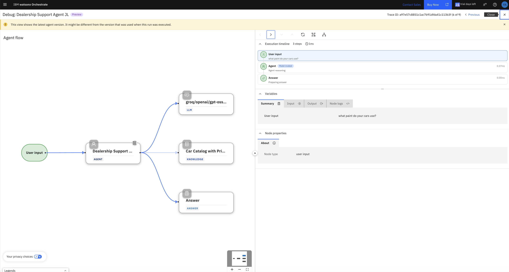

Here, we can review the agent's topology and the execution timeline side-by-side. You can select each step of the conversation and see which agent components are actively involved in this step, making it easier to trace how the agent is reasoning, routing, and using its tools and knowledge. This makes it easier to understand the agent's flow and narrow down where to investigate when debugging agent behavior.

If you would like to experiment with debugging a real issue and see the Debug panel in action, follow [the debugging lab](../debugging/README.md)

Let's close the **Debug** view and return to the agent's conversations.

### Agent Chat / Analytics - Learn how your agents and workflows are performing

Click the **Analytics** breadcrumb to navigate to the broader agent analytics page (you can also access it from the Agent Analytics section on the main Control Plane page): 

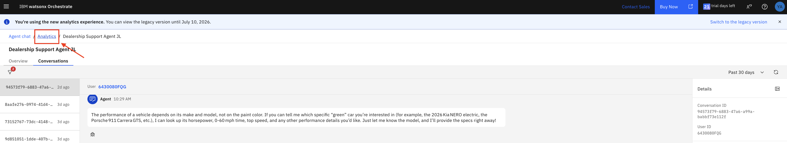

The **Analytics** page provides a broad view of agent activity across the environment.
It helps us compare usage, feedback, failures, and performance across agents to identify trends and areas of attention:

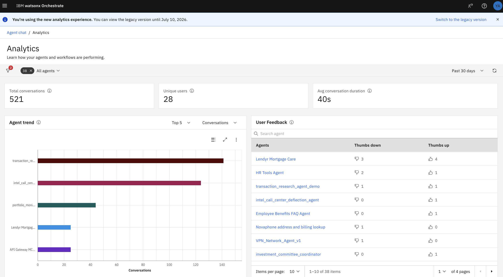

Click on the *watsonx Orchestrate* logo in the top left corner to return to the Control Plane home page.

## Control Plane AI Agent

The Control Plane includes an AI Agent tailored to your agent environment.
We can ask natural language questions to quickly understand performance, failures, and trends.

Let’s ask the Agent to find the agents with low success rates for this week:

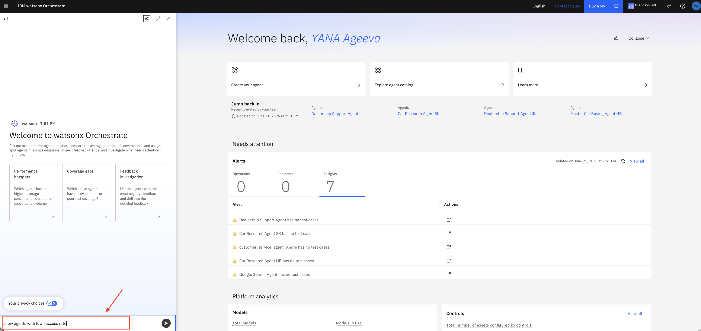

The agent comes back with:

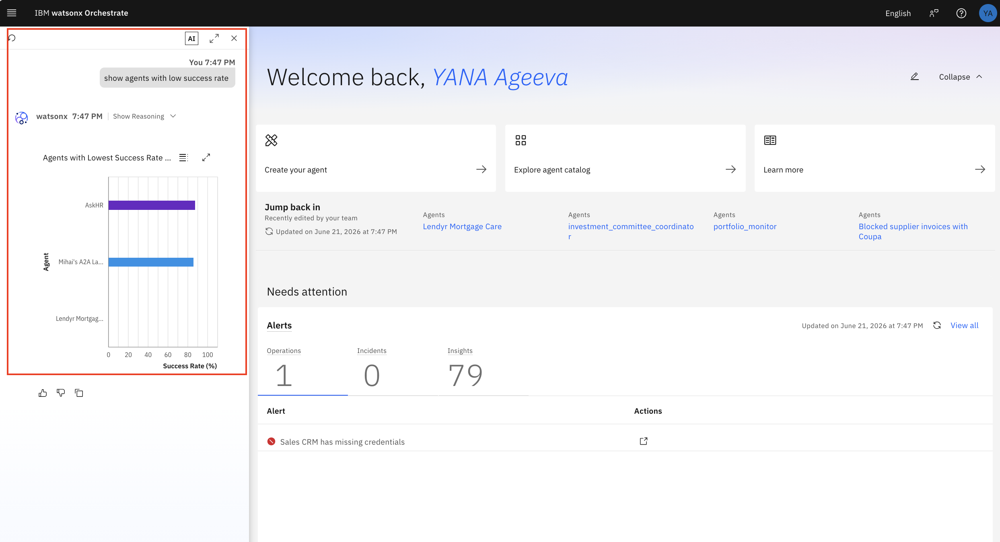

Instead of manually comparing performance data across agents, we can use natural language to surface the agents that may need attention. The agent converts questions into visual insights, highlighting low success rates and key trends to investigate.  That’s the power of the AI Agent in the Control Plane in watsonx Orchestrate.

## Enterprise and Asset Controls

Controls help enforce rules that govern how your agents, models, and MCP tools behave. They can be applied at the asset level for agents, models, and MCP tools, or at the enterprise level, affecting the entire instance through policies, safeguards, and platform behaviors that support reliable and compliant operation.

You can add new controls directly from the dashboard. Go to the **Platform Analytics** section and click on **Add control** under **Controls**:

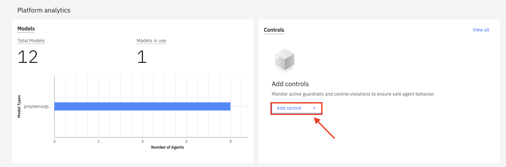

**Note:** if you already have existing controls, you can follow the **View all** link to the **Controls** page where you will be able to view all existing controls and add new ones: 

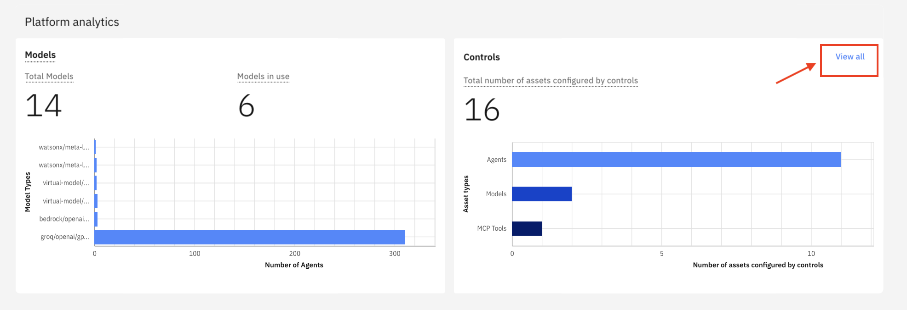

### Asset Controls

First let's explore asset controls. They can be applied to models, agents, and MCP tools. First, you create a control, then assign the right assets (e.g. agents or models to it).  Let's see this in action!

Click on **Create Control**:

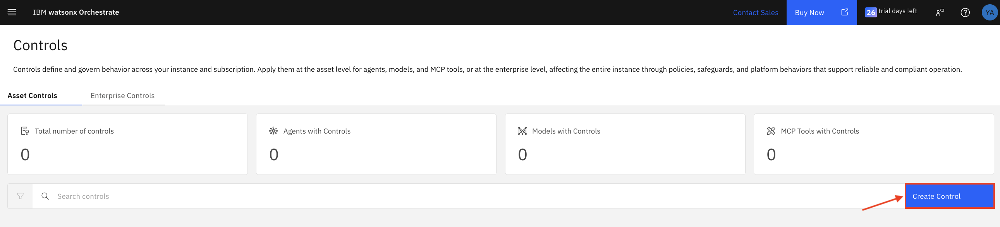

We'll focus on agent controls here, but for completeness take a quick look at the controls available for models: 

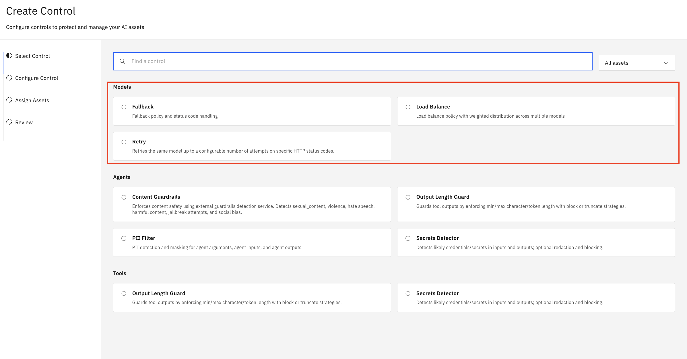

Feel free to click on any of these and explore further -- you can always cancel and come back.  For example, you can create a fallback control for models to fall back on another model when a given model fails, based on the status code received. Or you could choose to load balance across a set of models.

For agent controls, there are a few different types of controls available: 

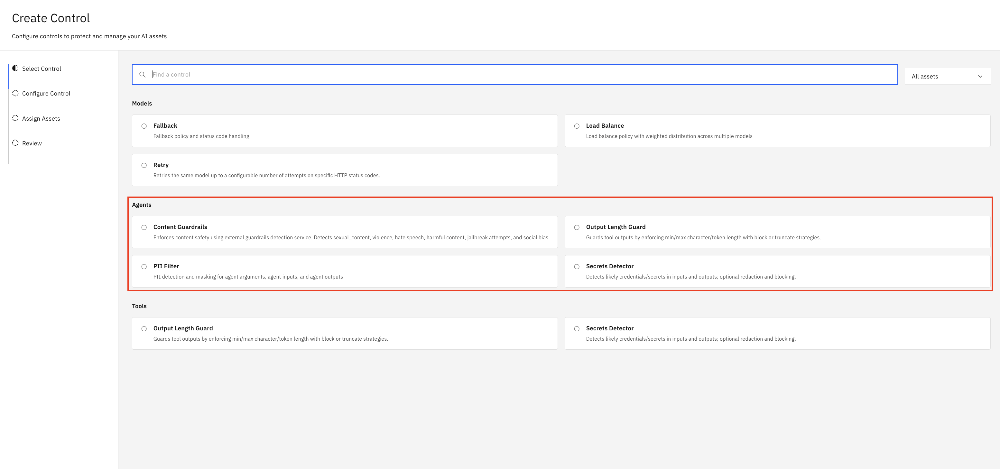

To experiment with **PII filter** controls for PII detection and masking of agent arguments, inputs, and outputs, follow the [PII Leakage Lab](../controls/README.md)

You can also define a **content guardrail** to enforce content safety using external guardrails detection service which helps detect sexual content, violence, hate speech, harmful content, jailbreak attempts, and social bias: 

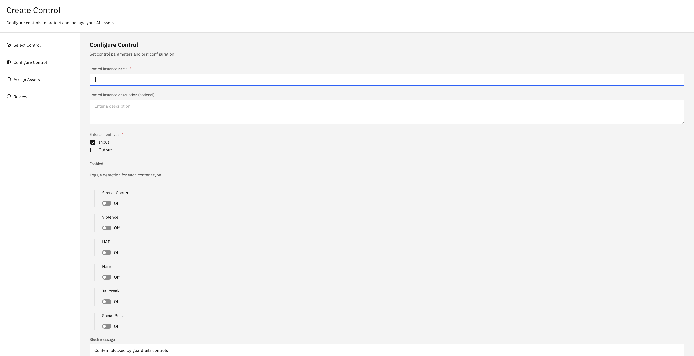

> [!NOTE]
> 🚧 Detailed steps to showcase content guardrail are underdevelopment and will be made available soon.

Additional controls you can experiement with are: 

* Agent tool **Output length guard** that enforces min/max character/token length with block and truncate startegies.
* **Secrets Detector** that detects likely credentials/secrets in inputs and outputs, with optional redaction and blocking.

Finally, controls are also available for tools - output length guard and secrets detector: 

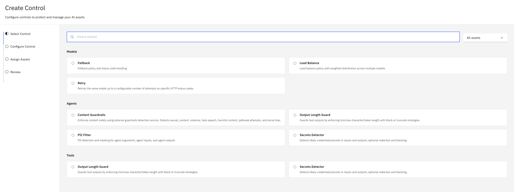

### Enterprise Controls

There are also a number of enterprise controls avaiable. We will not be covering them in detail in this lab, but you can take a quick peek to see what's available!

First, click on **Enterprise Controls** and review the different types of enterprise controls available:

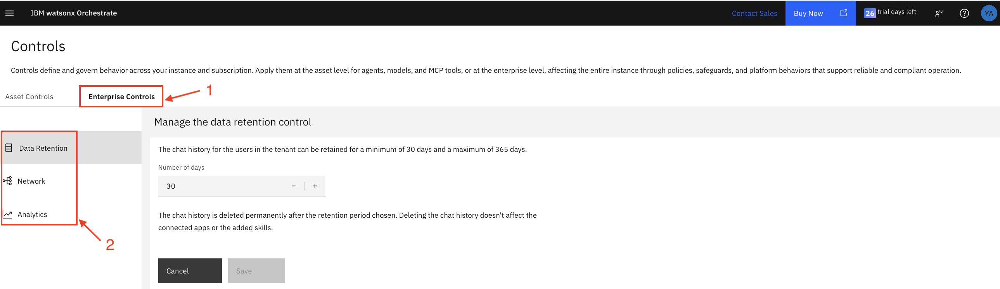

**Data retention** The data retention control allows you to manage data retention by specifying for how long chat history for users on this wxO tenant should be retained (default is 30 days), after which it will be automatically deleted. Note that all chat history will be deleted after 365 days. 

**Network** You can define network access by specifying which IP addresses can reach your system (inbound network restrictions) and which external destinations your system can connect to (outbound network restrictions).

**Analytics** This enterprise control helps you manage how analytics is collected and shown for your tenant in dashboards, logs, or reports. These settings help you control what information is captured so your team can get useful insights while staying aligned with your privacy and data-handling needs.  You can _Enable PII Masking_ to protect potentially sensitive data by masking common personally identifiable information (PII) in trace metadata. When masking is enabled, user inputs and agent outputs remain visible, while detected sensitive attributes, such as emails and phone numbers, are masked before appearing in dashboards, logs, or reports.

## Summary

Controlling enterprise AI agents requires more than a single dashboard. It requires visibility, governance, observability, debugging, analytics, and AI-assisted investigation across the entire agent environment.

With the Control Plane, teams can move from scattered signals to centralized control, helping enterprises manage agents with greater trust, clarity, and confidence at scale.

**Congratulations on completing the Agentic Control Plane lab!**

---

**← [Previous: 👀 Real-time Monitoring](/labs/agentic/lab_guides/6_real_time_monitoring.md) &nbsp;&nbsp; | &nbsp;&nbsp; [Back to homepage: 🚨 Control and Govern AI Agents Homepage](/labs/agentic/README.md) →**

