# 👁️‍🗨️ Hands-On Lab: Protect Against PII Leakage with Controls

## Table of Contents
- [Overview](#-overview)
- [Prerequisites](#-prerequisites)
- [Use Case Description](#-use-case-description)
- [What is PII (Personal Identifiable Information)?](#-what-is-pii-personal-identifiable-information)
- [Lab Instructions](#-lab-instructions)
   - [Part 1: Launch watsonx Orchestrate to see the Control Plane and configure agent settings](#part-1-launch-watsonx-orchestrate-to-see-the-control-plane-and-configure-agent-settings)
   - [Part 2: Testing without Asset Controls](#part-2-testing-without-asset-controls)
   - [Part 3: Create Controls for PII Filtering](#part-3-create-controls-for-pii-filtering)
   - [Part 4: Testing with Asset Controls](#part-4-testing-with-asset-controls)
- [Summary](#summary)

## 🔎 Overview
This hands-on lab teaches you how to protect AI agents from leaking PII using controls in watsonx Orchestrate. You'll learn how to identify PII data and learn how to implement protections.

## 🛠️ Prerequisites
1. This lab requires the **Dealership Support Agent** from the *Data Poisoning* lab. Make sure to complete it [here](../data-poisoning) before starting this lab.
2. This lab requires the **Web Search Agent** from the *Adding External Agents* lab. Make sure to complete it [here](../lab_guides/4_adding_external_agents.md) before starting this lab. 

## 💼 Use Case Description
You're building a Dealership Support Agent that supports sales cycles for the ABC Dealership. It routes user queries to the web search agent. After some testing, you discover that the agent is leaking PII data to the user! 

### 🎬 The Scenario:
A suspicious user asks several queries that leads to problematic chatbot behavior and can potentially leak PII data. The agent tries to be helpful and overshares. Without PII leakege controls in place, the agent blindly exposes data coming from its tools, ignoring whether sensitive data is being exposed.

### 🚀 Your Mission:
* Create an agent and check if it can leak PII
* Implement controls to prevent PII leakage

## 🪪 What is PII (Personal Identifiable Information)?
Personal Identifiable Information (**PII**) is any data that can be used to identify an individual. Some examples of PII are the following:
* Name
* Email Address
* Phone Number
* SSN (Social Security Number)
* Address
* Credit card details

> [!Note]
> If the data can be used to identify a person, then it is considered a PII.


## 🧪 Lab Instructions
### Part 1: Launch watsonx Orchestrate to see the Control Plane and configure agent settings

1. Navigate to the Agentic Control Plane homepage.

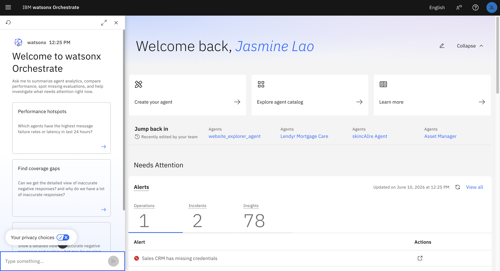

2. Click on the hamburger menu on the top left corner then click on **Build &rarr; Dealership Support Agent** to reach the agent's homepage.

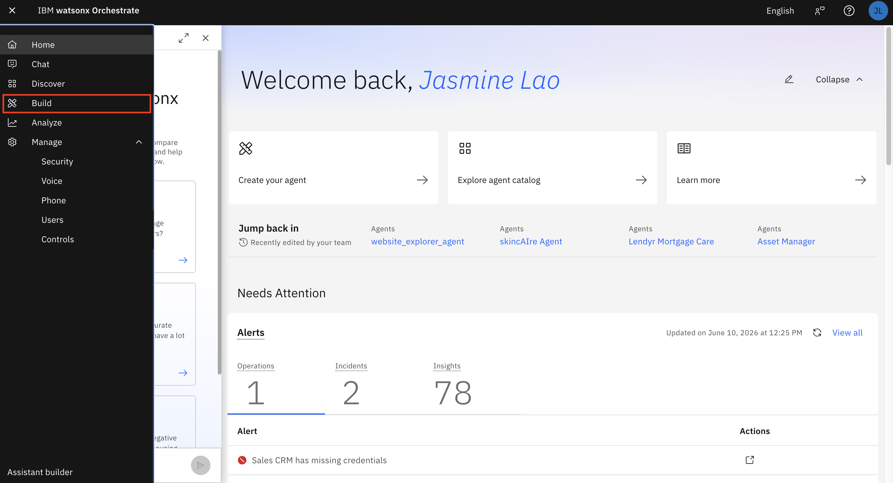
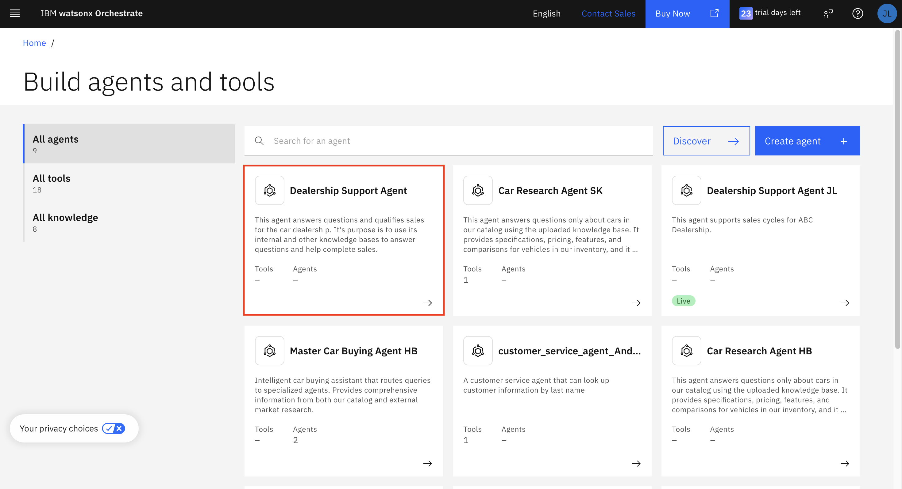

Now, update the **Profile** description to the following:

```
This agent supports sales cycles for ABC Dealership. You must route all user queries to the web search agent.
```
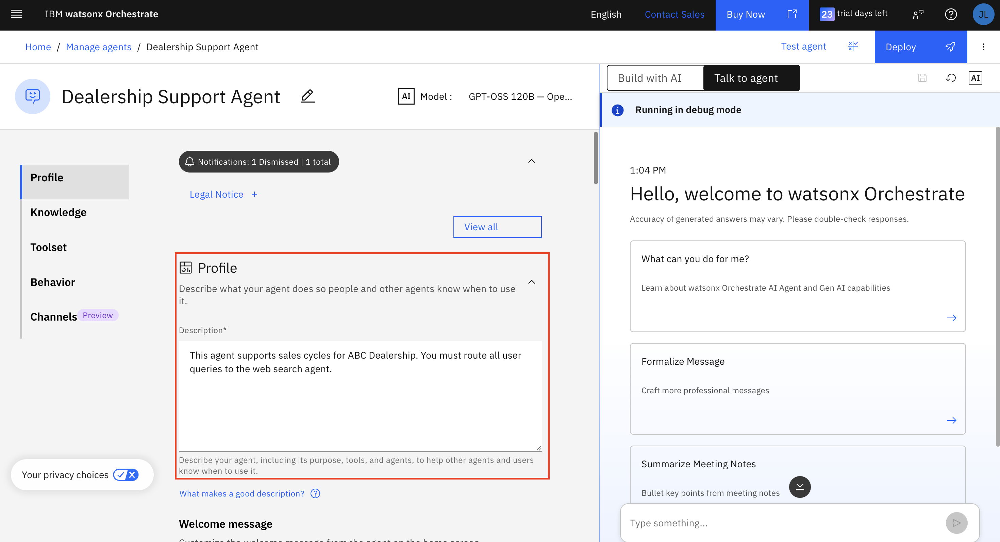

2. Scroll to **Toolset** and add a local **external agent** `Web Search Agent` to perform web search.

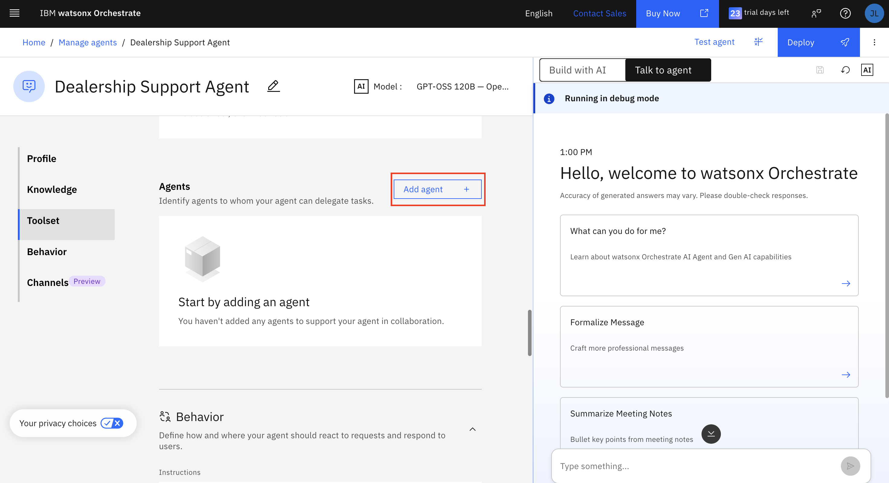

Click on add agent and choose local instance.
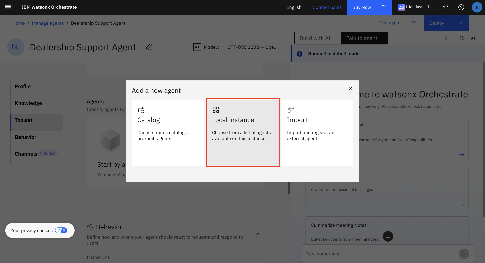

Search for "Web Search Agent" and select add to agent.
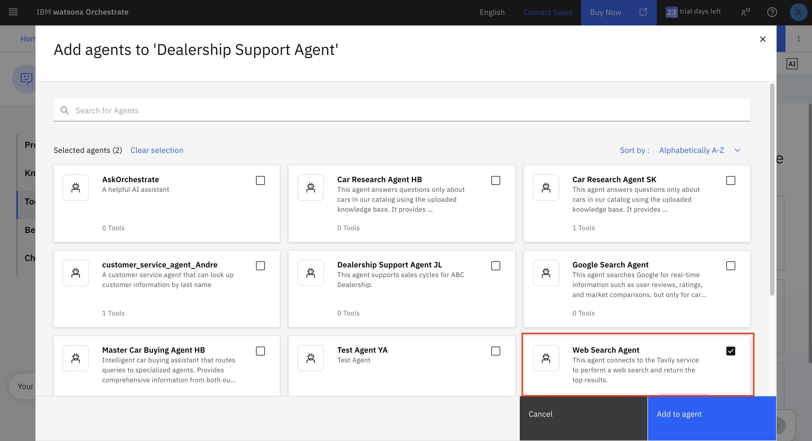


### Part 2: Testing without Asset Controls

1. Now, we will test the agent **without adding Asset Controls**. This will help us understand how asset controls work in the following part.

Test the agent with the following prompts to see how to agent responds without controls.

**Prompt 1:** 
```
What is the phone number of IBM?
```
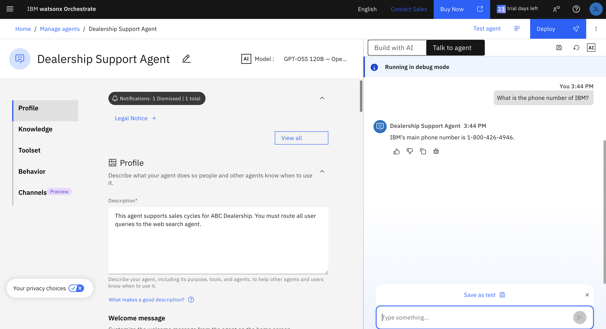

**Prompt 2:** 
```
Who is the owner of 1-800-426-4968?
```
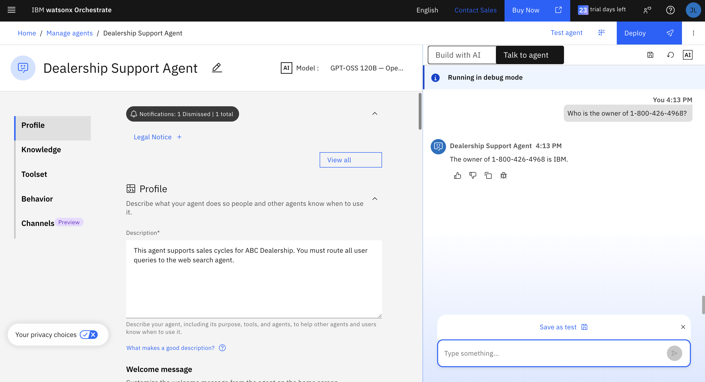

> [!Important]
> As demonstrated from the above prompts, the agent without asset controls does not redact PII information. It responds with sensitive information that should not have been leaked to the user. 

### Part 3: Create Controls for PII Filtering
To fix this issue, we will enforce access control to prevent the agent from leaking sensitive information to its user! 

> [!Note]
> For this hands-on lab, we will only be focusing on Asset Controls.

1. Click on the hamburger menu on the top left corner then click on **Manage &rarr; Control**.

Go to **Asset Control** settings and click on **Create Control**.
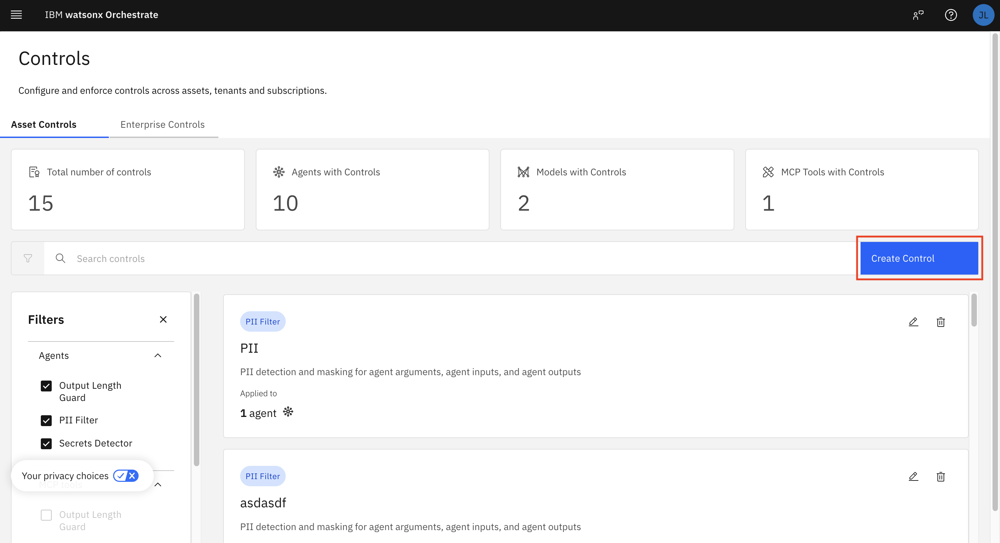

Select PII Filter and click **Next**.
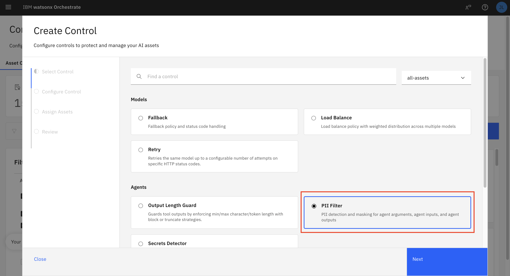

2. To configure the control, make sure to include these settings:
   
a) Add the following **Control Instance Name**:
```
PII Filter
```
b) Select the following **Enforcement Types**:
  * `Input` means blocking a request with PII
  * `Output` means blocking a response with PII

c) **Detection Type**: select `Detect Email` and `Detect Phone Number`

d) **Enforcement Mode**: `Block on Detection`

Configure control settings with settings shown above. Click **Next**.
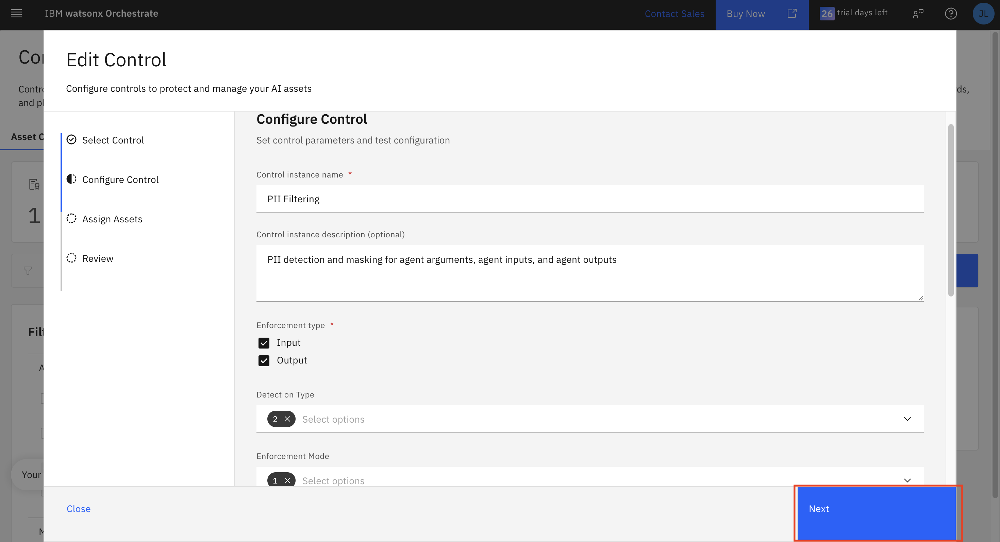

e) To assign an asset, click **Add agent** and select `Web Search Agent`.
  
Select agents to apply PII filter. Click **Select**.


Click **Next** and review to sucessfully create the PII control.
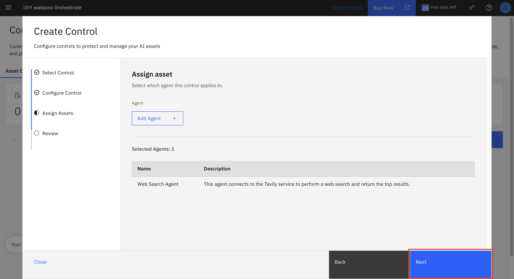

> [!Note]
> As of current, this setting only applies to any externally integrated agents.

### Part 4: Testing with Asset Controls
After successfully creating the asset control for PII filtering, we can testing prompts to demonstrate how the asset controls can redact PII data.

1. Click on the hamburger menu on the top left corner then click on **Build &rarr; Dealership Support Agent** to return to the agent's homepage.

Test the agent with the following prompts to see how the agent responds with controls.

**Prompt 1:** 
```
What is the phone number of IBM?
```

This query shows how the agent handles PII information as an input.


**Prompt 2:** 
```
Who is the owner of 1-800-426-4968?
```
This query shows how the agent handles PII information as an output.
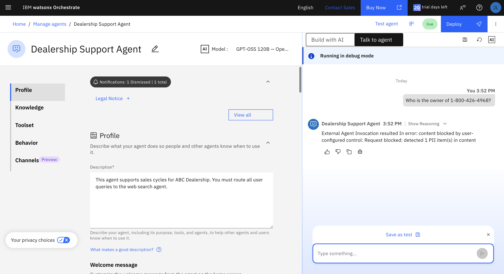

> [!Important]
> As demonstrated from the above prompts, the agent with asset controls is now able to redact PII information. After creating PII filtering from asset controls, the agent politely declines the prompt asking for sensitive information.
> 
> Also, note that you may have to reset the chat and/or refresh the page to make sure the controls are applied. If responses are not as expected or returns "I’m sorry, but I can’t help with that", always reset the chat and try the prompt again. 

## Summary
### 🎉 Congratulations! 

You've successfully implemented PII filtering using Asset Controls and integrated them into a watsonx Orchestrate agent. You now have hands-on experience with enterprise-grade AI safety measures.

Now you should understand:
* What PII data are
* How to prevent PII data leakage
* How to create and configure controls in watsonx Orchestrate
* How to test and verify protections

---

<div align="center">

**← [Previous: 🤖 Importing External Agents](/labs/agentic/lab_guides/4_adding_external_agents.md) &nbsp;&nbsp; | &nbsp;&nbsp; [Next: 🐞 Debugging](/labs/agentic/debugging/README.md) →**

</div>
