# 🐞 Hands-On Lab: Debug a Failing Tool in watsonx Orchestrate

## 📋 Table of Contents
- [Overview](#-overview)
- [Use Case Description](#-use-case-description)
- [What is an API (and an OpenAPI spec)?](#-what-is-an-api-and-an-openapi-spec)
- [Lab Instructions](#-lab-instructions)
   - [Part 1: Open the Car Research Agent](#part-1-open-the-car-research-agent)
   - [Part 2: Add the Vehicle Lineup Tool](#part-2-add-the-vehicle-lineup-tool)
   - [Part 3: Add Grounding Instructions](#part-3-add-grounding-instructions)
   - [Part 4: Trigger the Failure](#part-4-trigger-the-failure)
   - [Part 5: Debug with the Execution Timeline](#part-5-debug-with-the-execution-timeline)
   - [Part 6: Fix the Tool](#part-6-fix-the-tool)
   - [Part 7: Verify the Fix](#part-7-verify-the-fix)
- [What's next?](#whats-next)

## 🔎 Overview
This hands-on lab teaches you how to debug a failing tool in watsonx Orchestrate. You'll extend an agent you already built with a new capability, watch that new tool fail at runtime, observe how the failure appears in the chat and in the debug view, use the execution timeline to locate the root cause, and fix it.

## 💼 Use Case Description
In the previous labs you built a car buying assistant backed by the dealership catalog. Now the dealership wants the assistant to do more: shoppers often want to see a manufacturer's **full model lineup** before narrowing down to a specific car. To support that, you'll add a new tool that looks up every model a given make produces, powered by an external vehicle database API.

You wire up the new tool exactly as you would any OpenAPI tool — but the spec you were given is out of date, and every call to it fails. Your job is to debug it.

### The Scenario:
You add the new vehicle lineup tool to your Car Research Agent and ask it a natural question — what models does Porsche make? The agent correctly decides to call the new tool, but the tool fails with an HTTP error. The run is marked **Run Failed** and the user gets no answer.

### Your Mission:
* Add the new tool to your existing agent and observe the failure
* Use the debug view to trace the failure to its root cause
* Fix the tool and verify the agent works end to end

## 🌐 What is an API (and an OpenAPI spec)?

If you're new to APIs, here's the 60-second version you need for this lab:

* An **API** (Application Programming Interface) is a way for software to request data from another system over the internet. Instead of a person opening a web page, a program sends a request to a URL and gets structured data (usually JSON) back.
* An API lives at a **base URL** (e.g. `https://vpic.nhtsa.dot.gov/api`) and exposes **endpoints** — paths under that base URL that do specific things (e.g. `/vehicles/getmodelsformake/porsche` returns all Porsche models).
* An **OpenAPI specification** is a JSON or YAML file that *describes* an API: its base URL, its endpoints, what parameters they take, and what they return. It's documentation that machines can read.
* **watsonx Orchestrate** can turn an OpenAPI spec directly into a **tool**: you upload the file, and the agent can now call that API. The agent decides *when* to call it and *what parameters* to pass; the spec tells the platform *where* and *how* to make the actual HTTP call.

> [!Note]
> One important consequence: if the spec describes the API incorrectly — for example, if it points to the wrong base URL — the tool will import without any errors (the file is still valid), but **every call will fail at runtime**. That is exactly the bug you'll debug in this lab.

In this lab we use the **NHTSA vPIC API**, a free, public, no-authentication vehicle database run by the U.S. National Highway Traffic Safety Administration. Its documentation lives at https://vpic.nhtsa.dot.gov/api/ — keep that link handy, you'll need it in Part 5.

## 🧪 Lab Instructions

### Part 1: Open the Car Research Agent

1. Access the **control plane** [here](https://ap-south-1.dl.watson-orchestrate.ibm.com/home).

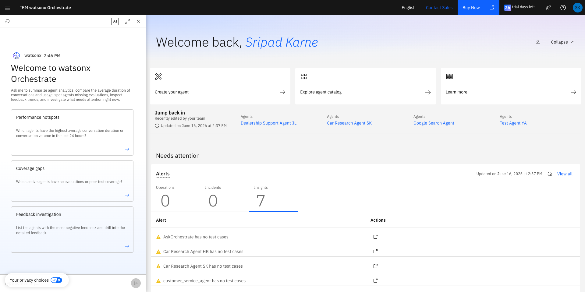

2. Click on the hamburger menu on the top left corner, then click on **Build**

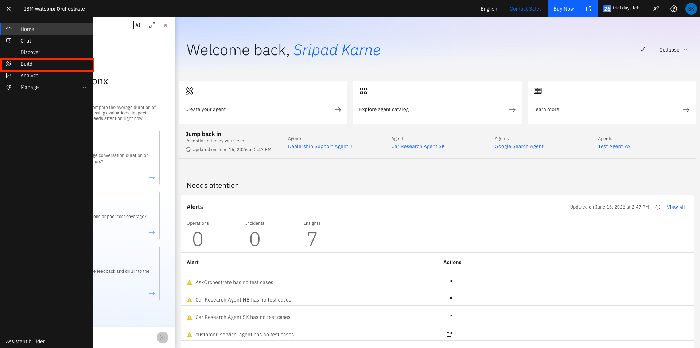

> [!Note]
> Some screenshots in this guide show the agent as "Car Research Agent SK" — ignore the **SK**, it's just the same **Car Research Agent** you made earlier.

3. From the list of agents, open the **Car Research Agent** you created in the previous lab.

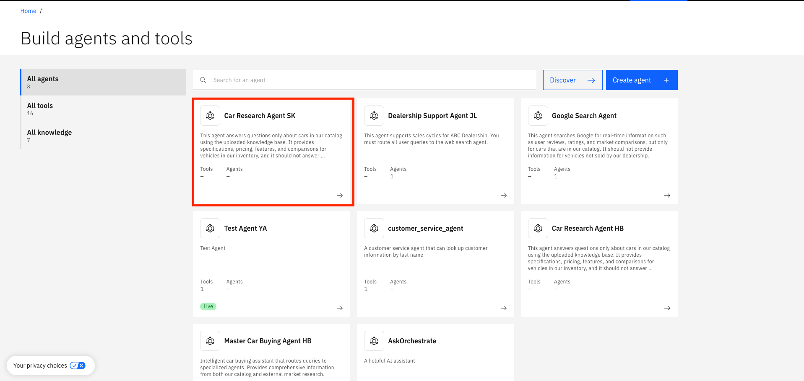

### Part 2: Add the Vehicle Lineup Tool

We'll add a new capability to the agent: looking up a manufacturer's full model lineup. We do this by uploading the vehicle database API's OpenAPI specification as a tool.

1. Download the [**vehicle_api_broken.json**](sample-data/vehicle_api_broken.json) file from the sample-data folder. This is the (out-of-date) OpenAPI spec for the vehicle database API.

2. Scroll down to **Toolset** and click **Add tool +**.

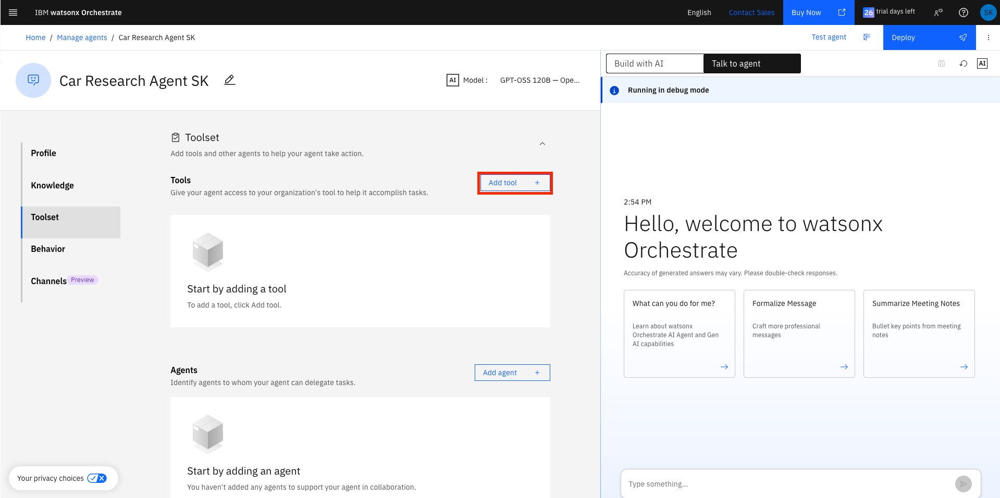

3. In the **Add from** section, select **OpenAPI** (*Import external tools from an OpenAPI file*).

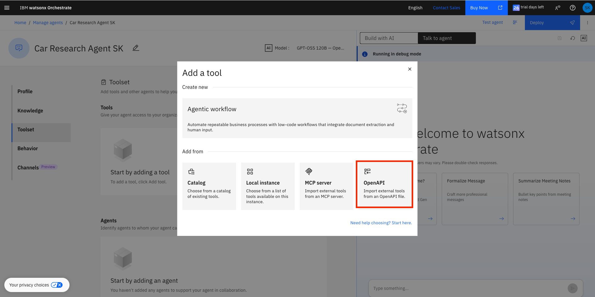

4. On the **Upload files** screen, click **Drag and drop an OpenAPI file here or click to upload** and select the downloaded `vehicle_api_broken.json`. Then click **Next**.

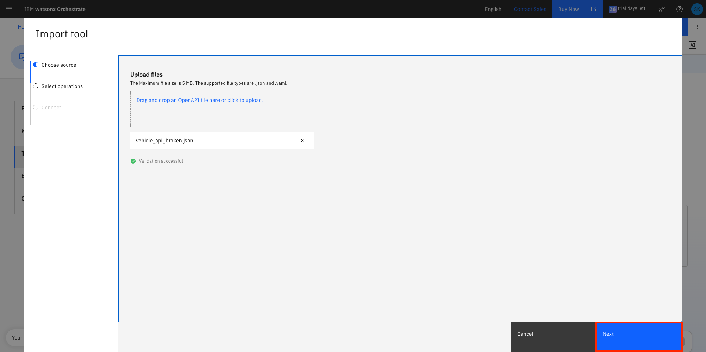

5. On the **Select operations** screen, check the box next to **Get all vehicle models for a car make**, then click **Done**.

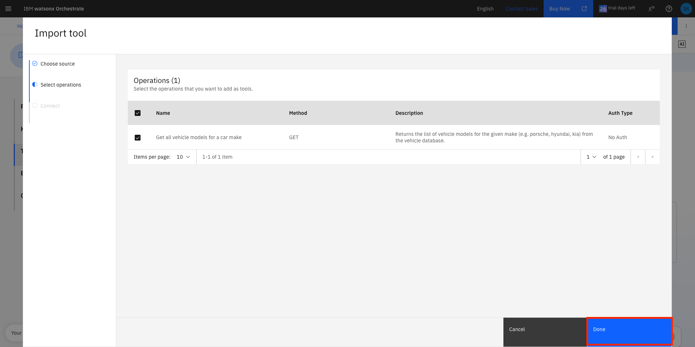

6. No configuration is needed — this is a public API with no authentication (**Auth Type: No Auth**). The new tool now appears in your agent's Toolset.

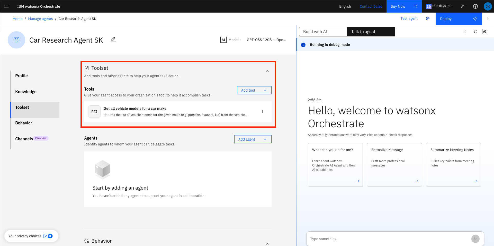

### Part 3: Add Grounding Instructions

Before testing, we'll make sure the agent uses the new tool for lineup questions and **reports failures honestly instead of inventing an answer**.

1. Scroll to the **Behavior** section and **add the following to the agent's existing Instructions** (leave the existing catalog rules in place — this new block goes at the end):

   ```
   The dealership now lets shoppers explore a manufacturer's full model lineup, even models we don't currently stock, so they can see what a brand offers before choosing a catalog vehicle. When a question calls for a manufacturer's complete lineup rather than a specific catalog car, use the get_models_for_make tool and return what it provides.

   Strict grounding for this tool: the model names in your answer must come ONLY from the tool's response. If the tool returns an error, a non-200 status, an empty result, or anything that is not a clean list of models (for example an HTML page instead of JSON), do NOT produce any model names from your own knowledge. In that case, tell the user the lookup failed and that you could not retrieve the lineup. Never guess or fill in models.
   ```

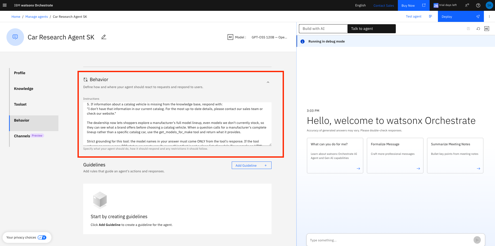

> [!Important]
> Without grounding instructions, an LLM agent may respond to a failed tool call by generating a plausible-looking answer from its own training data — hiding the failure from both the user and you. Grounding forces failures to surface so they can be found and fixed.

### Part 4: Trigger the Failure

1. In the chat preview, ask:

   ```
   What models does Porsche make?
   ```

2. The agent calls the new tool — and fails. The response tells you it couldn't retrieve the data.

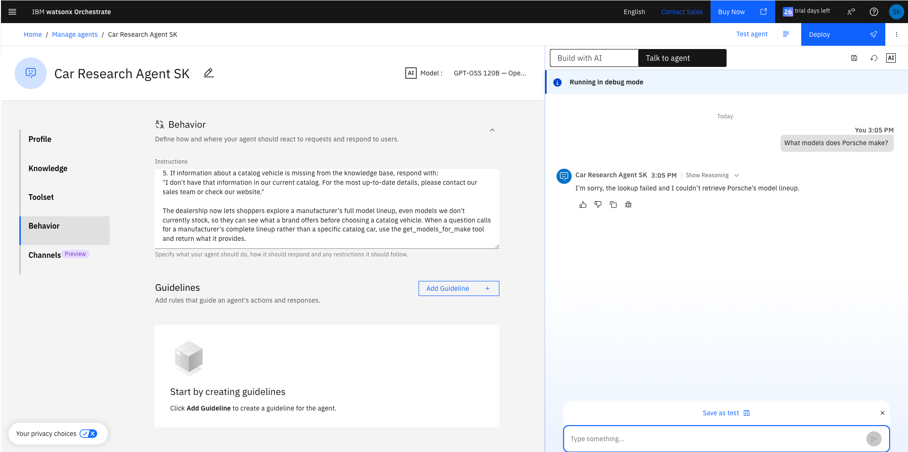

3. Scroll to the bottom and click on the **debug icon**.

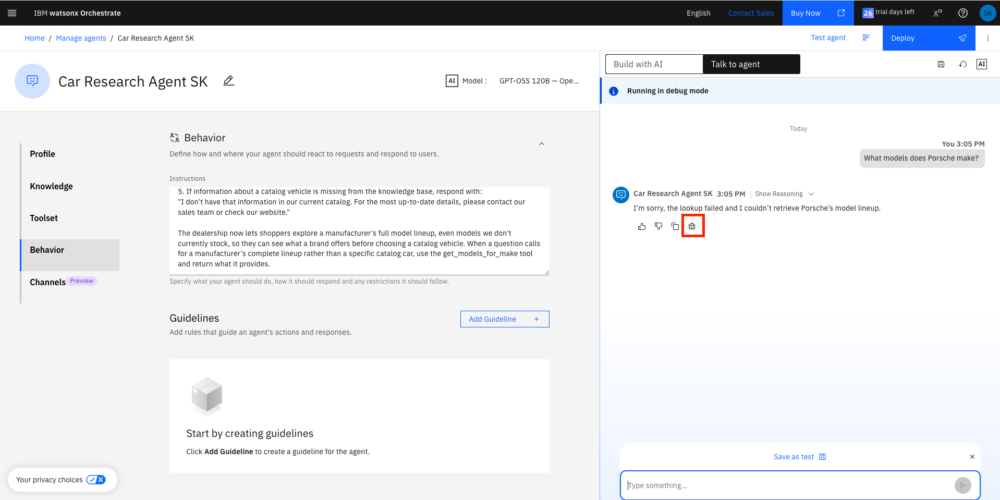

### Part 5: Debug with the Execution Timeline

Now we trace the failure to its root cause. Notice the **Run Failed** badge at the top of the execution timeline, and the red ✗ on one specific step.

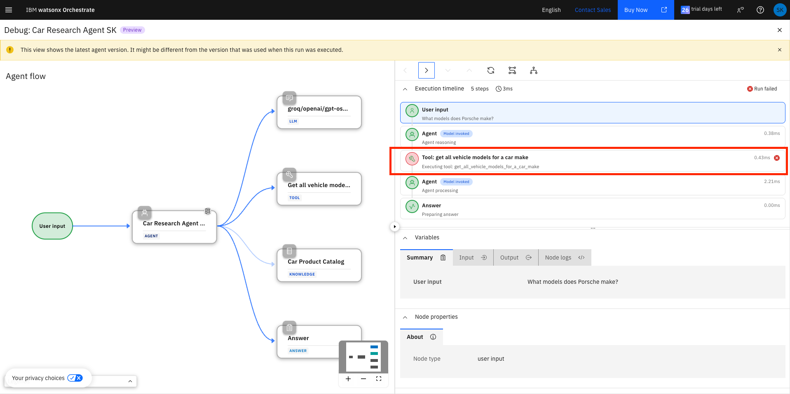

Follow the data through the timeline:

1. **Locate the failure.** The timeline shows five steps. *User input*, *Agent reasoning*, *Agent processing*, and *Answer* are all green — the failure is isolated to one step: **Tool: get_all_vehicle_models_for_a_car_make**, marked with a red ✗.


2. **Check what the agent sent.** Click the failed tool step and open the **Input** tab under **Variables**. Expand **Arguments**: you'll see `Path make: porsche` and `Query format: json`. The agent passed exactly the right parameters — so the agent's side of the call is correct, and the failure must be in the HTTP call the tool makes.
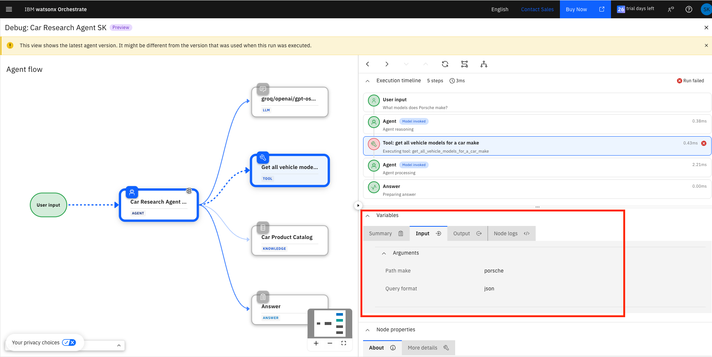

3. **Read the error.** Click on the **Output** tab on the failed step. You'll see two status codes — here's what each means:

   * **424** is what watsonx Orchestrate reports for the *tool node itself* ("Failed Dependency"). It just means "the tool I depend on failed" — it's the wrapper, not the root cause.
   * **404** ("Not Found") is the real signal. It's the status the **vehicle API** returned, and it means the server could not find anything at the address the tool requested.

   So look past the 424 and focus on the **404**: the agent's input was fine, but the address the tool called doesn't exist. The problem is *where* the tool is pointed.
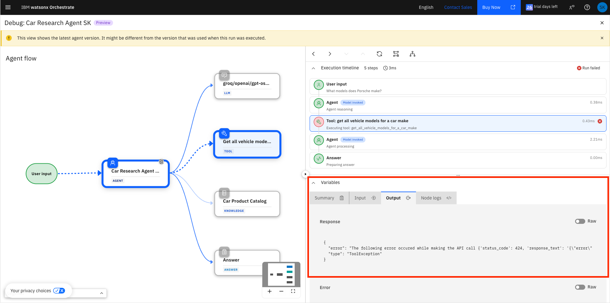
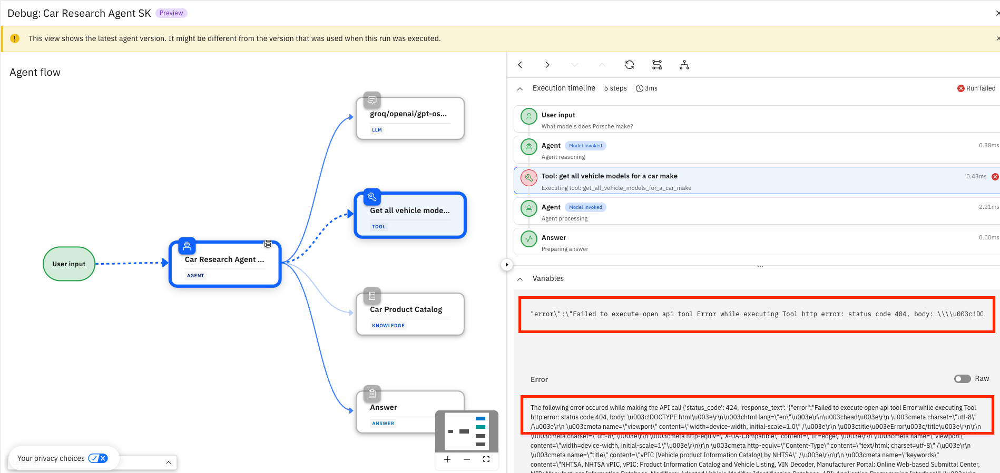

5. **Identify the target.** Click on Variables to close the tab and scroll down to **Node properties → About** (or **More details**). The **URL** field shows the address this tool is wired to call:
```
   https://vpic.nhtsa.dot.gov/api5
```

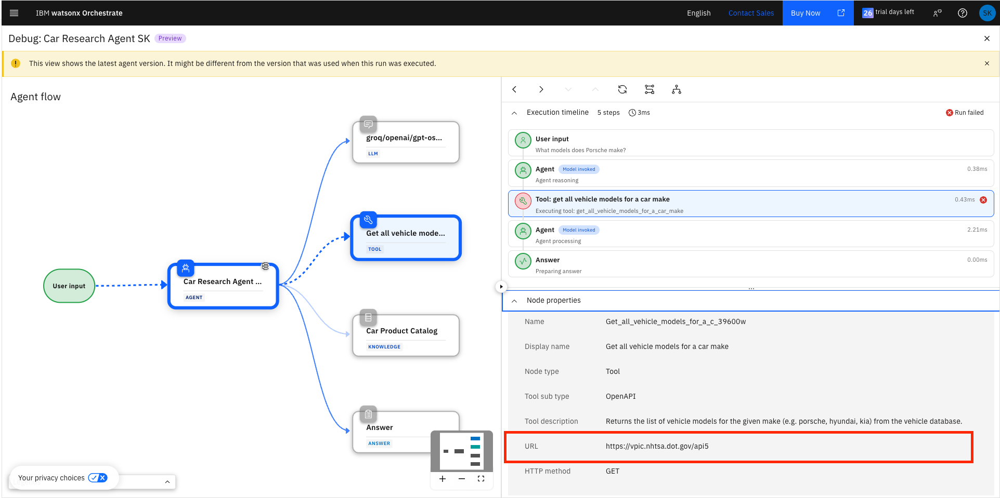

5. **Check against the documentation.** Check the API's documentation at https://vpic.nhtsa.dot.gov/api/. The documentation shows the real base URL is `/api` — but our tool is calling `/api5`, which doesn't exist. That mismatch is why the server returns a 404.

6. **Verify it yourself.** Paste the full failing URL into a new browser tab:

   ```
   https://vpic.nhtsa.dot.gov/api5/vehicles/getmodelsformake/porsche?format=json
   ```

   It returns a 404 / Not Found error page. Now change `api5` to `api` and try again:

   ```
   https://vpic.nhtsa.dot.gov/api/vehicles/getmodelsformake/porsche?format=json
   ```

   It returns JSON full of Porsche models. **Root cause confirmed:** the OpenAPI spec points at a base URL that doesn't exist. The spec file is syntactically valid — which is why it imported without errors — but it describes the wrong address. Validation can't catch this kind of bug; only a live call (and the debug trace) can.

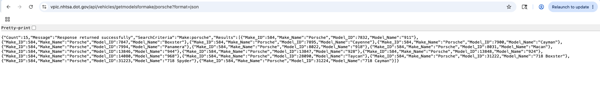
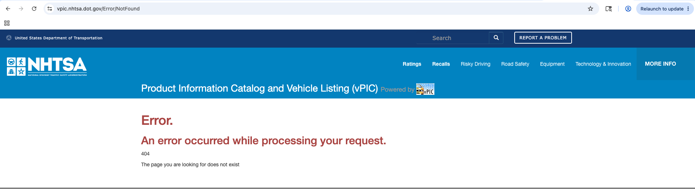

### Part 6: Fix the Tool

The fix is a corrected spec with the right base URL.

1. Download the [**vehicle_api_fixed.json**](sample-data/vehicle_api_fixed.json) file from the sample-data folder. It is identical to the broken spec except for one change: the server URL is `https://vpic.nhtsa.dot.gov/api` instead of `https://vpic.nhtsa.dot.gov/api5`.

2. In the agent's **Toolset**, click the **⋮** menu on the vehicle lineup tool and select **Remove**.

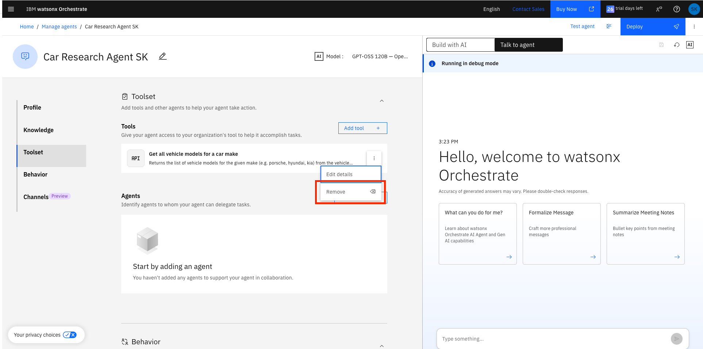
3. Click **Add tool +** → **OpenAPI** → upload `vehicle_api_fixed.json` → select **Get all vehicle models for a car make** → **Done**

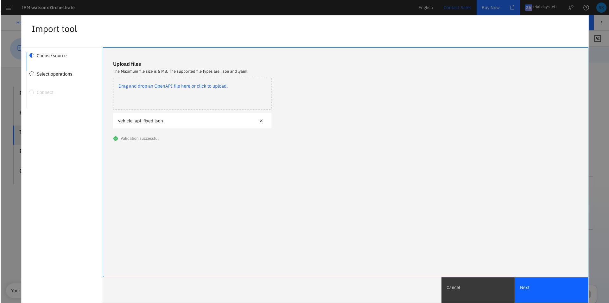
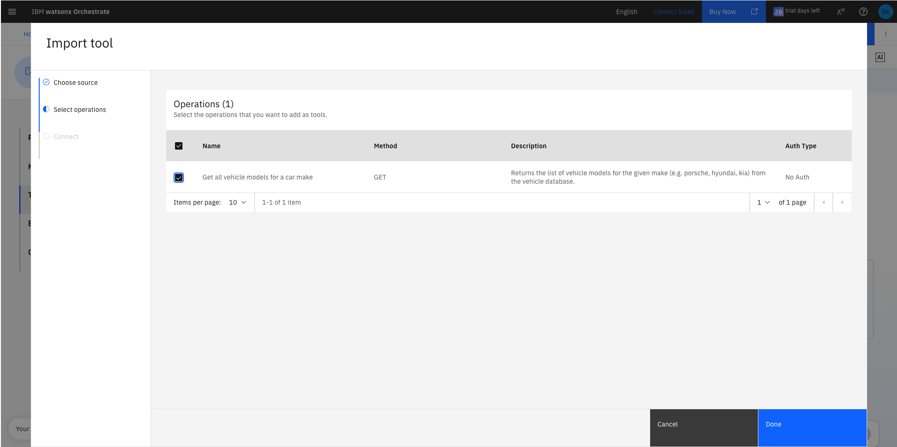
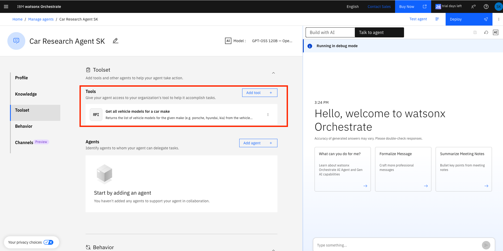


### Part 7: Verify the Fix

1. Start a **fresh chat** (↺ icon) and ask the same question:

   ```
   What models does Porsche make?
   ```

> [!Tip]
> Always re-test in a fresh chat. If the previous conversation is still open, the agent may answer from chat history instead of calling the tool.

2. The agent will now return the full list of models from the live API — **15 models**: 911, Boxster, Cayenne, Cayman, Panamera, 918, Macan, 944, 928, 924, 968, Taycan, 718 Boxster, 718 Spyder, 718 Cayman. (If you want to confirm the count, the raw API response includes a `"Count": 15` field.)

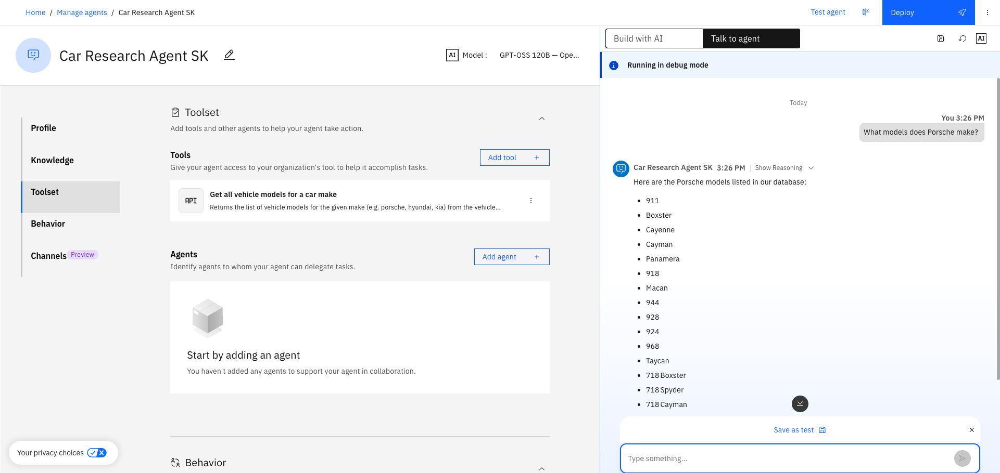

3. Optional: click the **debug icon** on this run. The execution timeline is now fully green, the tool step shows a ✓, and the **URL** under Node properties shows the corrected address ending in `/api`. Compare it side by side with the failed run from Part 5 for a clear before/after.

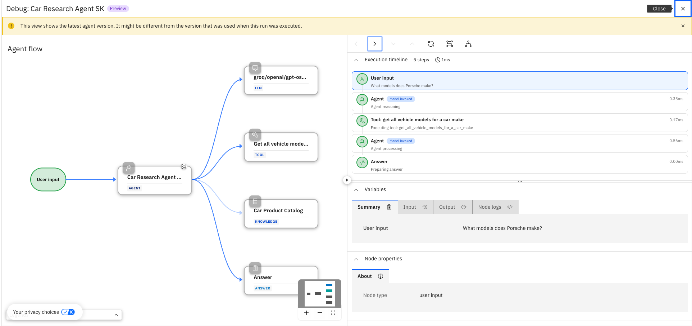

## What's next?
### 🎉 Congratulations!

You've successfully debugged and fixed a failing tool in watsonx Orchestrate using only the UI and the built-in debug view.

Now you should understand:
* How an OpenAPI spec becomes a tool, and why a valid spec can still produce a broken tool
* That agentic failures are isolated per step — green steps exonerate themselves, and the red step localizes the bug
* How to use the execution timeline, Input tab, Error details, and Node properties to trace a failure from symptom to root cause
* How to verify a diagnosis independently (browser test against the API documentation) before applying a fix
* Why grounding instructions matter: they make agents report tool failures instead of hallucinating answers

---

<div align="center">

**← [Previous: 👁️‍🗨️ PII Leakage](/labs/agentic/controls/README.md) &nbsp;&nbsp; | &nbsp;&nbsp; [Next: 🔎 Automatic Evaluation](/labs/agentic/lab_guides/5_automatic_evaluation.md) →**

</div>
