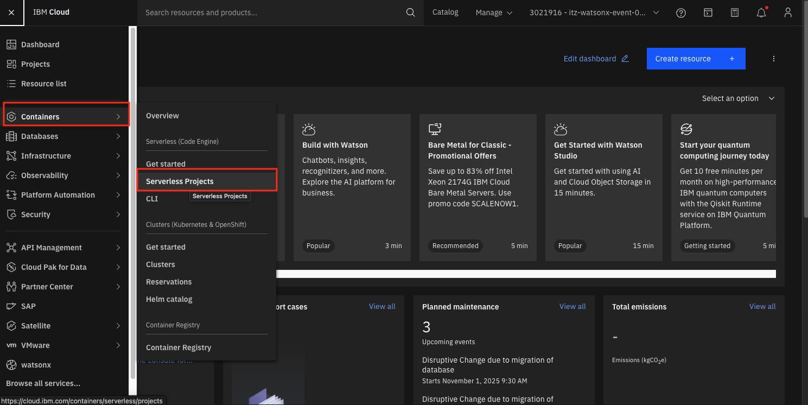
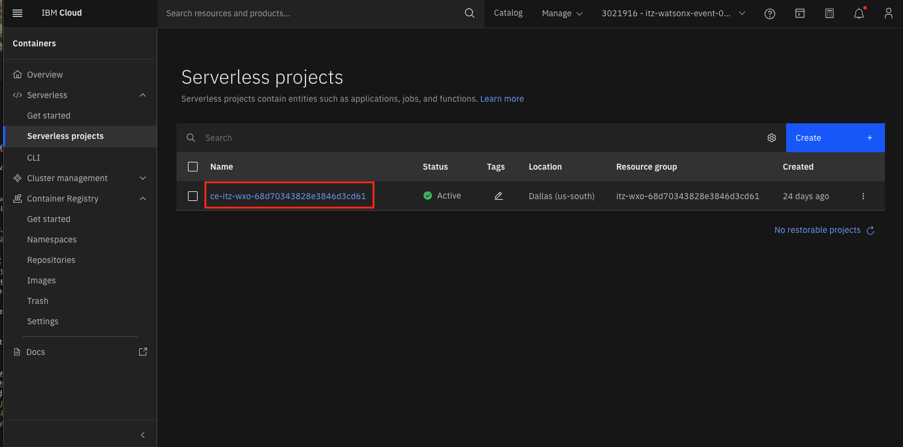
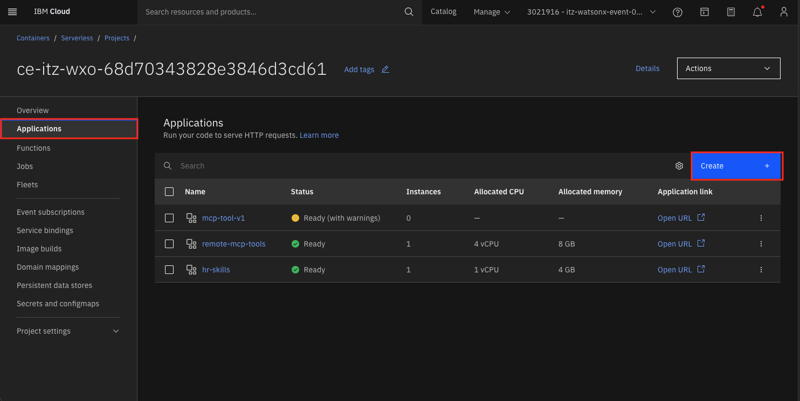
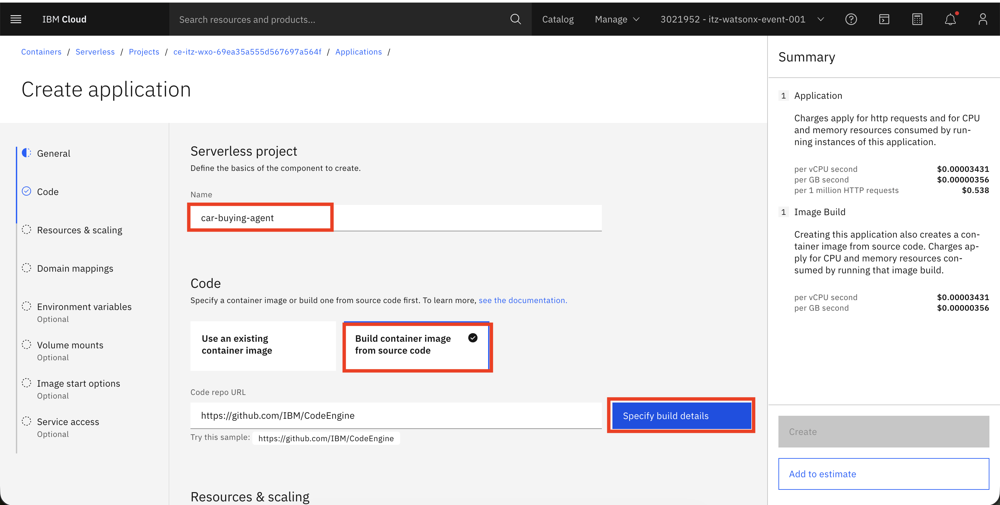
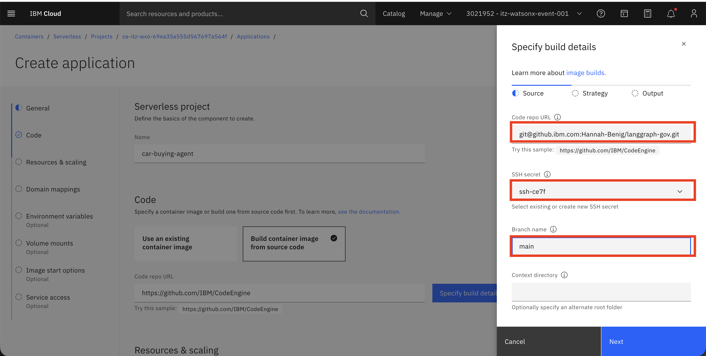
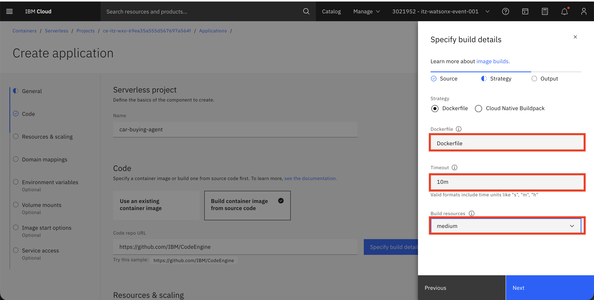
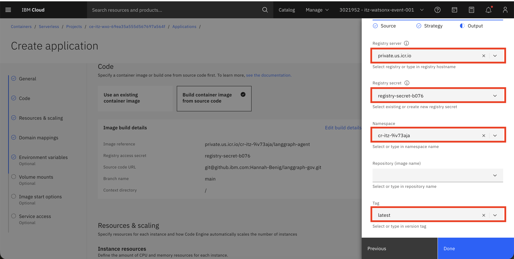
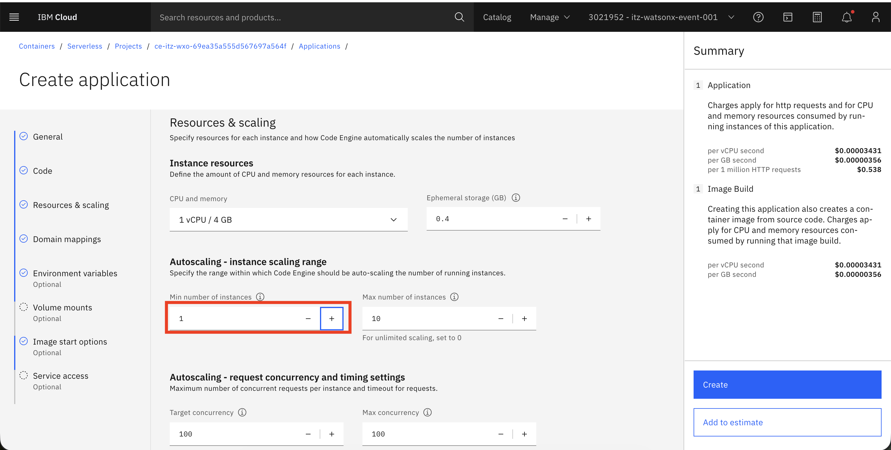
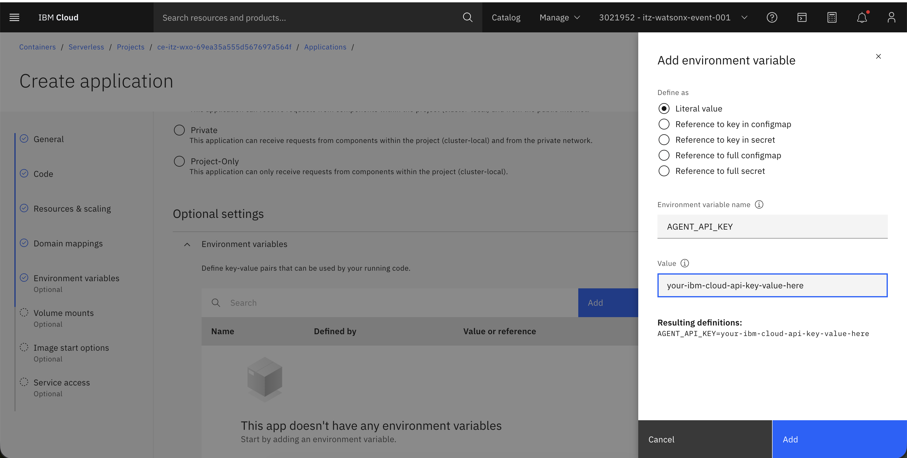
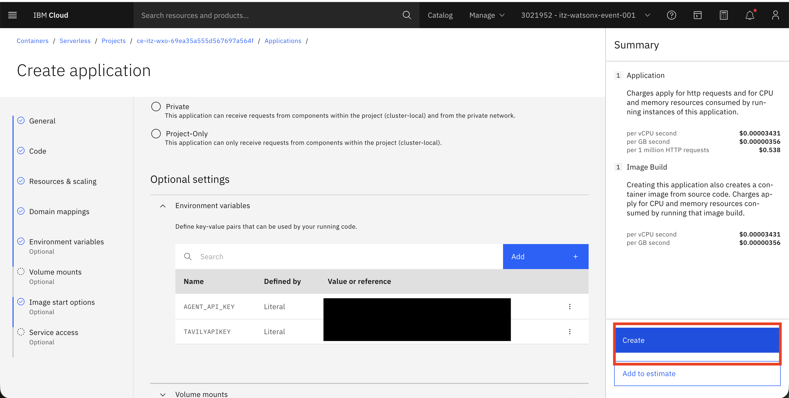

# Deploying the Car Buying Assistant manually

1. Navigate to [IBM Cloud](cloud.ibm.com). From the hamburger menu on top left, go to the **Containers --> Serverless Projects**

   

1. Choose the existing project if available. Otherwise, click on the **Create** button and provide the project name `car-buying-assistant` and click on the **Create** button to create the serverless project. Click on project name to open it.

   

1. Create the Registry and SSH secrets. For those steps go [here](https://github.ibm.com/skol/agentic-ai-client-bootcamp-instructors/blob/main/environment-setup/common/Readme.md)
   
1. Create the application by going back to project level, selecting **Applications** and clicking the **Create** button.
   
   
       
1. Enter the following values:
   - Name: `car-buying-agent`
   - Select the option `build container image from source code`
     
   Select **Specify build details**
   
   

   Add the following values on the **Source** panel:
   - Code Repo URL: `git@github.ibm.com:Hannah-Benig/langgraph-gov.git`
   - SSH secret: The name of the SSH secret you just created
   - Branch name: `main`

   

   Click **Next**
       
   

   Add the following values on the **Strategy** panel:
   - Timeout: `10m`
   - Build Resources: `M`
     
   Click **Next**
   
   
   
   
   Add the following values on the **Output** panel:

   - Registry server: `private.us.icr.io`
   - Registry secret: The name of the registry secret you just created.
   - Namespace: Should be pre-filled but if not, choose the namespace associated with your IBM Cloud account.
   - Tag: `latest`

   
     
   Click **Done**
    

1. Under the **Resources & scaling** section of the **Create Application** panel, set the following:

   - Min number of instances: `1`

   
   

1. You will need a IBM Cloud API Key and Tavily API Key for this deployment. 
 - To create an IBM Cloud API Key, follow the instructions  [here](apikey.md).
 - To create a Tavily API Key, create an account [here](https://app.tavily.com/home) f

Under **Optional settings**->**Environment variables** panel and click **Add** to add the following variables as `Reference to key in secret`:
   ```
   AGENT_API_KEY=<IBM Cloud API Key>
   TAVILYAPIKEY=<get from tavily.com>
   ```
   
   
   

   
1. Click **Create** to deploy.



1. Once it's deployed, you can get the Public url by going back to **Applications** and clicking the **Open URL** link next to the `car-buying-agent` application.

The link that you will give to attendees will be like: 
`https://car-buying-agent.20evj2i80qp0.us-south.codeengine.appdomain.cloud/v1/chat`

Replace the URL before `v1/chat` with the URL you got from the deployment.

## Testing the Deployment

Test the health endpoint:
```bash
curl https://<your-deployment-url>/health
```

Expected response:
```json
{"status": "healthy"}
```

Test the chat endpoint:
```bash
curl -X POST https://<your-deployment-url>/v1/chat \
  -H "Content-Type: application/json" \
  -H "x-api-key: 1234" \
  -d '{
    "message": "Tell me about the Toyota Camry 2024"
  }'
```

