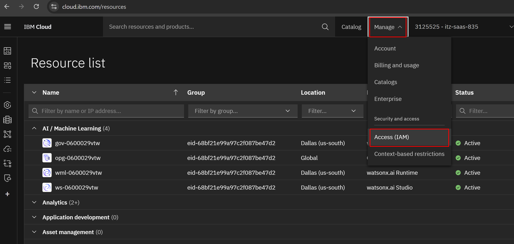

## Create an API key

To create an API Key, go to [IBM Cloud](https://cloud.ibm.com/) encuring that you are in the correct account (as you did above)

1. Click on the **Manage** menu, and then **Access (IAM)**  

2. Click on **API Keys** on the left menu, then click **Create** to generate a new API key.  

3. Enter a name and click **Create**  

4. Copy or download the API key. You will not be able to see it again, so it's important to save it at this point and copy it somewhere you can get to it!  
