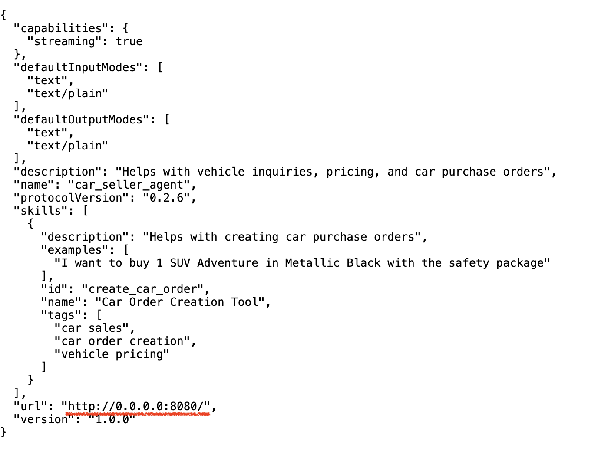
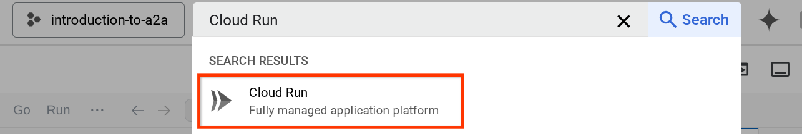
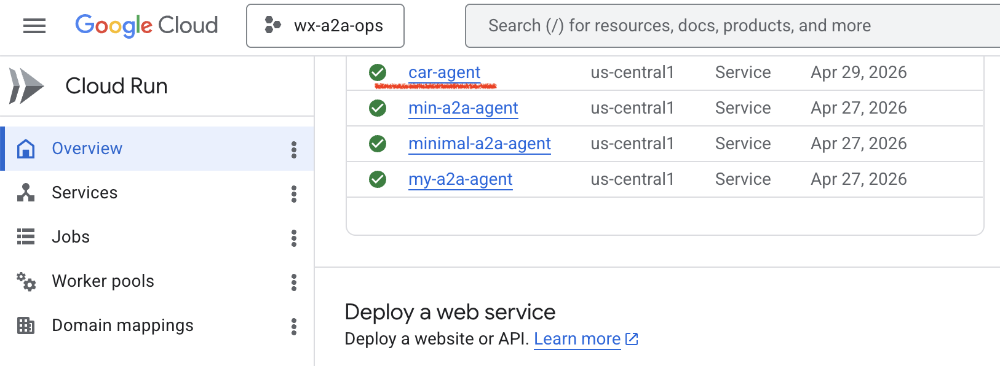
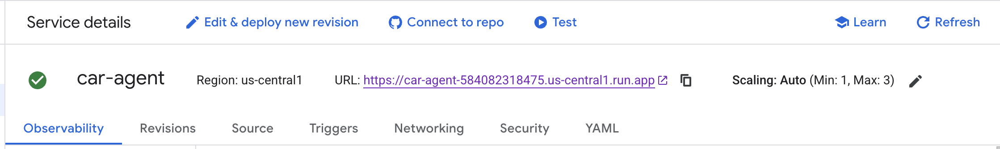
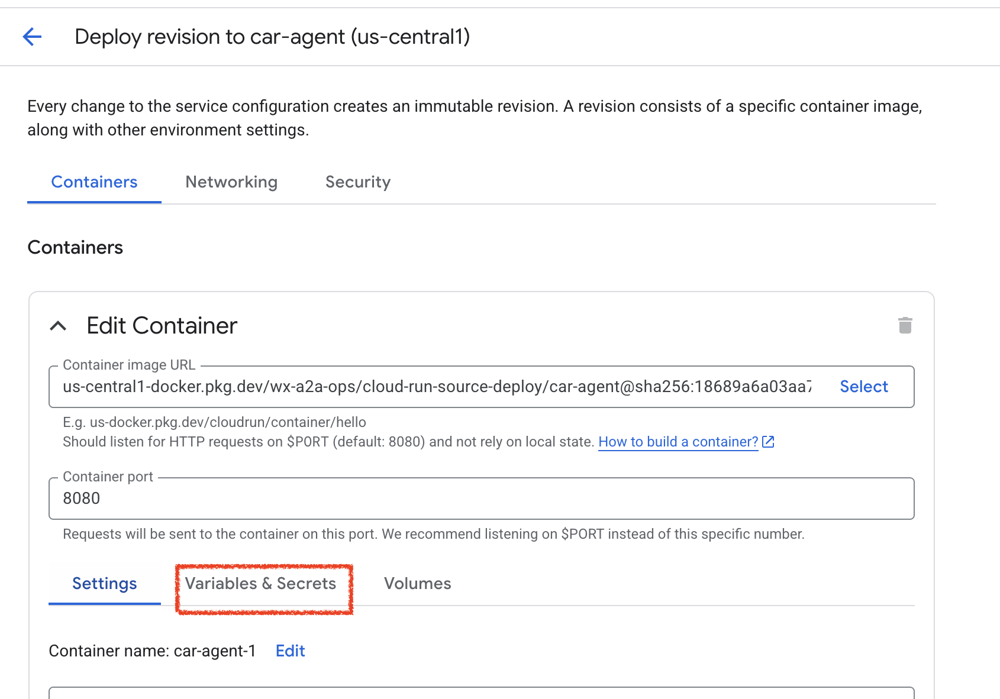
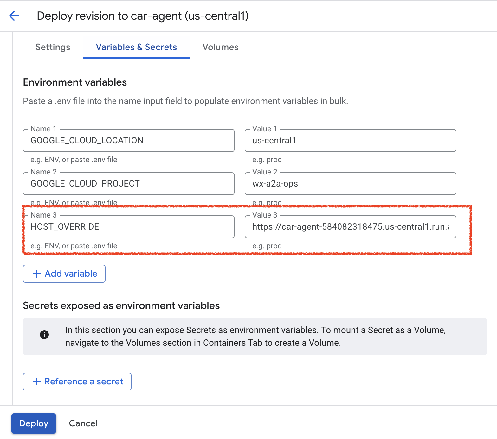
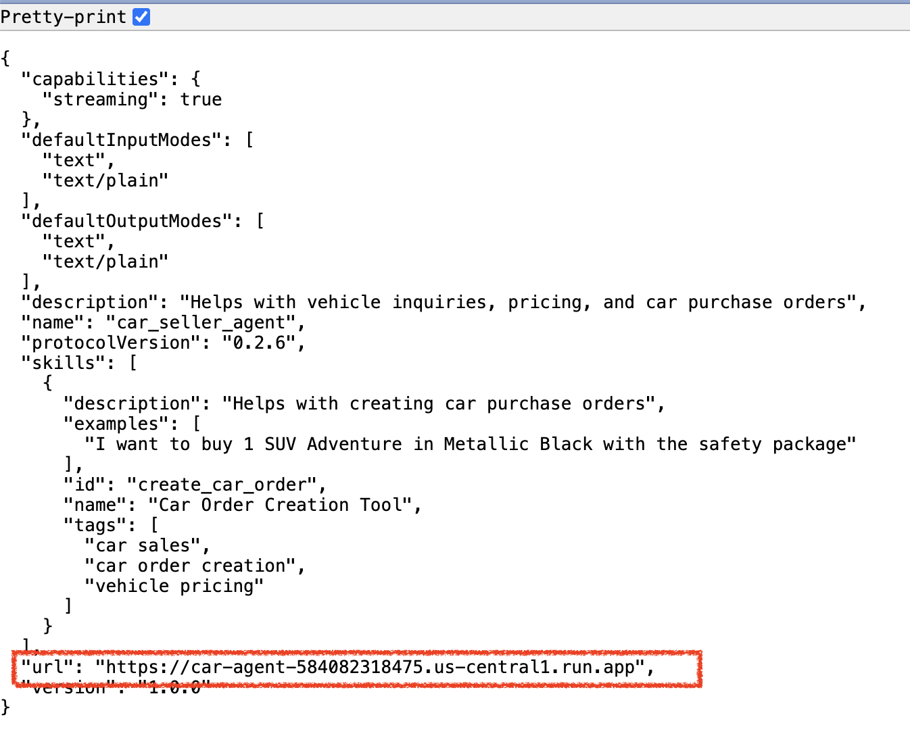

# Car Seller Agent A2A Demo 🚗

This demo shows how to enable A2A (Agent2Agent) protocol communication on car seller agent hosted in GCP, using the A2A Python SDK. In this demo example the car agent is built on top of LangGraph. This agent uses web search to find and provide car reviews, information, and recommendations about vehicles.

### Google Cloud (GCP) Free Trial ☁️
To provision a Google Cloud (GCP) Free Trial, you need to navigate to the official landing page and complete a quick three-step form using a valid Google account and a credit card for identity verification. The entire process takes less than five minutes and automatically grants you $300 in free credits valid for 90 days.

Here is the step-by-step process to set up your account:

🛠️ Provisioning Steps
1. Visit the Platform: Open an incognito browser window and navigate to the Google Cloud Homepage.
2. Initiate Sign-Up: Click on the "Get Started for Free" or "Start Free" button located in the top-right corner.
3. Log In: Sign in using your existing Google/Gmail account, or create a new one if you do not have one.
4. Select Country & Terms: On the first setup screen, select your country of residence, agree to the Terms of Service, and click Continue.
5. Set Account Type: Choose your account type (e.g., "Individual" for personal learning or "Business" if applicable).
6. Add Billing Information: Enter a valid credit card, debit card, or bank account info. Google will execute a temporary \$0.00 or \$1.00 pre-authorization to verify your identity and prevent fraud, which is reversed within 3 days.
7. Submit: Click "Start My Free Trial" to automatically jump into the Google Cloud Console dashboard.

## Prerequisites ✅
If you are executing this project from your local IDE, login to gcloud using the CLI with the following command:
```
gcloud auth application-default login
```
Enable the following APIs:
```
gcloud services enable aiplatform.googleapis.com 
```
Install uv dependencies and prepare the Python env:
```
curl -LsSf https://astral.sh/uv/install.sh | sh
uv python install 3.12
uv sync --frozen
```
## How to Run ▶️
First, we need to run the remote car seller agent.

Run the Car Seller Agent - Locally
Create a gcp_car_agent/.env file with the required environment variables. Substitute GOOGLE_CLOUD_PROJECT with your Google Cloud Project ID.
```
GOOGLE_CLOUD_LOCATION=us-central1
GOOGLE_CLOUD_PROJECT={your-project-id}
```
Run the car agent.
```
cd gcp_car_agent
uv sync --frozen
uv run .
```
It will run on http://localhost:10000 and you can check your agent card at http://localhost:10000/.well-known/agent.json

## Deployment 🚀
Deploy the Car Agent - Cloud Run
Run the following command
```
cd .. 
gcloud run deploy car-agent \
    --source gcp_car_agent \
    --port=8080 \
    --allow-unauthenticated \
    --min 1 \
    --region us-central1 \
    --update-env-vars GOOGLE_CLOUD_LOCATION=us-central1 \
    --update-env-vars GOOGLE_CLOUD_PROJECT={your-project-id}
```
If you are prompted that a container repository will be created for deploying from source, answer Y. After successful deployment it will show a log like this.

Service [car-agent] revision [car-agent-xxxxx-xxx] has been deployed and is serving 100 percent of traffic.
Service URL:
```https://car-agent-xxxxxxxxx.us-central1.run.app```
The xxxx part here will be a unique identifier when we deploy the service.

**Note:** On a newly created GCP project, the first deploy may fail with a 403 error because the Compute Engine default service account lacks required permissions. To fix this, grant the service account the `roles/storage.objectViewer` and `roles/cloudbuild.builds.builder` roles, then retry the deployment.

Open a new browser tab and go to
```https://car-agent-xxxxxxxxx.us-central1.run.app/.well-known/agent.json```
route of those deployed car agent services via browser. This is the URL to access the deployed A2A server agent card.

If successfully deployed, you will see the response like shown below in your browser when accessing the agent card



This is the car agent card information that should be accessible for discovery purposes.

Notice that the url value is still set at ```http://0.0.0.0:8080/``` here. This url value should be the main information for A2A Client to send messages from the outside world and it is not configured properly.

We need to update this value to the URL of our car agent service by adding an additional environment variable ```HOST_OVERRIDE```.

Updating the Car Agent URL Value on Agent Card via Environment Variable
To add ```HOST_OVERRIDE``` to car agent service, do the following steps

1. Search Cloud Run on search bar on top of your cloud console


2. Click on previously deployed 


3. Copy the car-agent-service URL, then click on the Edit and deploy new revision


4. Then, click on Variable & Secrets section


5. After that, click Add variable and set the ```HOST_OVERRIDE``` the value to the service URL (the one with ```https://car-agent-xxxxxxxxx.us-central1.run.app``` pattern )


6. Finally, click the deploy button to redeploy your service


When you access the car-seller agent card again in the browser ```https://car-agent-xxxxxxxxx.us-central1.run.app/.well-known/agent.json``` , the url value will already be properly configured