# Creating a Simple RAG Agent

## Overview

This lab guide introduces you to building your first AI agent using watsonx Orchestrate with Retrieval-Augmented Generation (RAG). You'll create a car sales assistant that can answer questions about vehicles in your company's catalog by combining the power of large language models with a knowledge base of product information. This foundational lab teaches you the core concepts of agent creation, knowledge integration, and behavior configuration.

---

## Table of Contents

- [Part 1: Connect to watsonx Orchestrate](#part-1-connect-to-watsonx-orchestrate)
- [Part 2: Create Car Research Agent with Knowledge Base](#part-2-create-car-research-agent-with-knowledge-base)

---

# Creating a Simple RAG Agent

### Part 1: Connect to watsonx Orchestrate

1. Log in to IBM Cloud (cloud.ibm.com). Navigate to the top-left hamburger menu, then to **Resource List**. Open the **AI/Machine Learning** section. You should see a **watsonx Orchestrate** service. Click to open it.

   

2. Click the **Launch watsonx Orchestrate** button:

   

### Part 2: Create Car Research Agent with Knowledge Base

This agent will answer questions about cars in your company's catalog using RAG (Retrieval Augmented Generation).

1. Go to the watsonx Orchestrate home page, click on the hamburger menu (☰), select **Build**.

   

2. Click on the **Create agent** button.

   

   Click on the **Create from scratch** button.

   

3. Select **Create from scratch**, add the following information:
   
   **Name**:
   ```
   Car Research Agent
   ```
   
   **Description**:
   ```
   This agent answers questions only about cars in our catalog using the uploaded knowledge base. It provides specifications, pricing, features, and comparisons for vehicles in our inventory, and it should not answer questions about vehicles we do not sell.
   ```

   Click on **Create** button.

   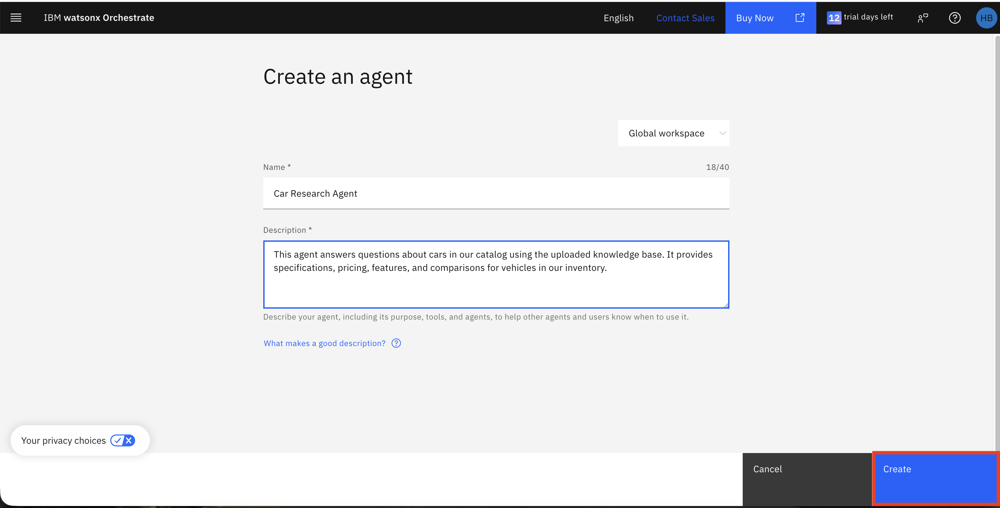

4. In the **Knowledge Source** section, click on the **Choose knowledge** button.

   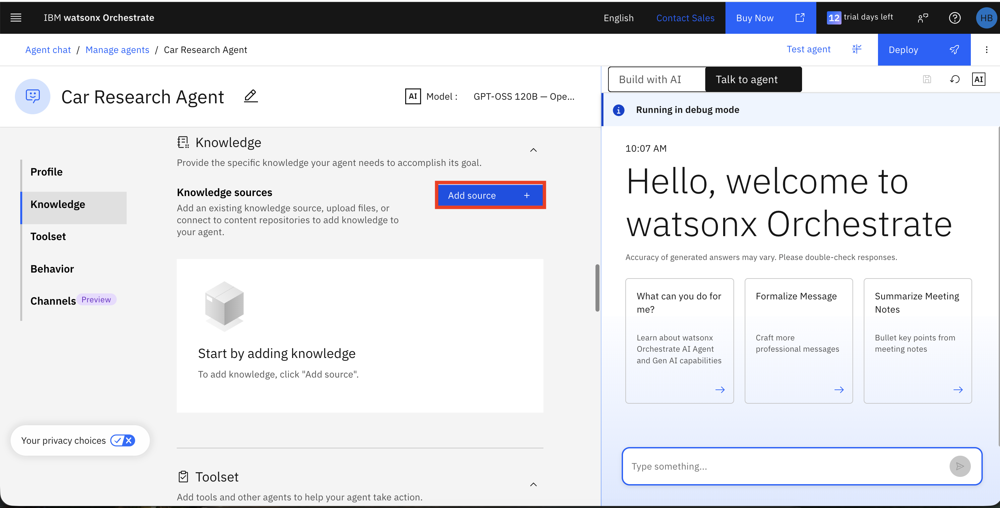

5. After clicking the **Choose knowledge** button, a pop-up window will appear. Select **Add Source** , **Upload files**, then click **Next**.

   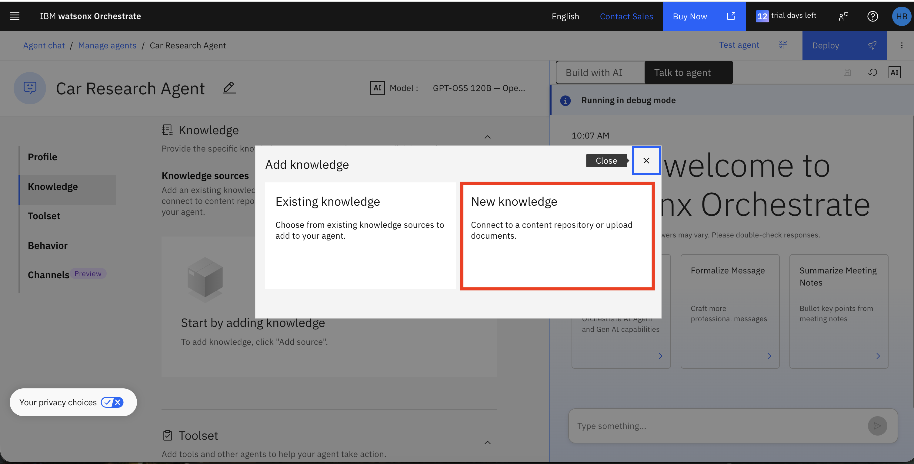

   

6. Upload the provided [Catalog_with_prices_clean.pdf](../agentic-monitoring/sample-data/Catalog_with_prices_clean.pdf) document and click the **Next** button.

   

7. Add the name and description below and then click **Save**.

   **Name:**

   ```
   Car Product Catalog
   ```
   
   **Description:**
   ```
   This knowledge document contains our car catalog with specifications, pricing, features, and warranty information for various vehicle models.
   ```

   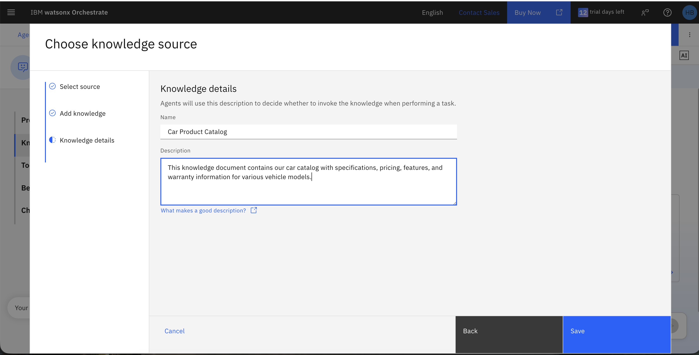

8. After completing all the above steps, your knowledge source will be added and will appear as shown in the image below.

   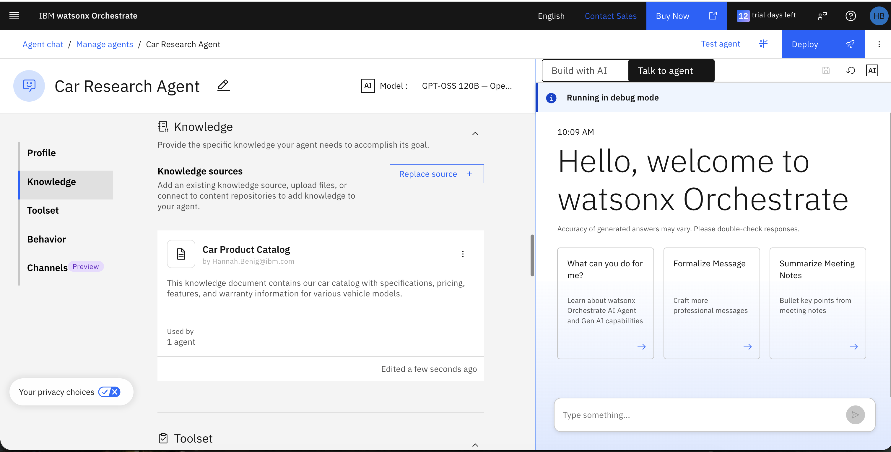

9. Click on the three dots on the top right of the **Car Product Catalog**, select **Edit details**button, and click the **Edit knowledge settings** button and change the **Response** to **Dynamic** and the **Maximum Search Results** to 10, then click the **Save** button.

   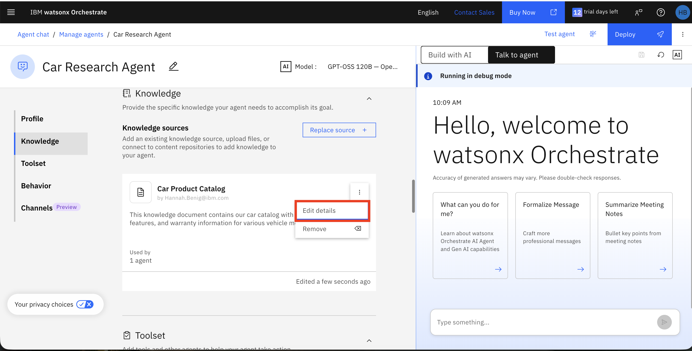
   
   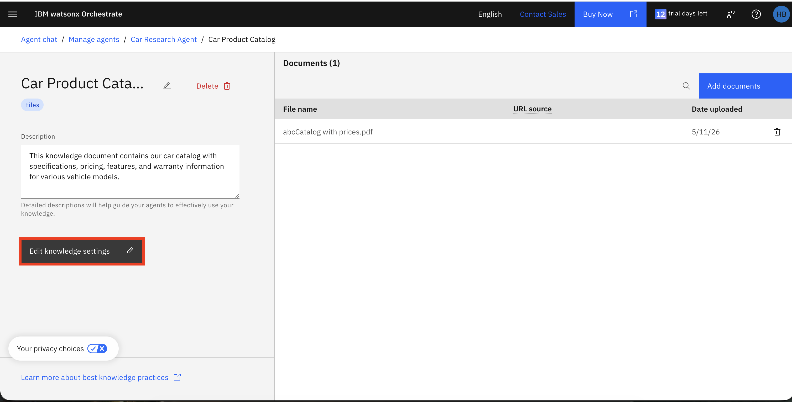


   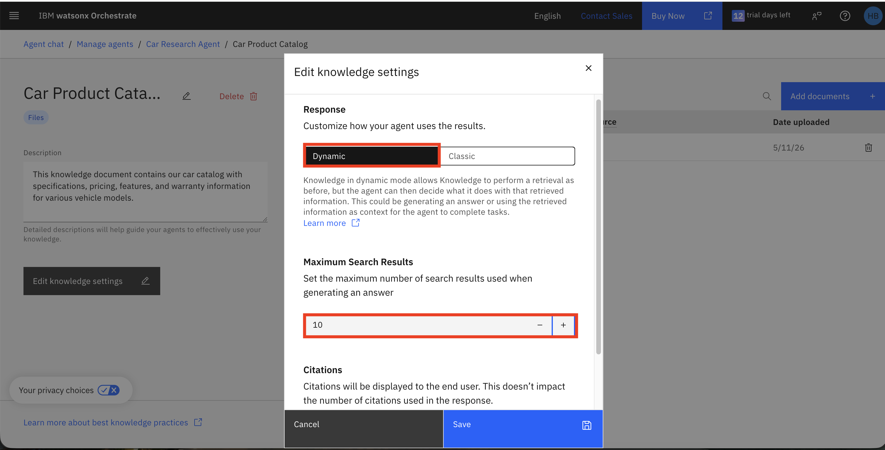

10. In the **Behavior** section, add the following to the **Instructions** text field:

    ```
    You are a car sales assistant with access to our complete vehicle catalog. You may answer questions only about cars that are in our catalog.

    1. For specification queries about cars in the catalog: Provide detailed, accurate information from the knowledge base. Include exact specifications, pricing, and features.

    2. For comparison queries about cars in the catalog: Create a comprehensive side-by-side comparison table. Each feature (engine, fuel economy, safety features, dimensions, etc.) should be a separate row. Do not group features together.

    3. For product listings: Present all available vehicles in the requested category with key specifications and pricing, but only from our catalog.

    4. If the user asks about a vehicle that is not in our catalog, respond with:
    "I'm sorry, our dealership does not sell that car, so I can't provide information on that vehicle."

    5. If information about a catalog vehicle is missing from the knowledge base, respond with:
    "I don't have that information in our current catalog. For the most up-to-date details, please contact our sales team or check our website."

    Always be specific, accurate, and helpful. Do not speculate or answer about vehicles outside the catalog. Use tables for comparisons to make information easy to read.
    ```

    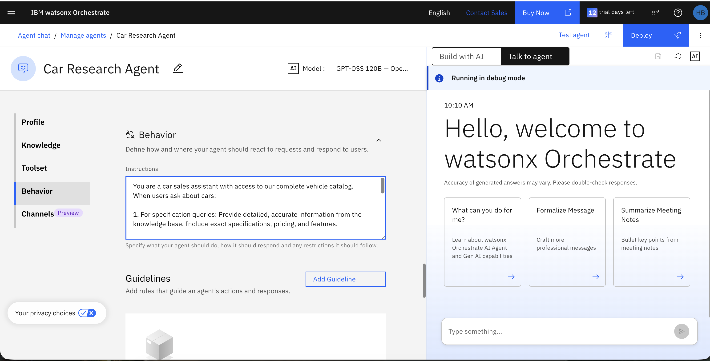

11. Now test your agent. Try these queries in the **Preview** window:

    ```
    Show me all the sedans in your catalog
    ```

    ```
    Give me the specifications of the Nissan Versa 2024
    ```

    ```
    Compare the Honda CR-V and Toyota RAV4
    ```

    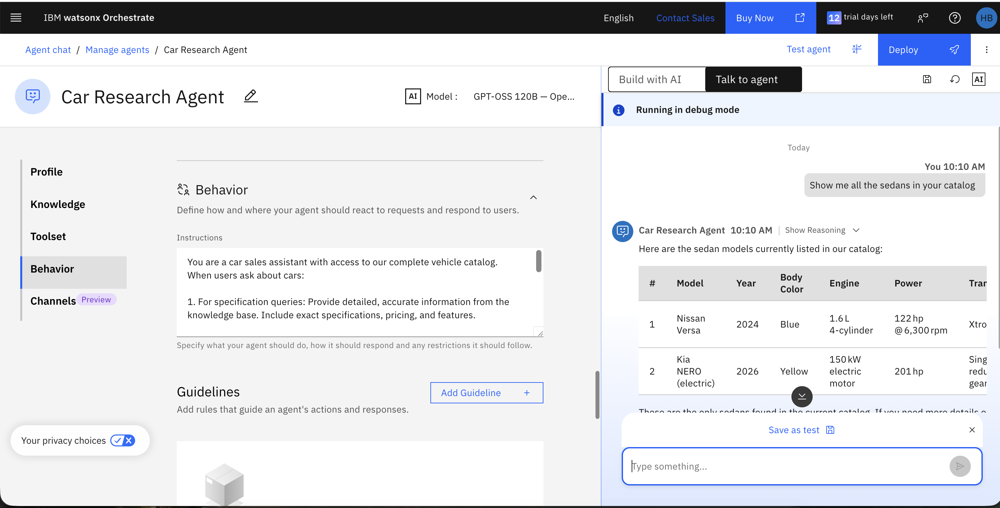
    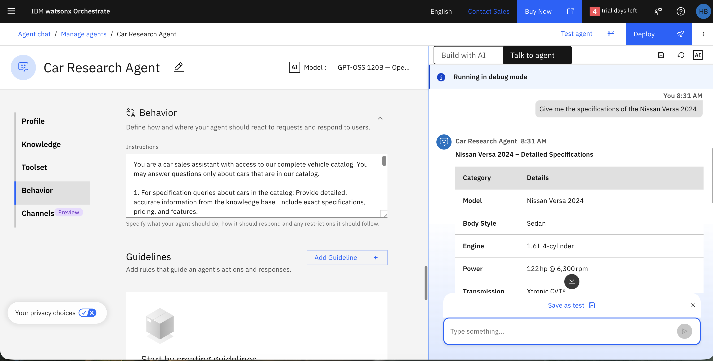
    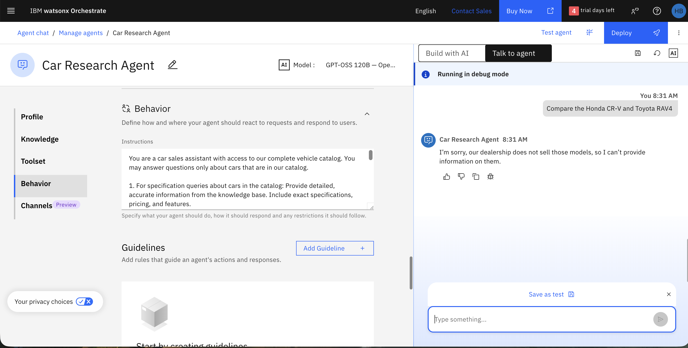
