# 🤖 Importing External Agents

## 🔎 Overview

Agents might live in different platforms. In this lab, you will learn how to control and govern agents living anywhere with watsonx Orchestrate. You'll learn how to connect a third-party LangGraph agent that performs Web searches, create a master orchestrator agent to intelligently route queries, and test the complete multi-agent system. 

## Table of Contents

- [Part 1: Connect a third-Party Web search agent](#part-1-connect-third-party-web-search-agent)
- [Part 2: Create the Car Dealership Agent](#part-2-create-master-car-buying-agent)
- [Part 3: Test your agentic system](#part-3-test-your-agents)
---

## 📤 Importing an external agent

### Part 1: Connect Third-Party Web Search Agent

Your instructor has already deployed a LangGraph agent for you to import. Now we'll connect the external LangGraph agent that performs web searches for car information, reviews, and market data.

> [!TIP]
> This agent uses the Agent-to-Agent (A2A) protocol to communicate with watsonx Orchestrate. 

1. Click on the **Manage Agents** link in the breadcrumb menu at top left.

2. Click the **Create agent** button.

   

3. Select **Create from scratch**.
   
   **Name**:
   ```
   Web Search Agent
   ```
   
   **Description**:
   ```
   This agent searches the web for real-time information such as user reviews, ratings, and market comparisons, but only for cars that are in our catalog. It should not provide information for vehicles not sold by our dealership.
   ```

   Click on **Create** button.

   

4. In the **Agents** section, click on the **Add agent** button.

   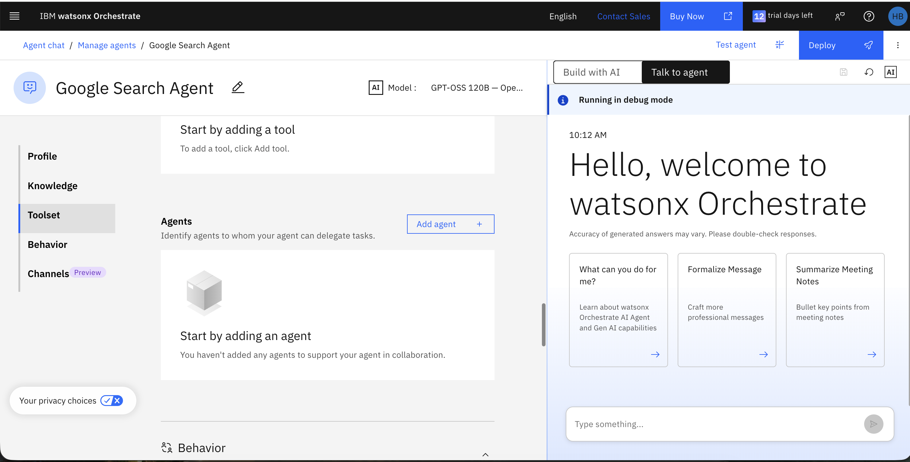

5. Click **Import** then **Add from external source**.

   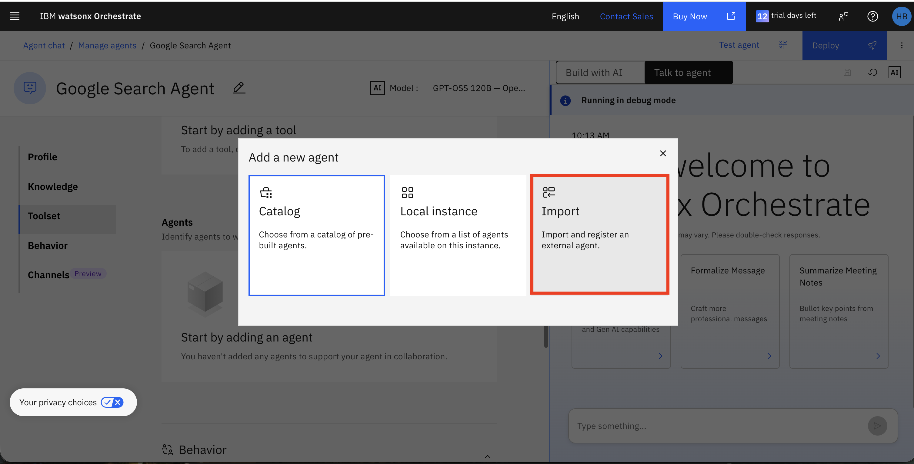

   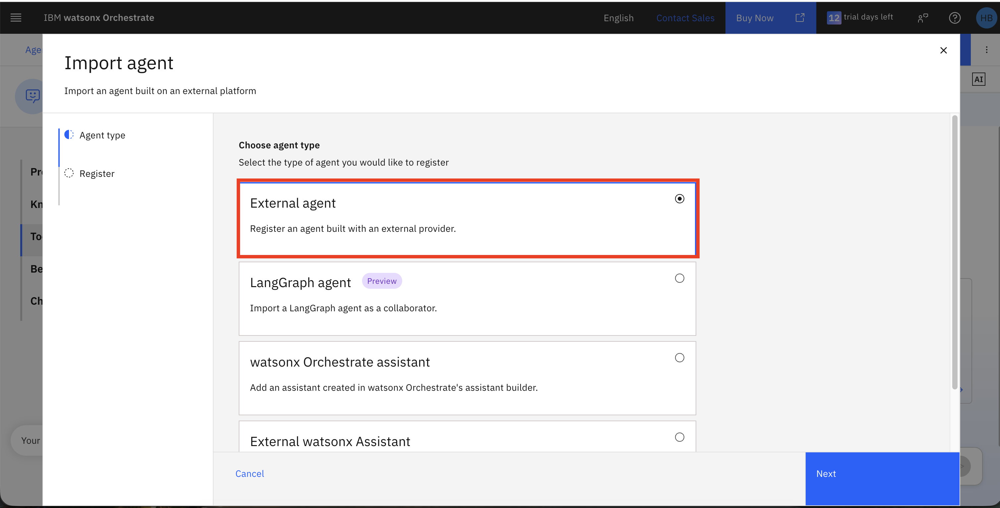

6. Select **External agent via A2A standard**.

7. Fill in the connection details provided by your instructor:

   **Endpoint URL**: (Provided by your instructor instructor)

   **Authentication type**: Select **API Key**

   **API Key Value**: (Provided by your instructor)

> [!Note]
> Instructors must complete the instructor guide to provide participants with the Agent Endpoint URL and the API Key, which is required for the this lab.

   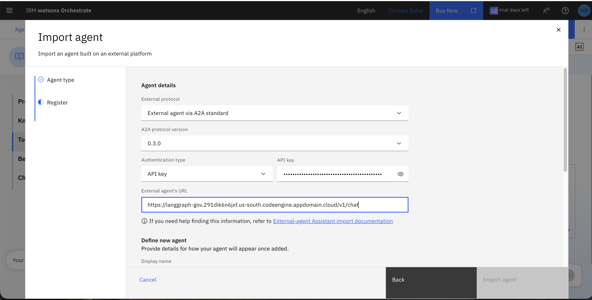

   Scroll down to the **Define new agent** section and fill in the details:  

   **Name**:
   ``` 
   Web Search Agent
   ```

   **Description**:
   ```
   This agent connects to the Tavily service to perform a web search and return the top results.
   ```

   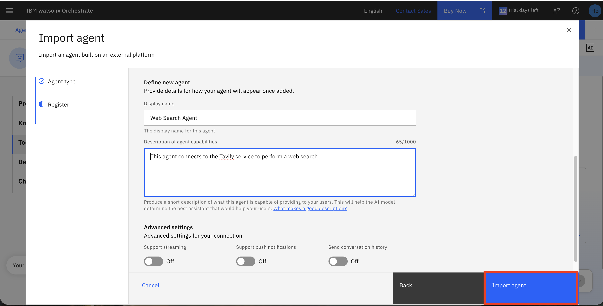

   Then click on **Import Agent**

9. In the **Behavior** section, add the following instructions:

    ```
    You are a car research specialist with access to real-time web Search. You may use web Search only for cars that are in our catalog.

    1. User reviews and ratings for cars in our catalog: Search for owner experiences, common complaints, and satisfaction ratings.

    2. Market comparisons for cars in our catalog: Find competitive information and industry reviews when the question is about one of our catalog vehicles.

    3. Latest information for cars in our catalog: Search for recent news, recalls, or updates about specific catalog models.

    4. The vehicles in the catalog are: Nissan Versa, Hyundai Kona Electric, Alfa Romeo Spider, Porsche 911 Carrera GTS, and Kia Nero. If the user asks about a vehicle that is not in our catalog, do not search the web. Respond with:
    "I'm sorry, our dealership does not sell that car, so I can't provide information on that vehicle."

    Always provide the source URLs for the information you find. Format search results clearly with:
    - Title of the source
    - Key information or summary
    - Source URL

    If search returns no results for a catalog vehicle, inform the user and suggest alternative search terms.
    ```

    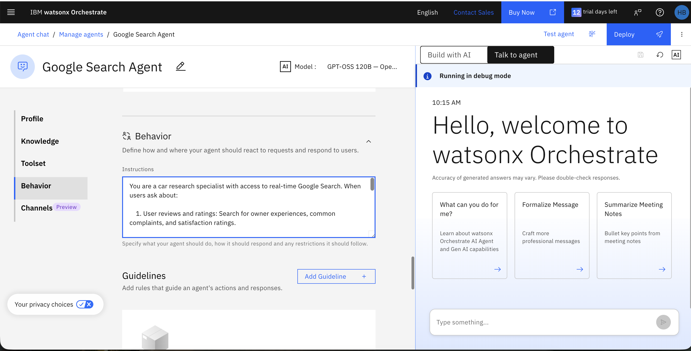

10. Test the agent with these queries:

    ```
    What do owners say about the Porsche 911?
    ```

    ```
    Find user reviews for the Toyota Camry
    ```

    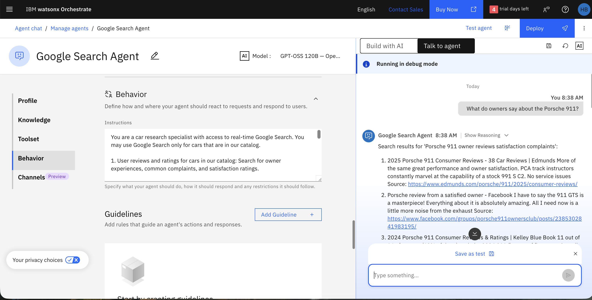
    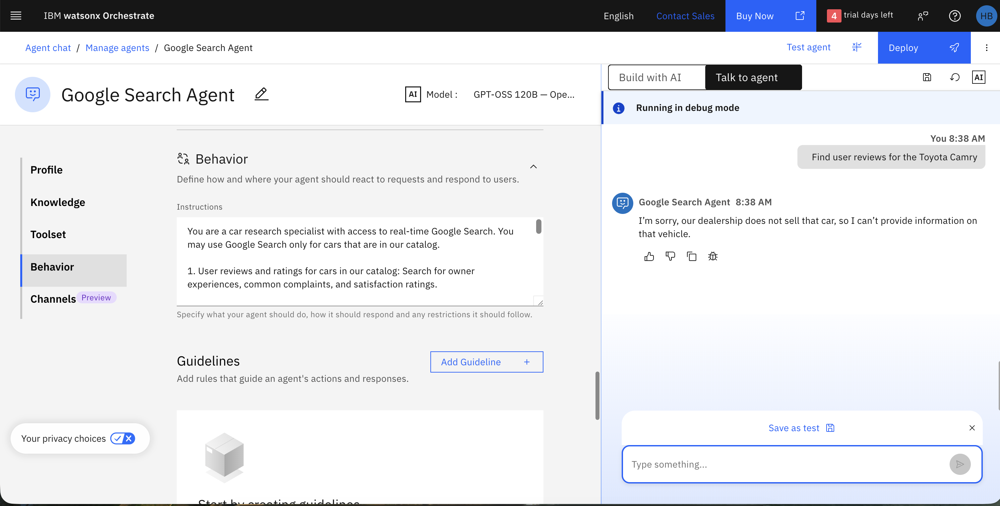


### Part 2: Create Master Car Buying Agent

Now we'll create an orchestrator agent that intelligently routes queries to the appropriate specialized agent.

1. Click on **Manage Agents** and then **Create agent**.

   

   Click on the **Create from scratch** button.

   


2. Enter the following details

   **Name**:
   ```
   Master Car Buying Agent
   ```
   
   **Description**:
   ```
   Intelligent car buying assistant that routes queries to specialized agents. Provides comprehensive information from both our catalog and external market research.
   ```

   Click on **Create** button.

   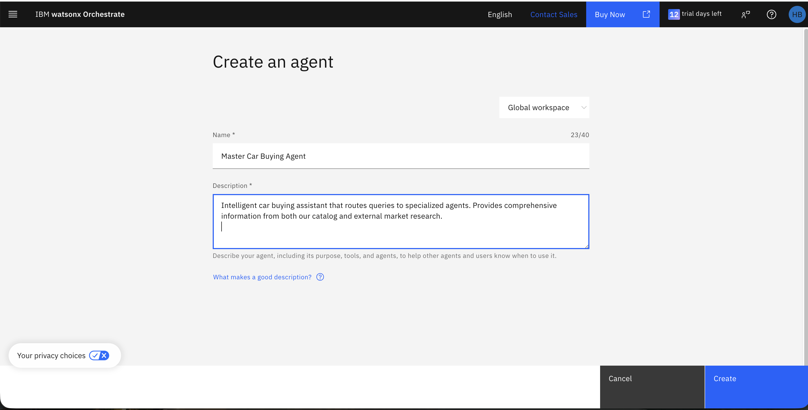

3. In the **Agents** section, click on the **Add agent** button.

   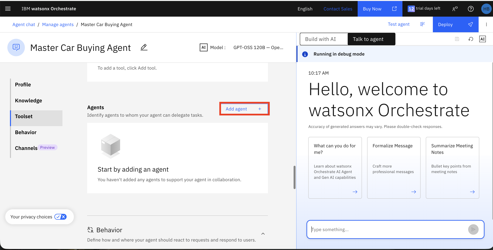

4. Click **Add from local instance**.

   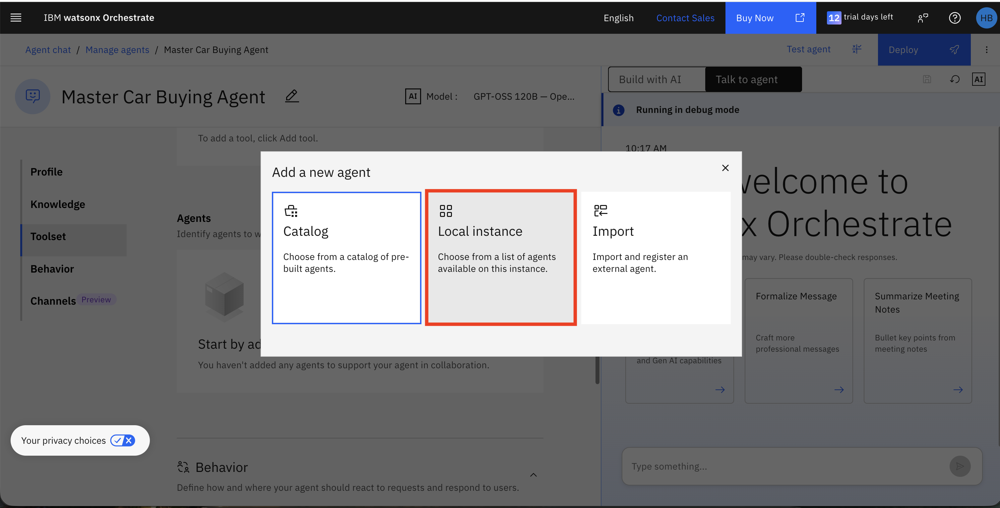

5. Select both **Car Research Agent** (that you created in the [data poisoning lab](../data-poisoning/README.md))
and the **web Search Agent** you just created, then click **Add to Agent**.

   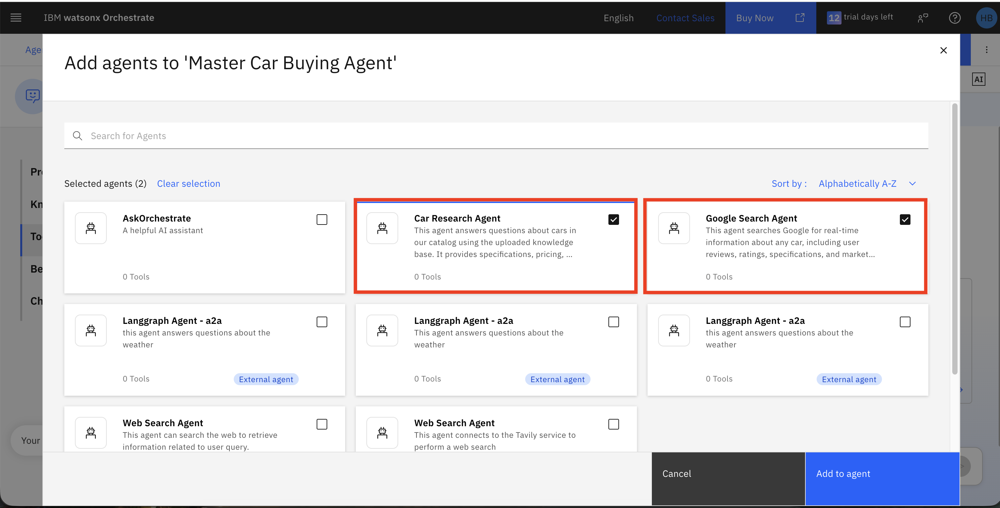

6. In the **Behavior** section, add the following routing logic:

    ```
    You are the Master Car Buying Assistant. Your role is to route user queries to the appropriate specialized agent and synthesize responses. 

    ROUTING RULES:

    1. CATALOG QUERIES → Car Research Agent
       - "Show me your sedans/SUVs/trucks"
       - "What's the price of [car in catalog]?"
       - "Compare [catalog car] and [catalog car]"
       - "Give me specifications for [catalog car]"
       - Any query about cars in our inventory

    2. EXTERNAL RESEARCH → web Search Agent
       - "What do owners say about [catalog car]?"
       - "Find reviews for [catalog car]"
       - "Are there any recent recalls for [catalog car]?"
       - "What are reviewers saying about [catalog car]?"
       - Any query requiring market research or user reviews for a car in our catalog

    3. HYBRID QUERIES → Both Agents
       - "How does [our catalog car] compare to market leaders?"
       - "What do reviewers say about [our catalog car], and what are its specs?"
       - First get catalog info, then get market research for that same catalog car, then synthesize

    4. NON-CATALOG CARS → Do not use web Search Agent
       - If the user asks about a car that is not in our catalog, do not answer with generated details and do not search the web.
       - Respond with: "I'm sorry, our dealership does not sell that car, so I can't provide information on that vehicle."

    RESPONSE GUIDELINES:
    - The vehicles in the catalog are: Nissan Versa, Hyundai Kona Electric, Alfa Romeo Spider, Porsche 911 Carrera GTS, and Kia Nero.
    - Always determine whether the vehicle is in our catalog before routing
    - Only use Car Research Agent and web Search Agent for cars in our catalog
    - Always identify which agent(s) you're using
    - For comparisons, create clear tables with all relevant features
    - Cite sources for external information
    - If a query is ambiguous, ask for clarification
    - Do not speculate about vehicles outside our catalog
    - Provide comprehensive, helpful responses for supported vehicles
    

    
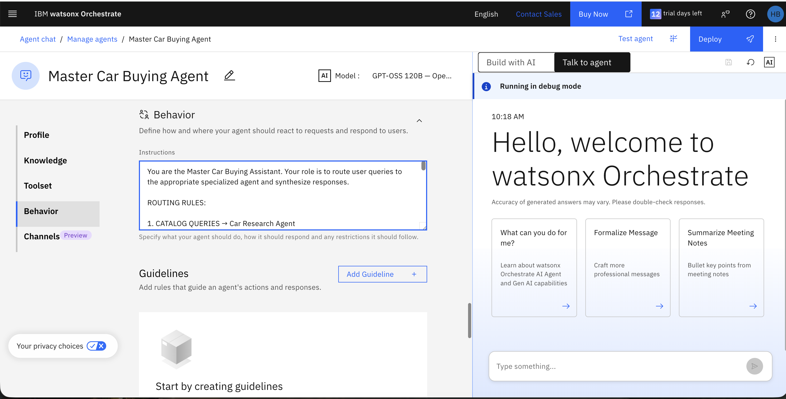

7. Test the master agent with various queries:


    ```
    Compare the Kia Nero with the Hyundai Kona Electric
    ```

    ```
    Are owner reviews more positive for the Alfa Romeo Spider or the Porsche 911?
    ```

    ```
    Show me user reviews for the Tesla Model Y
    ```


    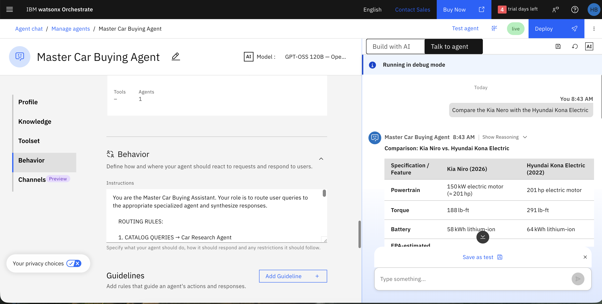
    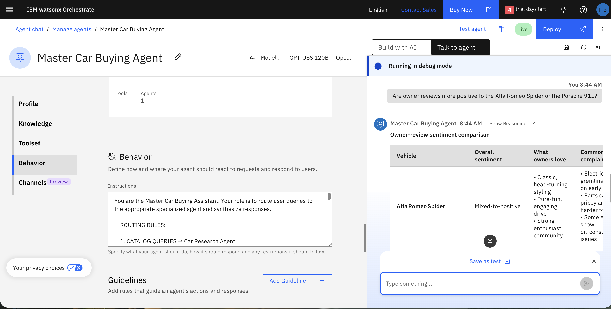
    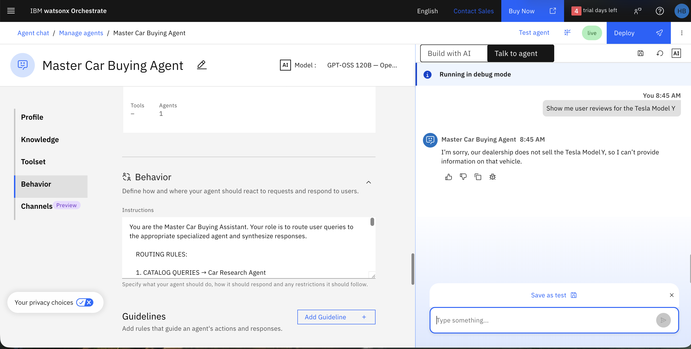


8. Click **Deploy** to make the agent live.

    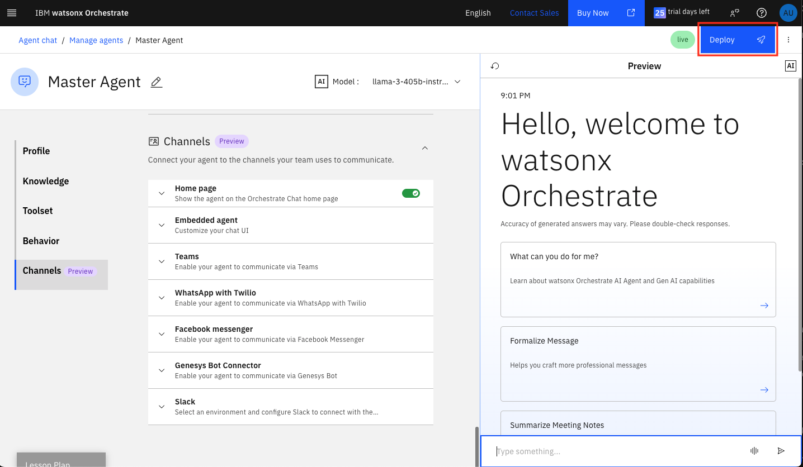
    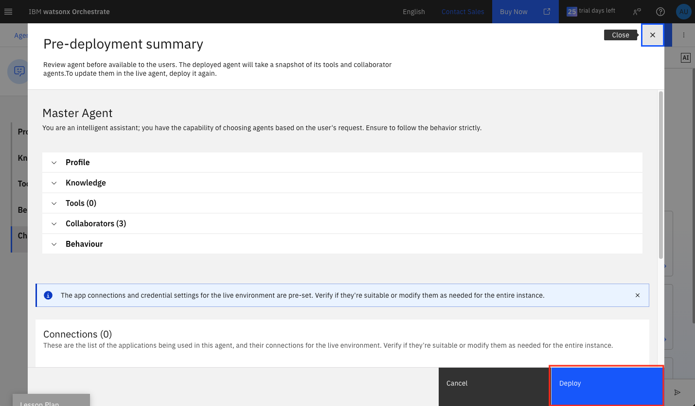

    Your agent is now **Live**!

9. Click **Activate agent monitoring** when prompted.

    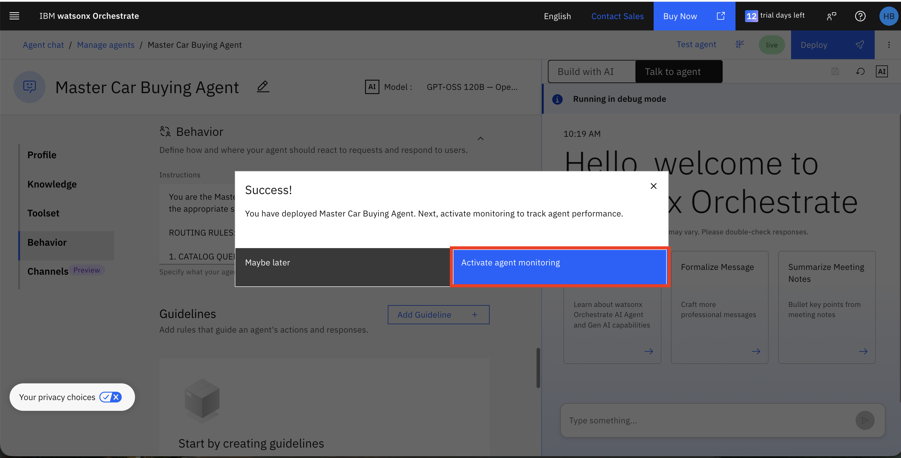

### Part 3: Test Your Agents

Now let's test the complete system through the chat interface.

1. Click on **IBM watsonx Orchestrate** on the top left of your window.


2. Select the **Master Car Buying Agent** from the dropdown menu.

   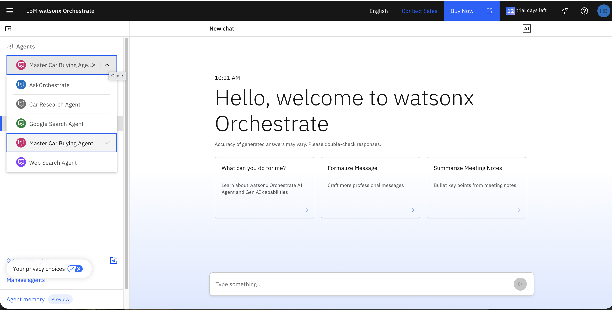

3. Try these comprehensive test scenarios:

   **Scenario 1: Catalog Research**
   ```
   Show me all the electric vehicles in your catalog
   ```
   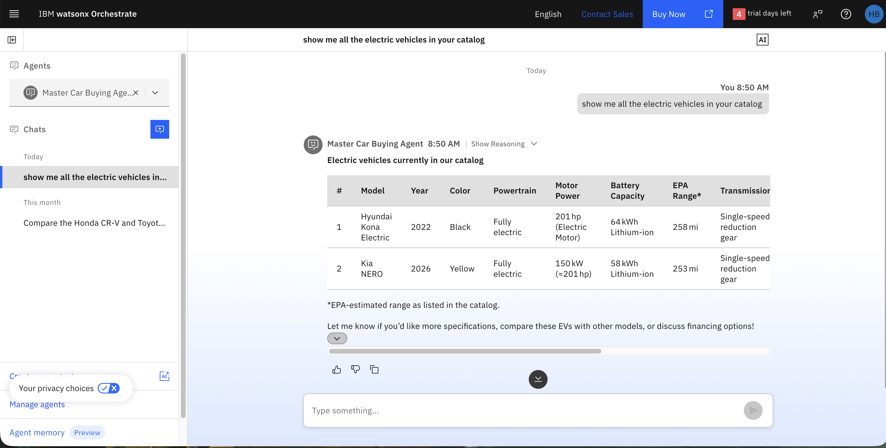

   **Scenario 2: External Research**
   ```
   What do owners say about the Nissan Versa?
   ```
   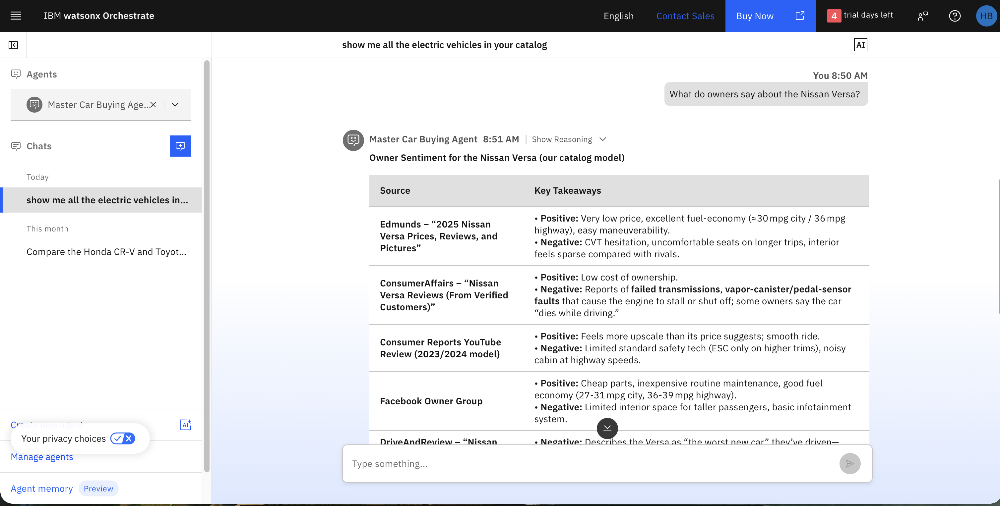
   
   ```

   What do owners say about the BMW X5 2024?
   ```

   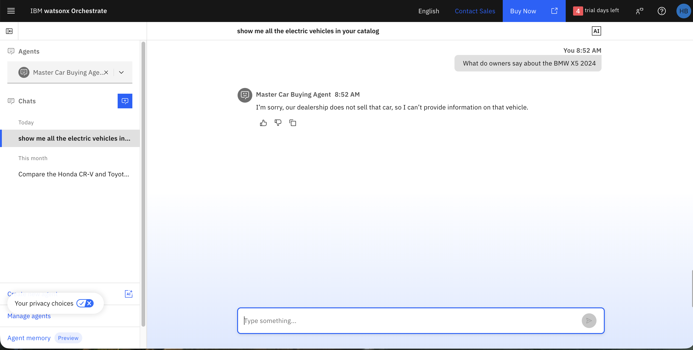


   **Scenario 3: Hybrid Catalog + Review Query**
   ```
   What do reviewers say about the Porsche 911, and what are its key specs?
   ```
   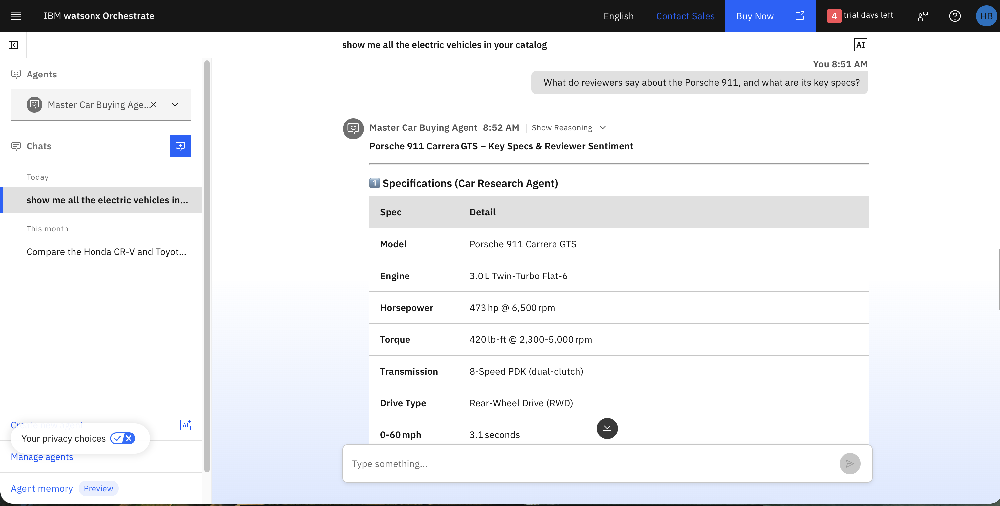

   **Scenario 4: Complex Query**
   ```
   I'm looking for a family SUV under $40,000 with good fuel economy. What do you recommend from your catalog, and how do they compare to market leaders?
   ```
   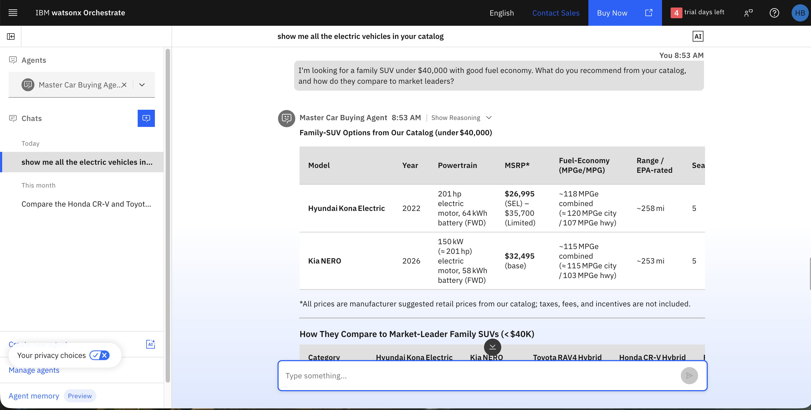

---

<div align="center">

**← [Previous: 🤢 Data Poisoning](/labs/agentic/data-poisoning/README.md) &nbsp;&nbsp; | &nbsp;&nbsp; [Next: 👁️‍🗨 PII Leakage](/labs/agentic/controls/README.md) →**

</div>
