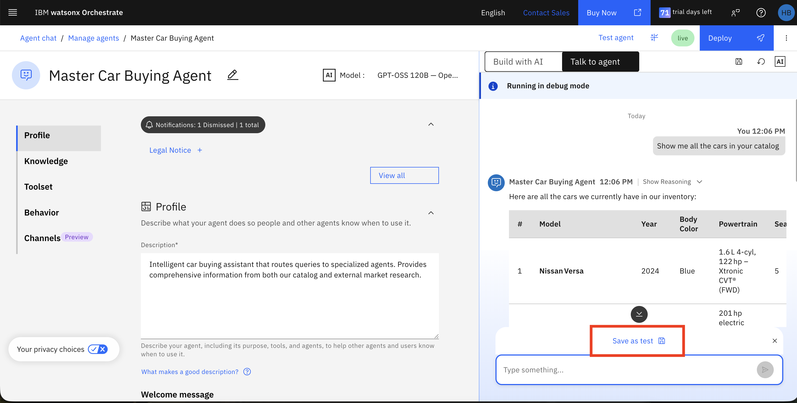
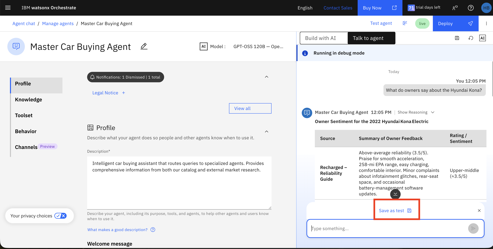
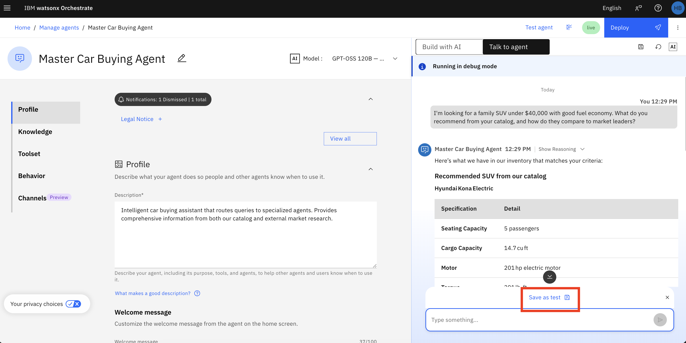
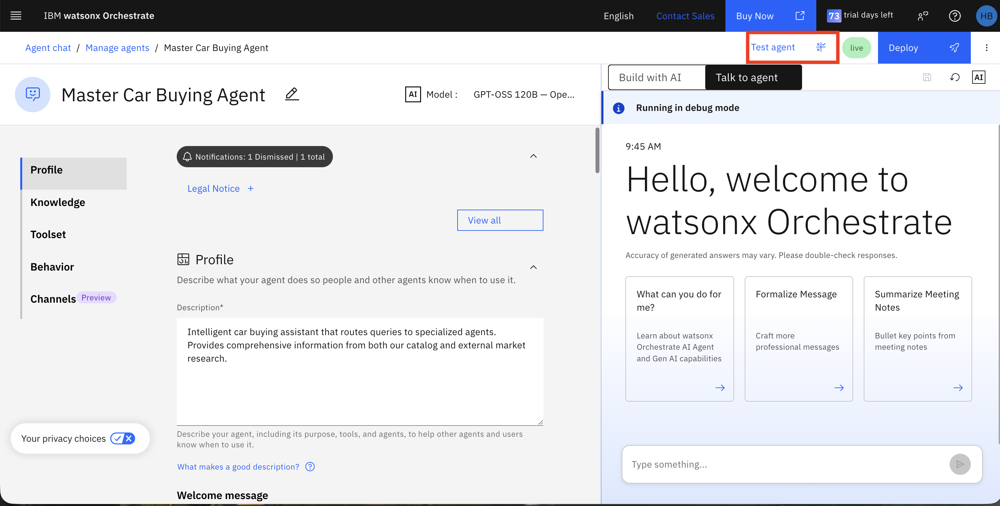
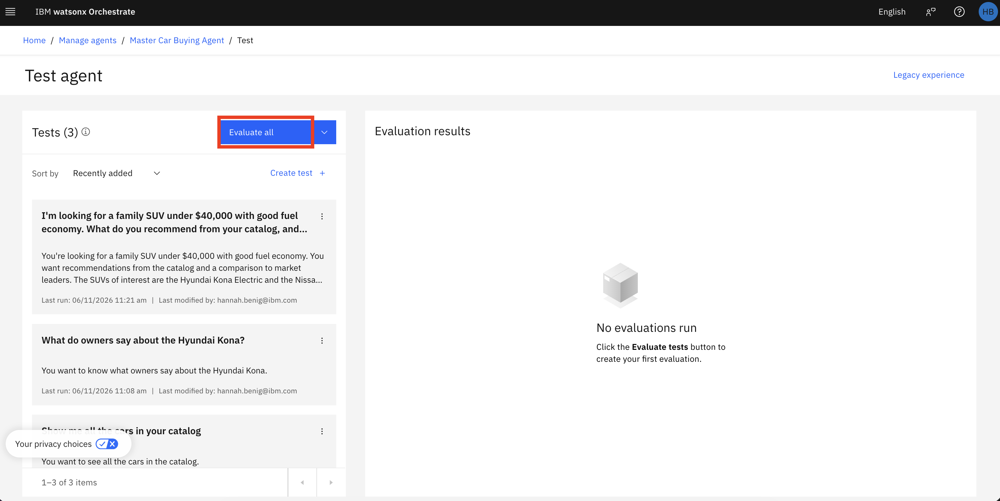
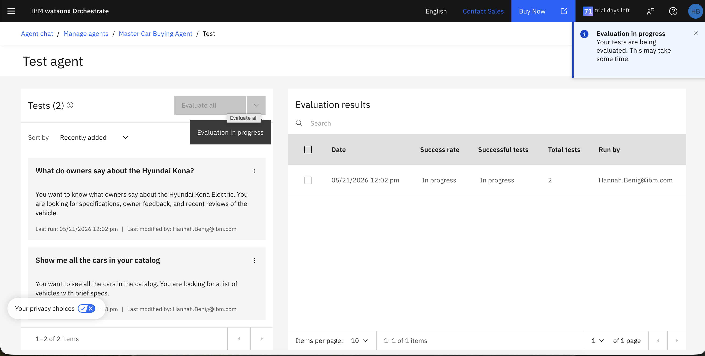
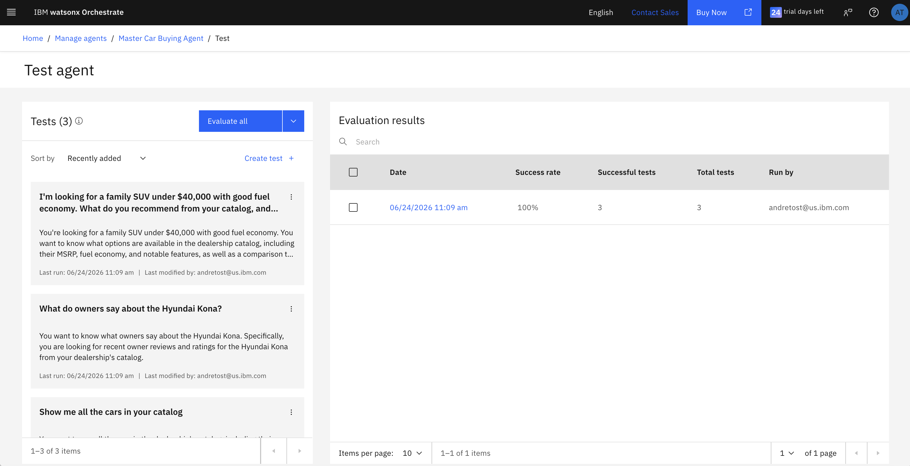
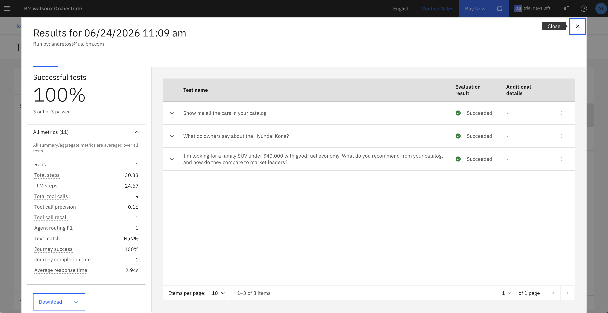
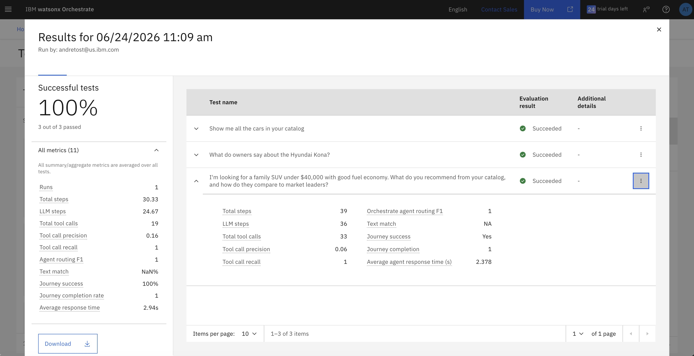

# 🧐  Agent Evaluation

## 🔎 Overview

This lab guide teaches you how to systematically evaluate your AI agents using watsonx Orchestrate's built-in testing. You'll learn to create test cases, run automated evaluations, interpret performance metrics, and understand agent behavior. These skills are essential for ensuring your agents perform reliably before deployment.

## 📊 Evaluate your AI Agents

Let's evaluate the agent's performance using test cases.

1. Navigate back to the **Master Car Buying Agent** Build page. 

2. Now you will create **Test Cases**. These will allow you to examine the performance of the agent throughout its lifecycle. You could easily examine the impact of changing the knowledge base, the behavior, or other agent parameters, by re-runing the test cases. Enter the following questions in the chat. After each one, click **Save as Test**.

The first two questions are simple and should be easy for the agent to answer. The third question is more complex and requires more tool calls.

```
Show me all the cars in your catalog
```



> [!NOTE]
> Notice that test cases are built on a conversation basis, meaning you could test the performance of an entire conversation automatically. In this case, we'd like to create simple test cases with individual questions. Click on the **Reset Chat** button above (below **Deploy**) before typing the next question. 

```
What do owners say about the Hyundai Kona?
```


Now click on **Save test** and type the next question:

```
I'm looking for a family SUV under $40,000 with good fuel economy. What do you recommend from your catalog, and how do they compare to market leaders?
```


> [!NOTE]
> You can also save tests using the **Save** button above the chat, on the left side of the **Reset chat** button.

Click on **Save test**, reset the chat, and type the next question:

3. Click on the **Test agent** button on the top right. This will bring the **Test** screen where you will be able to execute automated tests.

   

  

4. Click **Evaluate All**. 

   

5. While the evaluation is running, you'll see an **In progress** status.
This will take some time, feel free to move on to part 7 while you wait. 

   

6. Once completed, you'll see a green **Completed** status. Click on the completed test run to view results.

   

7. Review the evaluation results:

   
   

> [!NOTE]
> Your results may vary from the screenshots above. 

## 📊 The metrics
Below is a breakdown of the key metrics and what they mean:

**Routing & Accuracy:**
- **Orchestrate agent routing F1**: Harmonic mean of precision and recall for routing decisions (measures how accurately the master agent routes queries to specialized agents)
- **Keyword match**: Whether the response contains expected keywords
- **Semantic match**: Whether the response is semantically similar to the expected output
- **Text match**: Whether the response exactly matches the expected text output

**Execution Metrics:**
- **Total steps**: Total number of actions or operations performed across all tests
- **LLM steps**: Number of times the language model was invoked to generate responses
- **Average agent response time (s)**: Mean time taken to generate each response in seconds

**Tool Usage Metrics:**
- **Total tool calls**: Number of times agents or external tools were invoked during testing
- **Expected tool calls**: Number of tool calls that were expected to be made
- **Correct tool calls**: Number of tool calls that were made correctly
- **Missed tool calls**: Number of expected tool calls that were not made
- **Tool calls with incorrect parameters**: Number of tool calls made with wrong parameters
- **Tool call recall**: Ratio of necessary tool calls that were actually made (measures if all needed tools are being used)
- **Tool call precision**: Ratio of relevant tool calls to total tool calls (measures if tools are being called appropriately)
- **Tool match success**: Whether the correct tools were called

**Success Metrics:**
- **Journey success**: Whether the complete test scenario achieved its intended outcome
- **Journey completion**: Whether the multi-step test interaction completed all steps without errors


---

<div align="center">

**← [Previous: 🐞 Debuggging](/labs/agentic/debugging/README.md) &nbsp;&nbsp; | &nbsp;&nbsp; [Next: 👀 Real-time Monitoring](/labs/agentic/lab_guides/6_real_time_monitoring.md) →**

</div>
