# 👀 Monitor Agents in Real Time

## 🔎 Overview

This lab guide introduces you to real-time monitoring capabilities in watsonx Orchestrate. You'll learn how to track agent performance, analyze conversation patterns, and monitor key metrics like success rates, user feedback, and content safety indicators. Real-time monitoring is crucial for maintaining agent quality in production and identifying issues before they impact users.


## 💻 Hands-on Instructions

watsonx Orchestrate allows you to fully monitor AI Agents, whether in development or production. In the previous labs, you have created multiple agents. Go to your Master Car Buying agent and perform the following actions.

1. On yout Agent Builder screen and click on the **Deploy** button above the chat window:

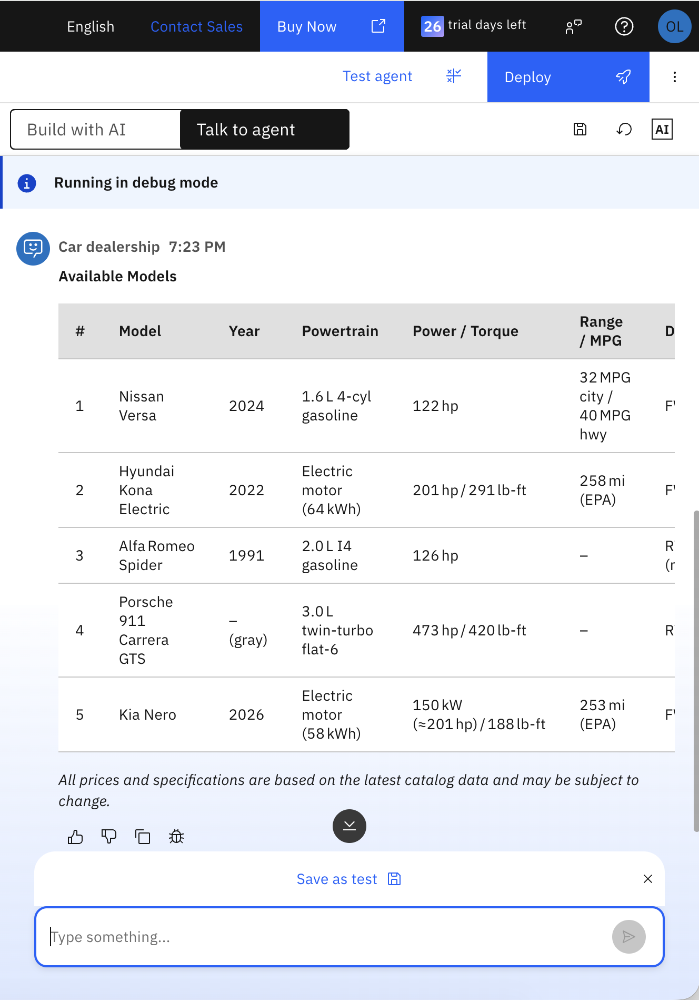

2. Now, in the Pre-deployment screen, you can review your agent settings and parameters. There's no need to make any changes. Now click on **Deploy**.

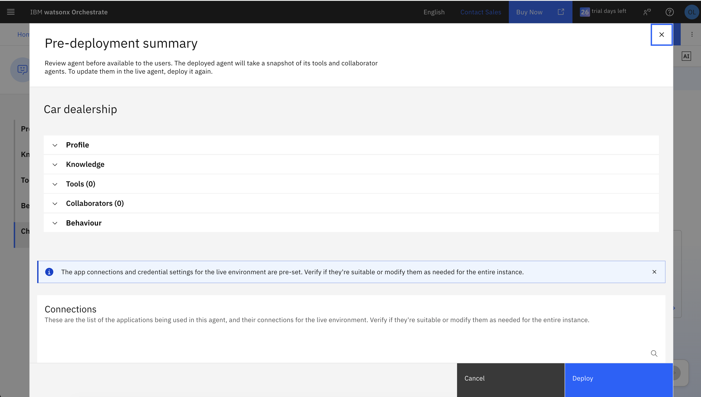

> [!NOTE]
Once your agent has been deployed, it can be accessed via a number of channels. watsonx Orchestrate can also help you embed your agents into a website, or make them avaiable via **Slack**, **WhatsApp**, and a number of other channels. Since the focus of this lab is monitoring, we'll skip this for now but the user is encouraged to try out the **Channels** section in the Agent Builder.

3. Now your agent is live and you will see a green **Live** icon above the chat window:

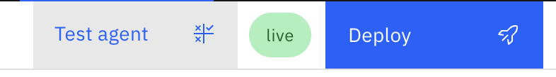
   
4. Now chat with the agent. Ask a number of questions and look at the answers. You can thumbs up or thumbs down each answer to provide feedback on the quality of the responses.
     
6. Now go to the Hamburger menu and click on **Analyze**

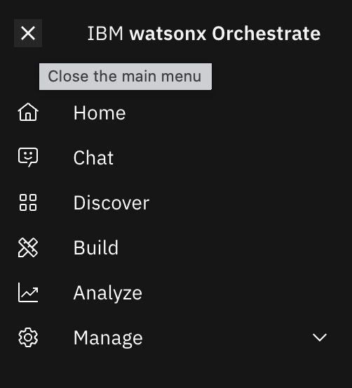
   
7. This will take you to the main **Agent Analytics Screen**. This one shows you an overview of all your agents.

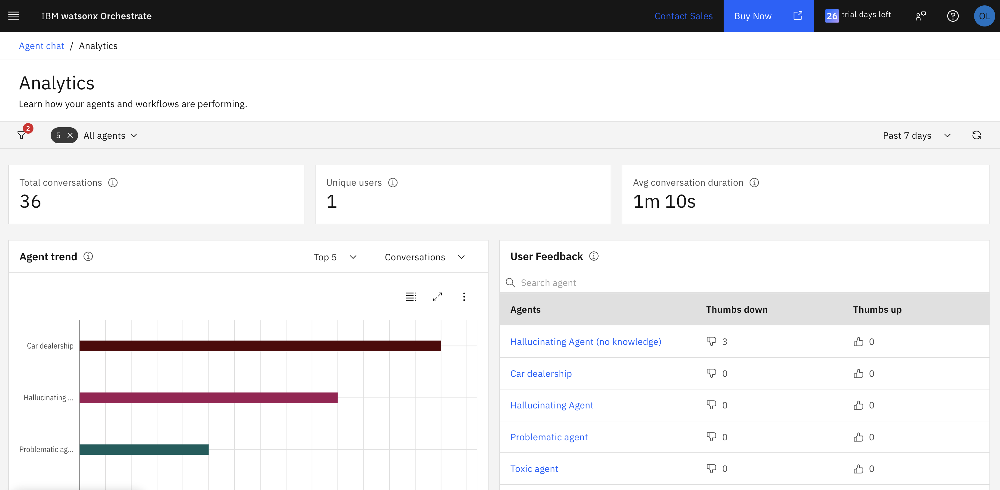
   
8. Click on your own agent on the right side and you'll be able to see macro metrics such as:

- Total number of conversations
- Total input and output token counts
- Number of unique users that have interacted with the agent
- Average conversation duration
- Average message latency

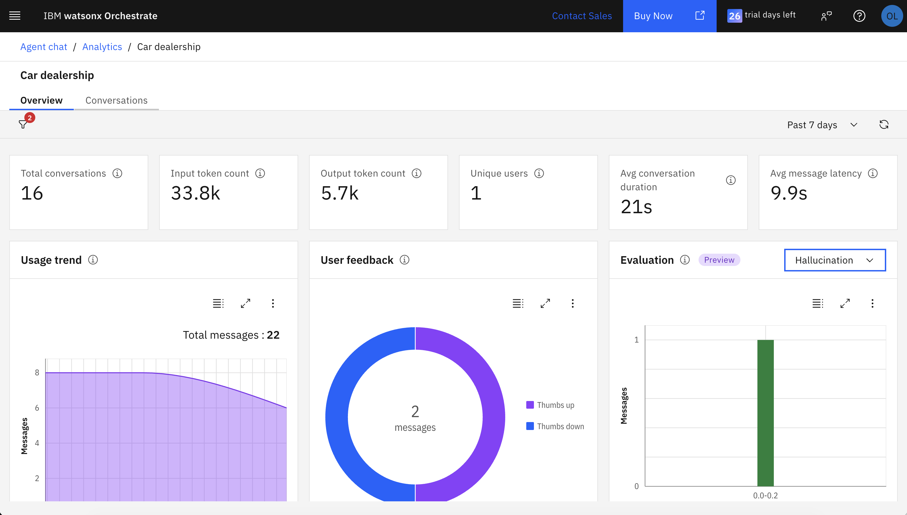
   
8. But you can also inspect granularly each conversation and each message in the chats. Click on **Conversations**.

> [!NOTE]
If you'd like to populate more conversations, you can go back to your chat window and ask questions to the agent. You can click on the Restart 🔄 button above in the chat window to force a new conversation to be created.

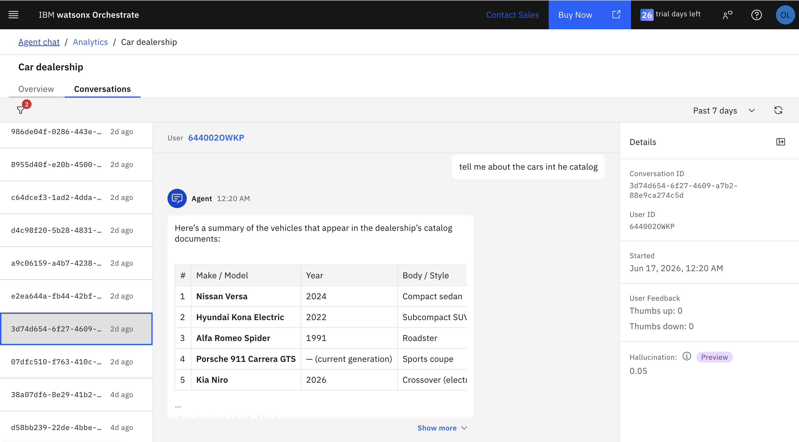
   
9. Finally on the **Evaluation** tab you can check for:

- Hallucinations
- Toxicity
- Helpfulness

These features are still in preview mode and additional labs will be developed soon.


   
<!--

---

## Table of Contents

- [View Monitoring Results](#view-monitoring-results)

---


#### View Monitoring Results

1. We've already deployed the agent and enabled monitoring. Let's check the monitoring dashboard. Click **IBM watsonx Orchestrate** on the top left corner to return to the control plane welcome screen.

    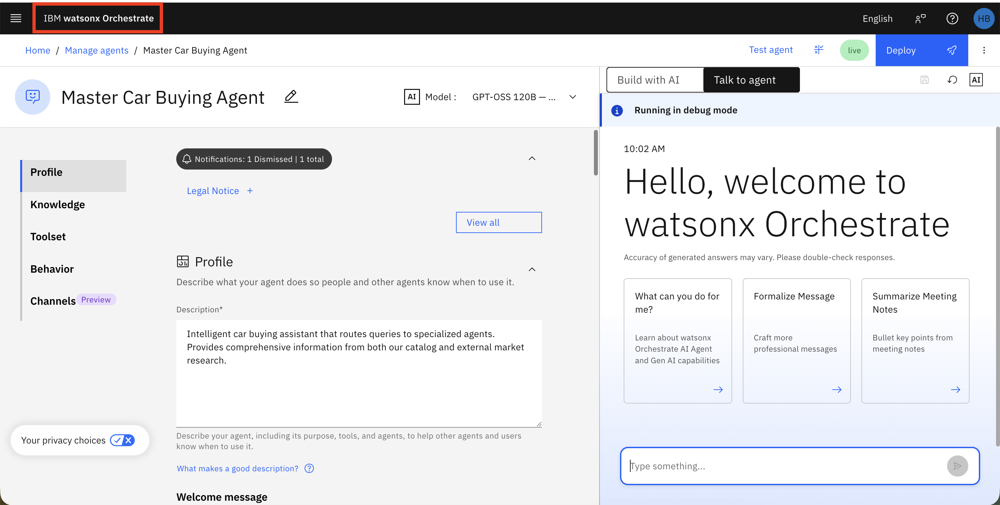

2. Let's explore the agent analytics using the chat on the left. Ask the following question:

```
show me agents with the lowest success rate for this week
```

   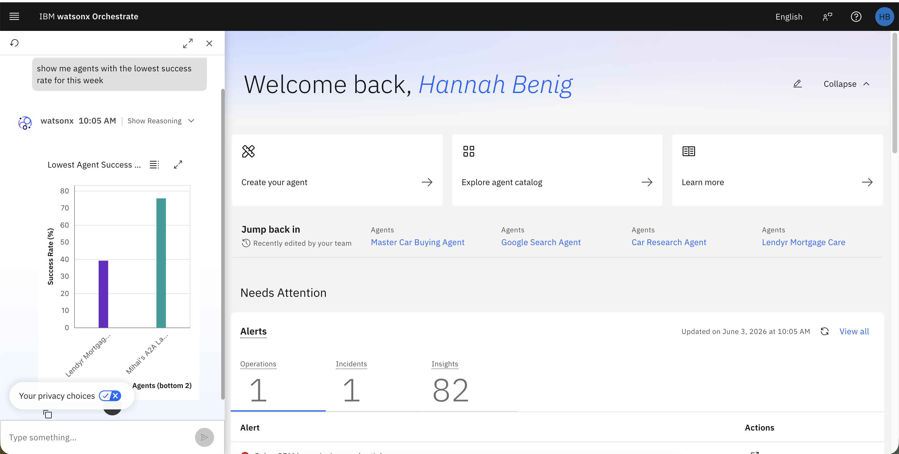

3. Next let's explore Platform and Agent Analytics. Select **Analyze** from the hamburger menu.

   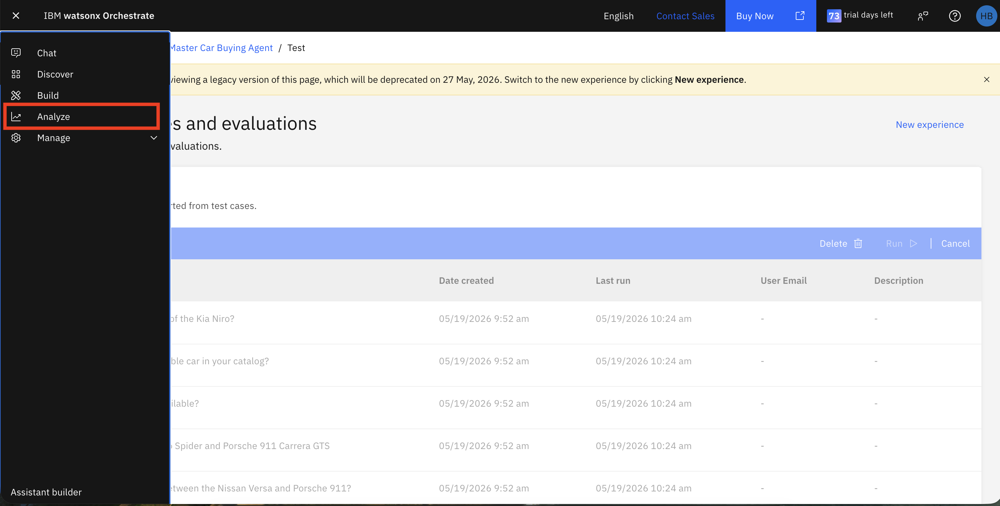


4. You'll see the evaluation dashboard with key metrics including top conversations, unique users, and average conversation duration. You'll also see charts reflecting the number of conversations with each agent and the performance of your agents.

   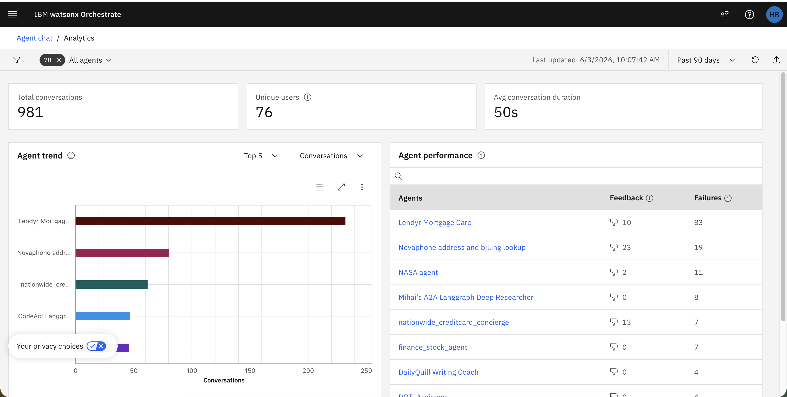

5. Search for the Master Car Buying Agent in the Agent Performance chart.

   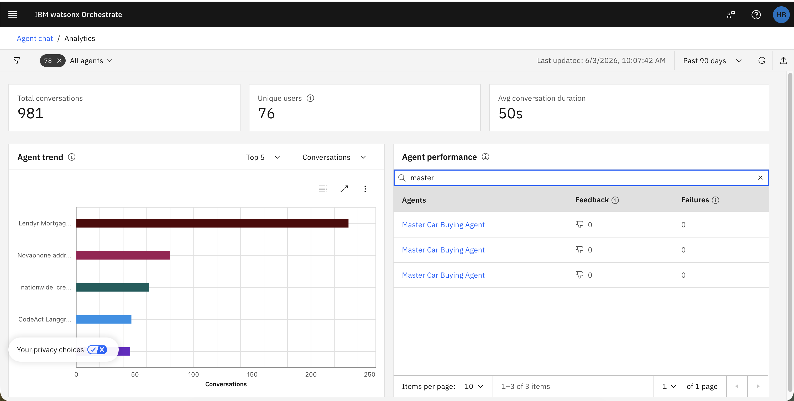

6. Switch the view from the Overview to the Conversations tab. This shows details for all messages in the conversation. 

   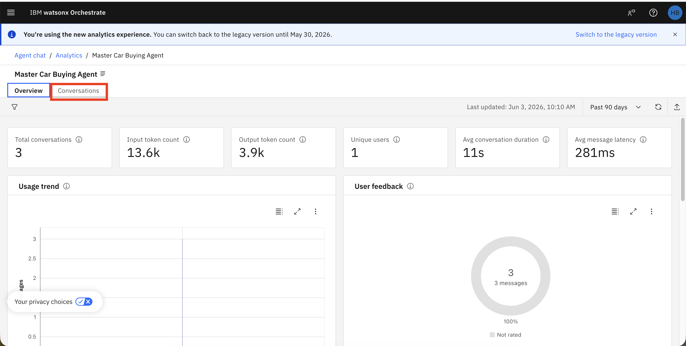


7. Review the conversation details. You can see the user's message, the agent's response, and the metrics for each message.

   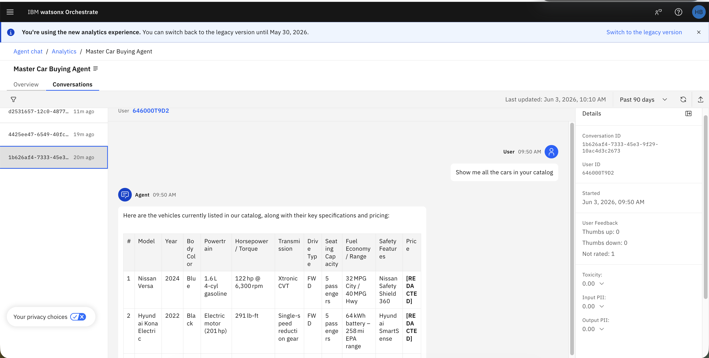

   **Understanding the Metrics**:

   **User Feedback Metrics**:

   - **Thumbs up**: Number of positive feedback responses from users indicating satisfaction with the agent's answer.

   - **Thumbs down**: Number of negative feedback responses from users indicating dissatisfaction with the agent's answer.

   - **Not rated**: Number of interactions where users did not provide feedback.

   - **Toxicity**: Score indicating the level of toxic, offensive, or inappropriate content in the response (0.00 = no toxicity detected).

   - **Input PII**: Score indicating whether personally identifiable information was detected in the user's input (0.00 = no PII detected).

   - **Output PII**: Score indicating whether personally identifiable information was detected in the agent's response (0.00 = no PII detected).

   -->


---

<div align="center">

**← [Previous: 🔎 Automatic Evaluation](/labs/agentic/lab_guides/5_automatic_evaluation.md) &nbsp;&nbsp; | &nbsp;&nbsp; [Next: 📊 Dashboard and Agent Analytics](/labs/agentic/control-plane/README.md) →**

</div>


