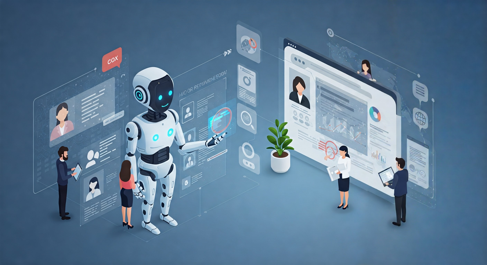
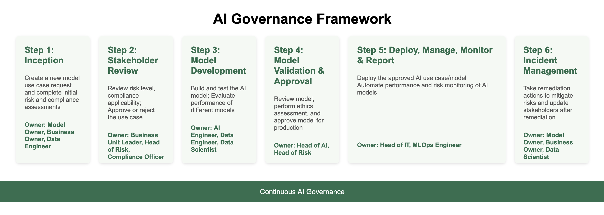
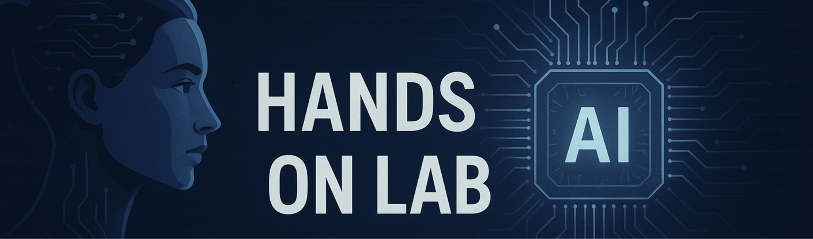
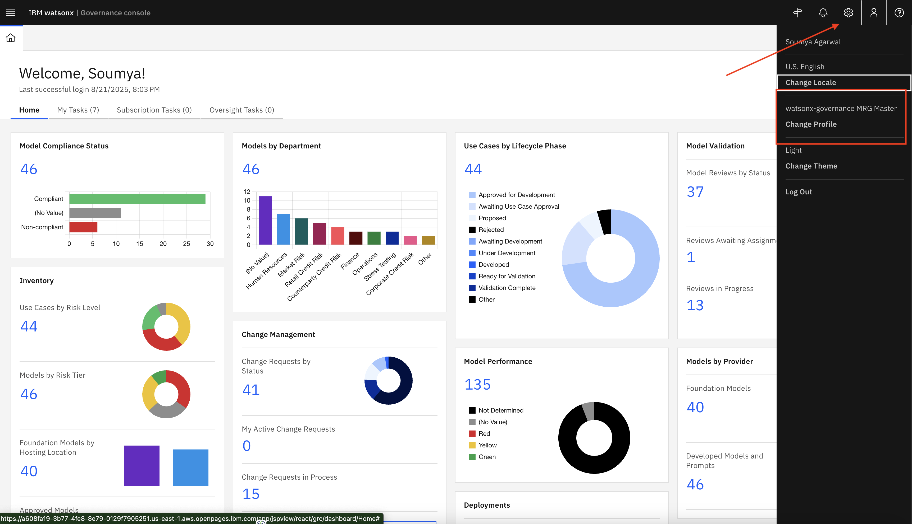

# 🧑‍💼 Managing AI Risk and Compliance with watsonx.governance

## Table of Contents
- [Introduction](#introduction)
- [Hands-on step-by-step lab](#hands-on-lab)
- [Guide directory](./guides-directory.md)
- [Credential directory](./credential-directory.md)

-------
# Introduction

## 👋 Meet Jose – The Chief Risk Officer

Jose works at **TechCorp Inc.**, a large multinational enterprise using AI to improve HR processes like hiring and employee planning.

But there was a problem...  
AI was everywhere, but **nobody really knew**:
- Who built what
- Whether the models were fair and safe
- Whether they complied to regulations like EU AI Act, etc.
- What to do when something went wrong

Jose was responsible for managing all that risk — but he had **no clear way** to do it.

So, Jose and his team decided to leverage **watsonx.governance** to make AI governance easy, clear, and reliable and to easy the collaborate with all the stakeholders, including Maria, the AI engineer.

## 🎯 What Jose Wanted to Fix

Jose didn’t want to manage critical governance processes through spreadsheets, emails or slack messages. 

He wanted a simple system that would:

- ✅ **Track every AI model from start to finish**
- ✅ **Make sure models follow the rules (like GDPR, EU AI Act, etc.)**
- ✅ **Foster collaboration with the development team — without slowing them down**
- ✅ **Catch problems early and fix them fast**
- ✅ **Keep everything ready for audits**

And that’s where **watsonx.governance** helps.

## 👥 Who's involved in AI Governance?

AI Governance is a teams sport involving different roles in an organization. Though it's not uncommon to find scenarios where folks could perform the roles of severals personas, here's what these roles might look like:

## 🚀 The AI Governance Journey in 7 steps (Used by Jose’s Team)

A simple, structured process for managing AI models from idea to remediation.

## 💬 What Jose Says Now

> _“Before watsonx.governance, we had no clear process. Now everyone knows what to do, models are better, and we’re always ready for audits.”_

------
-------

# 📄 Hands-on step-by-step guides

> [!Important]
> In this lab, you will learn how to work on a real AI Governance use case involving multiple personas. You will work together with your team and each team member will be assigned a role from the list of personas above. For simplicity, all profiles have been granted privileges to run the steps for any of the personas, through the **watsonx-governance MRG Master** profile.
> 
## ⚙️ Pre-requisites

* Access credentials (provided by the instructor)
* IBM Cloud login with assigned stakeholder role
* Services: OpenPages with MRG (Main Labs), Model Management (Additional Labs).
> [!Note]
> If your team attending the bootcamp is unfamiliar with Model development/deployment, the instructor can fulfill the roles of Model developer/deployer, executing the required Model Management Labs.

## ⚙️ Lab Guides directory

Here are all the links for all the guides for each of the 6 steps of the AI Governance Journey:

| Step | Persona | Hands-on lab   (on the MRG Console) | Additional labs (on the Model Management Studio) |
|------|------|-------|---------------------|
| 1 | Use Case Owner | [Use Case Creation](./steps/step1/usecase-creation-model-owner.md)  | - |
| 2 | Risk & Compliance Officer | [Risk Review](./steps/step1/risk-review-rco.md), [Risk Endorsement](./steps/step2/risk-endorsement-bul.md) | - |
| 3 | Model Developer | [Developer Tasks](./steps/step3/model-developer-tasks.md) | [Model Development](./steps/step3/model-developement.md) |
| 4 | Model Validator | [Validator Tasks](./steps/step4/model-validator-tasks.md) | [Model Validation](./steps/step4/model-validation.md) |
| 5 | AIOps Engineer | [Deployer & Monitoring Tasks](./steps/step5/model-deployer-tasks.md) | [Model Deployment](./steps/step5/model-deployment.md) |
| 6 | Risk & Compliance Officer | [Incident Management](./steps/step6/mitigating-incidents.md) |  [Model Management Evals](./steps/step6/model-management-evals.md), [Integrating External Evals](./steps/step6/integrating-external-evals.md) |

At the end of each of the labs, you will find a [link](./guides-directory.md) to that lab's directory.
You can also follow along this main guide to get you started. 

## 🚀 Getting Started

1. Login to [IBM Cloud](https://cloud.ibm.com)
2. Navigate to **Resource List > AI / Machine Learning**
3. Launch the **OpenPages** instance from the list.   
*If you receive an authorization error, add **/app/jspview/react/grc/dashboard/Home** to the end of the URL.*

<!--
> 
-->

> [!Important]
> After logging make sure that the Profile has been set to **watsonx-governance MRG Master**:

> 🔐 **Note:** Make sure you're logged in as the appropriate role before proceeding with assigned tasks.

## 👩‍💼 Step 1 - Use Case Owner Responsibilities

As a Use Case Owner, your responsibilities include:

* Defining the use case (AskHR - Agentic AI)
* Submitting associated risks for assessment  

🔍 Follow these guides:

* [Creating and defining an AI use case](./steps/step1/usecase-creation-model-owner.md)

Once the guides above have been completed, the Use Case Owner would wait for steps 2-6 to be completed by other roles (development and deployment) up until an incident or issue is reported.
In our scenario, one issue will arise once the model in in production.  

💡 Don’t forget to fill in the **Risk Level** and **Control Details** before submission.

## 👤 Step 2 - Risk & Compliance Officer Responsibilities

As a Risk and Compliance Officer, you play a crucial role with the stakeholder endorsement. Your input ensures the use case aligns with business strategy and acceptable risk levels.

But, prior to your endorsement, the Risk & Compliance Officer would have reviewed and assessed the risks associated with the use case.

🗂️ Follow these guides:

* [Reviewing and Assessing Risk](./steps/step1/risk-review-rco.md) 
* [Stakeholder Risk Endorsement](./steps/step2/risk-endorsement-bul.md)

## 👨‍💻 Step 3 - Model Developer Responsibilities

As a Model Developer, your responsibilities include creating and evaluating Prompts and Agents for generative AI use cases. You will build and test these artifacts in the Prompt Lab and Agent Lab. Upon creation, a Factsheet is automatically generated and linked to the AI Use Case in watsonx.governance.

You are responsible for completing all required details in the factsheet and submitting it for governance approval.

🗂️ Reference:

* [Model Developer Tasks and Guidelines](./steps/step3/model-developer-tasks.md)

## 🔍 Step 4 - Model Validator Responsibilities

As a **Model Validator**, you are responsible for validating the AI System development including  validating the AI model’s performance and hallucinations metrics. You will reviewing every aspect to ensure the AI System meets governance standards.

🗂️ Reference:

* [Model Validator Tasks and Guidelines](./steps/step4/model-validator-tasks.md)

  
## 🔍 Step 5 - AIOps Engineer Responsibilities

As an **AIOps Engineer**, you are responsible for Deploying and Monitoring the AI use case/model on **IBM watsonx.governance**.

🗂️ For detailed steps, refer to:

* [Operations Team Tasks and Evaluation Guide](./steps/step5/model-deployer-tasks.md)

## 🔍 Step 6 - Risk & Compliance Officer Responsibilities

As a **Risk & Compliance Officer**, you are also responsible for reviewing incidents and issues that may arise along the lifecyle of a model. In this scenario, an issue would arise while the model is in production. Your task is to review the issue and help mitigate it.

* [Mitigating Incidents](./steps/step6/mitigating-incidents.md)

--------

## 🎉 Congratulations!

You've helped ensure this Agentic AI use case adheres to ethical AI practices by:

* Validating risk levels
* Confirming regulatory and internal compliance
* Approving only well-governed use cases
* Ensuring model fairness and quality through continuous validation

> 🛡️ Governance is not a one-time check — it’s a continuous loop of accountability and alignment.

