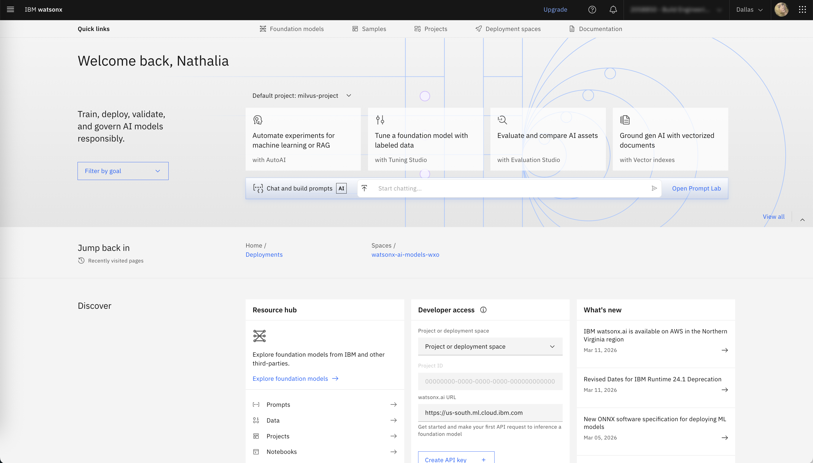
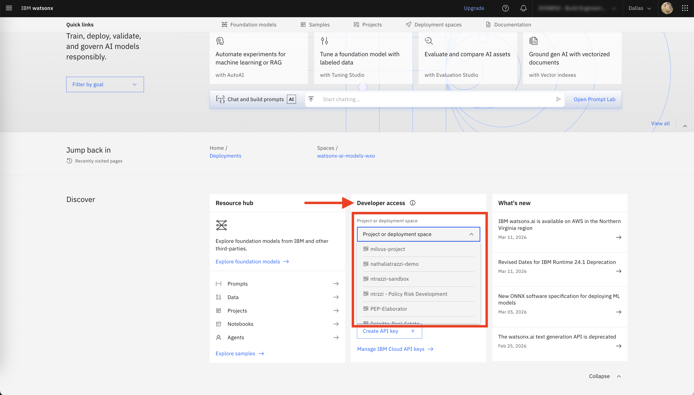
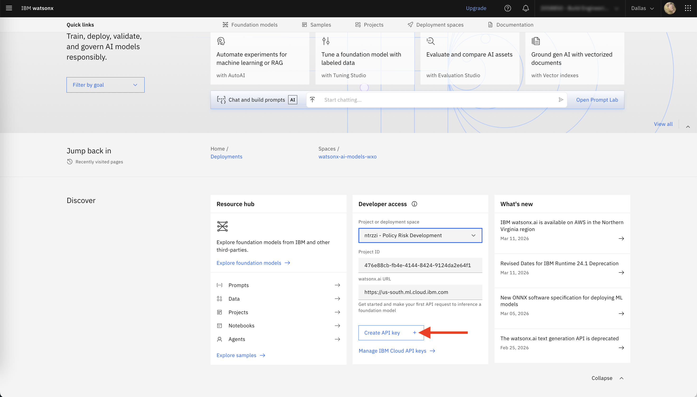
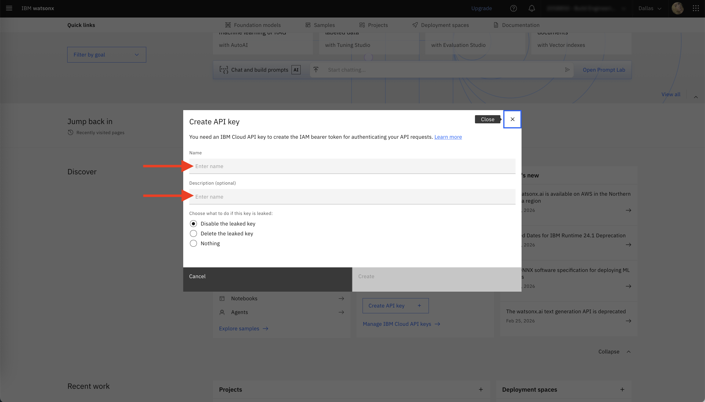
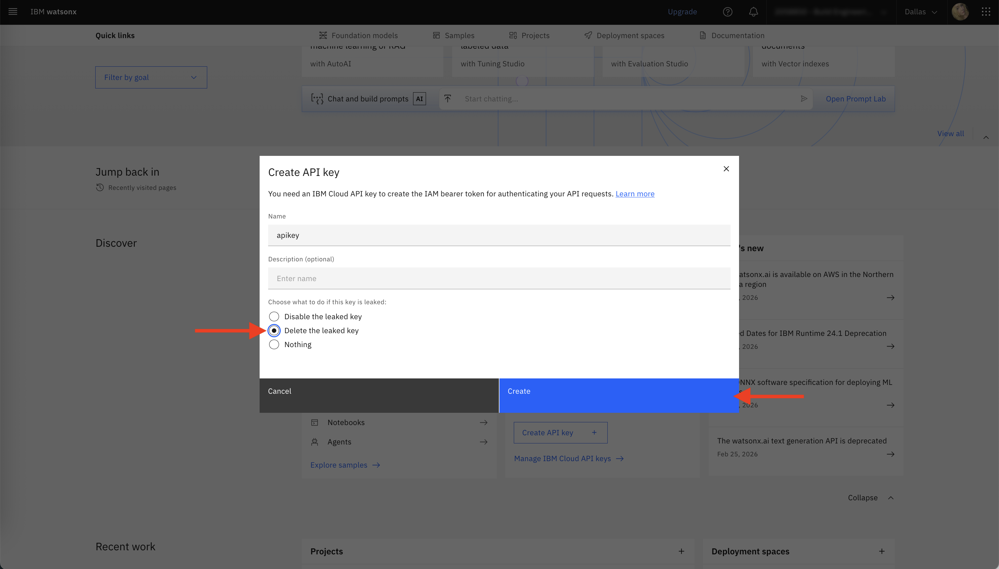
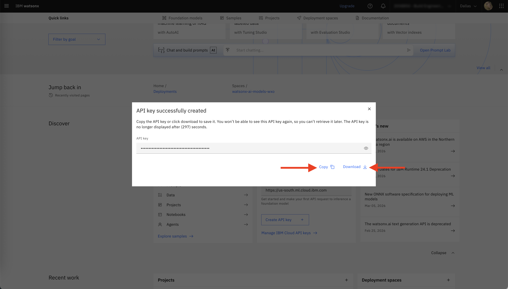

# Creating a Cloud API Key

On the <b>watsonx.ai</b> homepage, go to the Developer access section.

1 - Select a project

Choose an existing project.

If you don't have a project in this environment yet, follow one of the options below:
>
> - **1 - Create a sandbox**  
>   watsonx.ai can automatically set this up for you, it's really quick and easy: Scroll down and click on Create a sandbox option.
>
> - **2 -  Create a new project manually**
>   - Go to the **Projects** section  
>   - Click **+**  
>   - Provide:
>     - A name  
>     - A description  
>     - An associated **Cloud Object Storage** instance (usually already available in your environment)

2 - Click on `Create API key +`

3 - In the pop-up window:

Enter a name for your API key  

Then, add a description  

Select one of the available options for handling potential key exposure  

<b>API keys provide access to your cloud account and associated services. Store them securely and never share them publicly.</b>

<b>It is highly recommended to select an option that automatically disables or deletes the API key if it is ever exposed, helping to prevent potential security issues. </b>

Click `Create`

4 - Copy the API key or download the JSON file containing it

> Important: The API key is shown only once. After closing the pop-up window, you will not be able to view it again.

<b>Make sure to store your API key in a secure location, as you will need it for the next steps. </b>

You’re all set to move on to the next steps.

## Managing API keys

To manage your API keys in IBM Cloud, visit: https://cloud.ibm.com/iam/apikeys

