# Model Developer's Guide to perform Model Developement on watsonx

## Overview

This repository contains the Model Developer's Guide, focusing on automating HR policy question/answering processes using an AI System develop on the IBM watsonx platform.

## 1. Use Case

**Business Goal:** Automate question/answering process from HR policies using IBM watsonx **AutoRAG**, enabling faster, bias-free hiring while maintaining compliance in OpenPages.

### 🧠 Agentic RAG Capabilities for HR Policy Q&A:

1. Ingest and index HR policy documents (PDFs, DOCX, web pages, internal knowledge bases)
2. Allow users to ask natural language questions about HR policies (e.g., leave, benefits, conduct, compliance)
3. Retrieve relevant policies using semantic search
4. Generate clear, accurate answers grounded in official HR documentation
5. Highlight source references to support transparency and traceability
6. Support multilingual queries and inclusive language understanding

> **Note:** The Agentic RAG model for this use case is **already created and deployed** in the pre-production environment.

---

## 2. Persona

**Model Developer:** Responsible for accessing the deployed Agentic RAG model, running evaluations, and publishing outputs into OpenPages.

---

## 3. Step-by-Step OpenPages Flow

### **Step 1 – Run Notebook in watsonx.governance**

The Agentic RAG model is already developed and deployed. To access it:

1. Log in to the **IBM Cloud** platform using the **[Credential Guide](../../credential-directory.md)**.

2. Open **hamburger menu → Resource List → watsonx.governance**
   

3. Click the **Launch in watsonx.governance** button — this navigates to:
   [https://dataplatform.cloud.ibm.com/wx/home?context=wx](https://dataplatform.cloud.ibm.com/wx/home?context=wx)
   
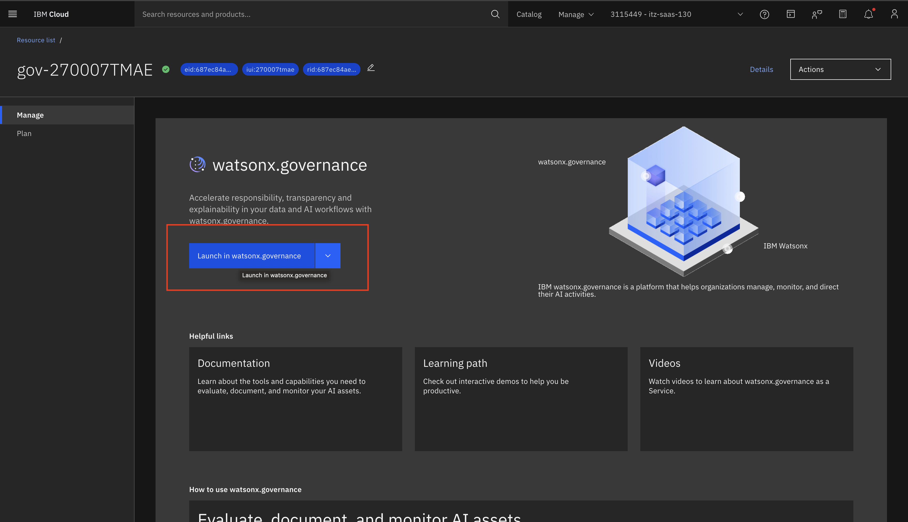

4. On the **watsonx Studio** homepage:
   
* Create a new project as explained in the steps linked here: [Steps for creating project](../..//instructor/create-project.md)
  
* After creating the project, go to the **Assets** tab and click on **New Asset**:
  
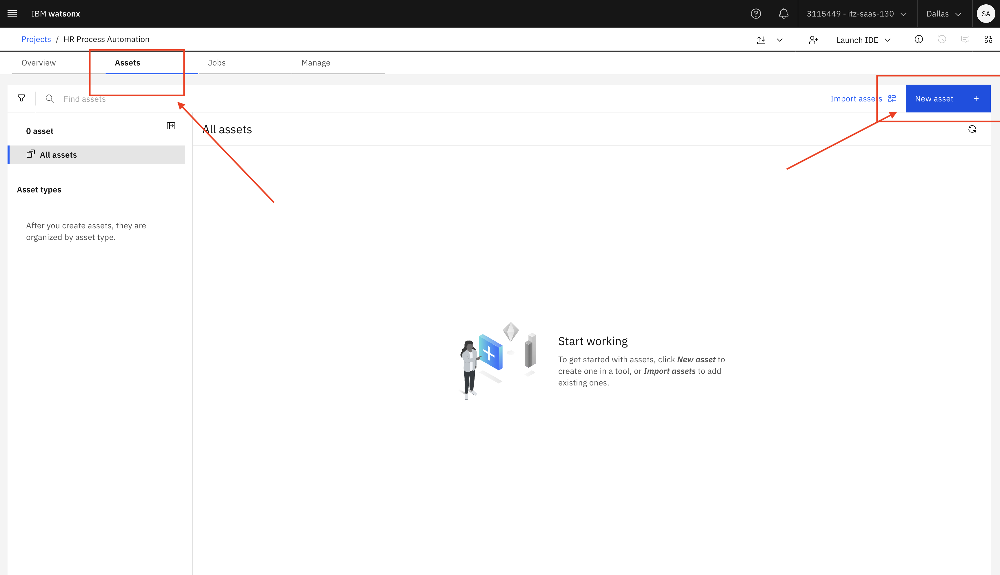

* Select **Working with data or models in Python or R notebooks** from the **All** option on the sidebar:
  
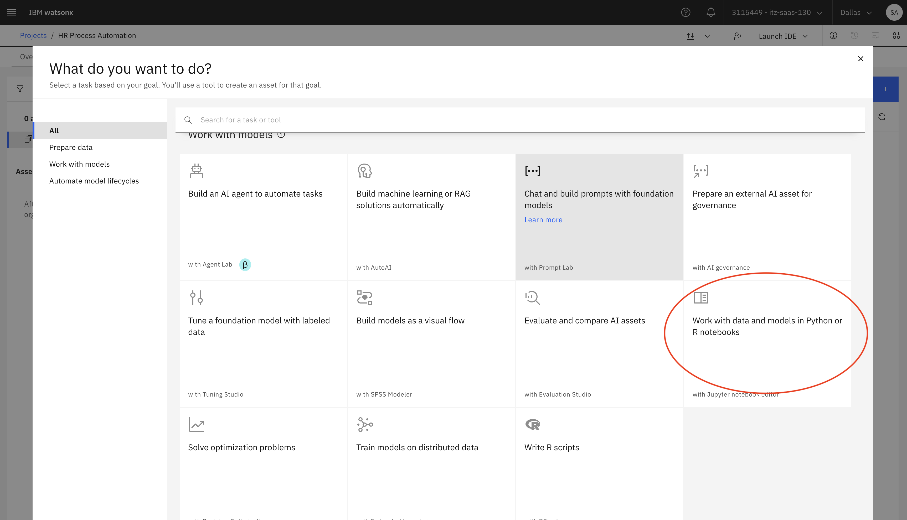

* Go to the **local file** tab and click **browse** to upload the notebook linked here as a local file: [Notebook](./notebook/agentic-rag-eu-de.ipynb)
  

* Select the [Notebook](./notebook/agentic-rag.ipynb), download it locally, and upload it to the watsonx.ai runtime.
  
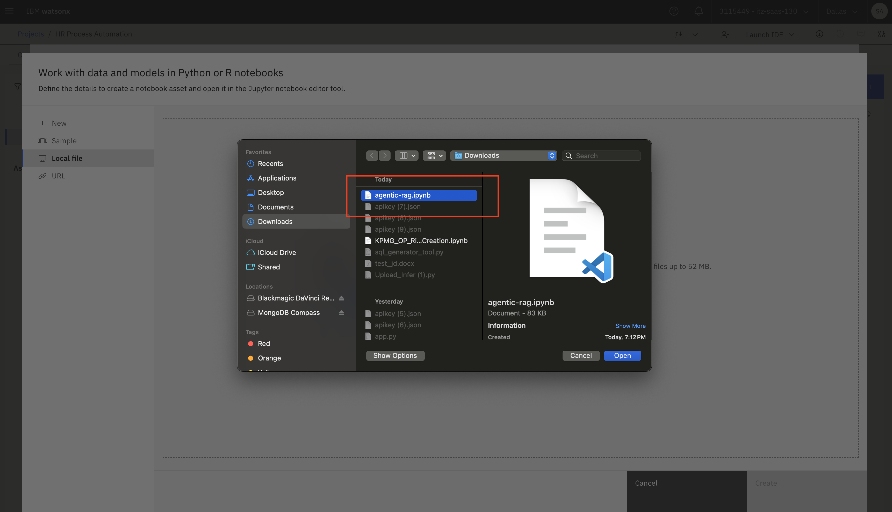

* After uploading, provide a name to the notebook, also review the selected runtime, it should match **Runtime 24.1 on Python 3.11**. The notebook has not yet been ported to the latest runtimes, it would failed on Python 3.12.

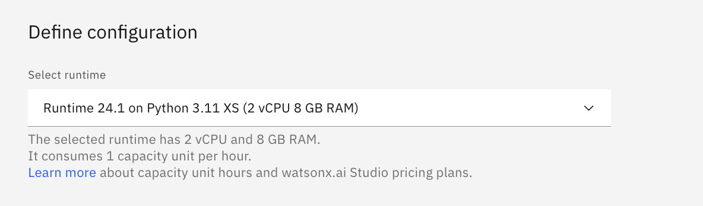

* Click the **Create** button:
  

* The notebook will now be ready to run and **create a Detached Prompt Template for Agentic RAG** in the OpenScale dashboard UI

-> In this notebook, update the first cell:

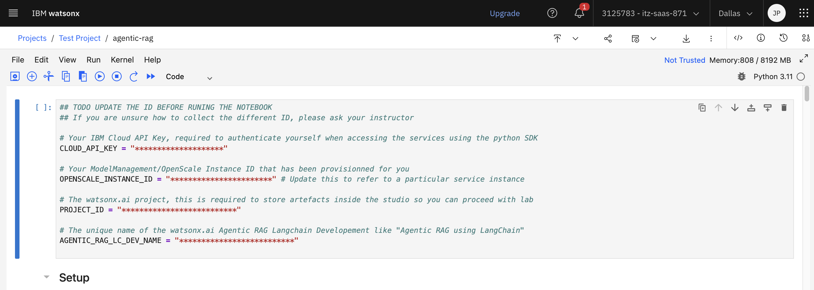

- Use **watsonx_api_key** created initially [Create API key](../../instructor/api_key_setup.md)
- Use **ModelManagement Service ID** communicated by your instructor (he should have configured and connected a ModelManagement aka OpenScale instance for you)
- Access **project_id** by navigating: hamburger menu → projects → view all projects → your project-> Manage tab -> copy project id.
- Provide a unique name to your development **AGENTIC_RAG_LC_DEV_NAME**

   
Run the first cell and proceed with the rest of the notebook

---

> **Note:** The Model Developer can use this Notebook for evaluation and integration.
This is a development of a LanChain RAG Chain. This developement will be referenced with the unique name that you've chosen ("AGENTIC_RAG_LC_DEV_NAME") in the studio and monitoring will be defined in ModelManagement to start collecting metrics. For the following, the chosen name is "Agentic RAG Testing".

---

### **Step 2 – Access the Deployed Agentic RAG Model in the ModelManagement Console**

Run the above notebook and then visualize the results in **IBM watsonx Openscale** Dashboard:

#### Using the ModelManagement / OpenScale UI:

Access the **Openscale** dashboard, back to your IBM Cloud Account, on the watsonx.governance instance:
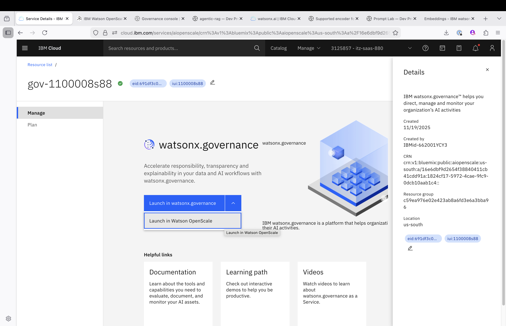

Navigate to the **Detached Prompt Template** asset within the project on **Openscale** Dashboard, a.k.a ModelManagement, by filtering on project:

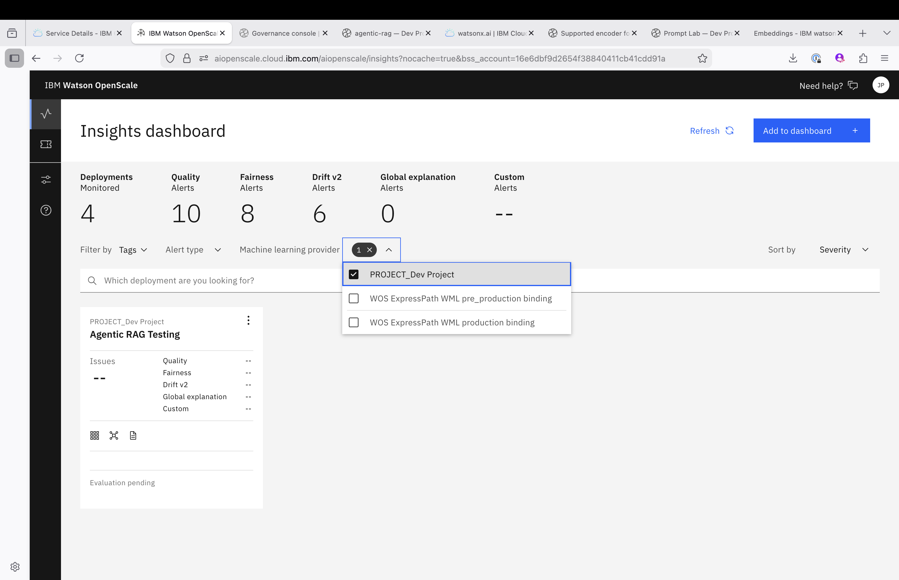

Click on Agentic RAG Testing
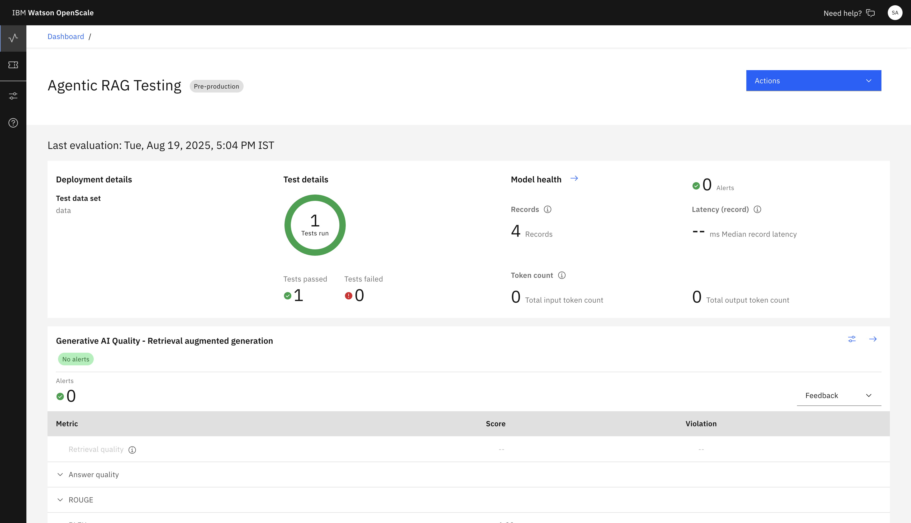

You have set up metric collection for the testing phase to evaluate your developement.

### **Step 3 – Access the Factsheet View of Detached Prompt Template**

1. Go to dataplatform.cloud.ibm.com watsonx studio

2. Navigate: hamburger menu → projects → view all projects → HR Process Automation (select this project)

   

3. Inside this project, you will find **Detached prompt template** named **Agentic RAG** - select that

   

  

4. After selecting, you will be onboarded to **AI Factsheet**

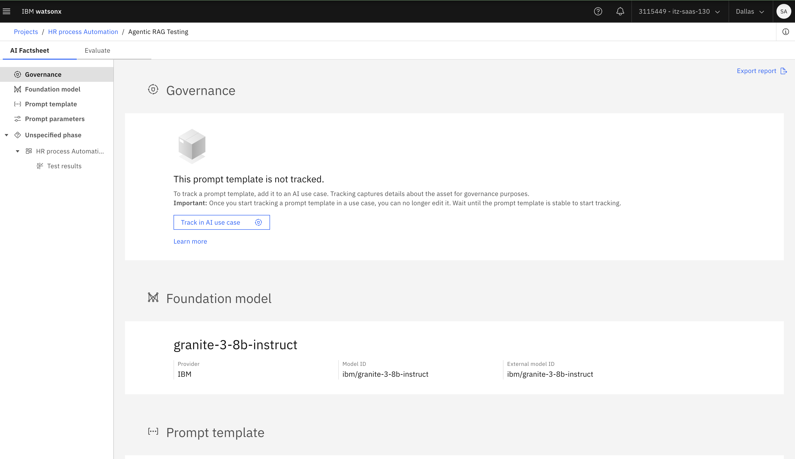

5. Now click on **Track in AI use case**  to associate asset to **AI Use case** click on **Go to AI Use cases** as project is not associated to **AI Use case** :

   

6. Select **AI Use case** created by **Use case owner** initially :

7. Go to **Associated workspaces** section and Select **Development** phase and click on **Associate Workspace**:

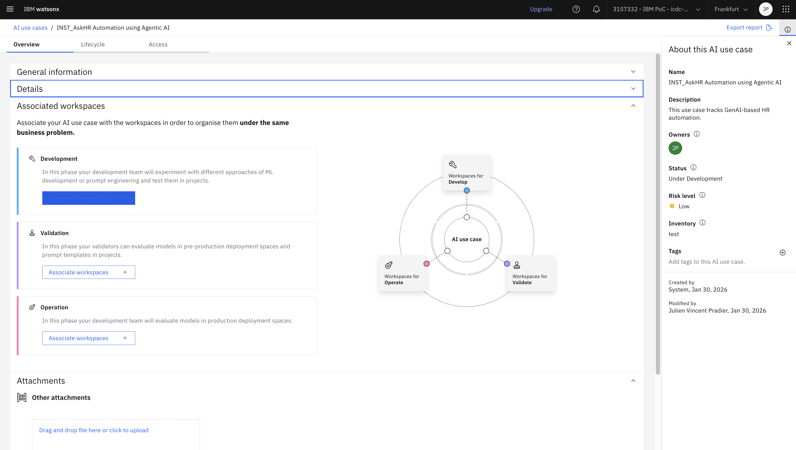

9. Here, Select **Project** just created initially and click **Save**

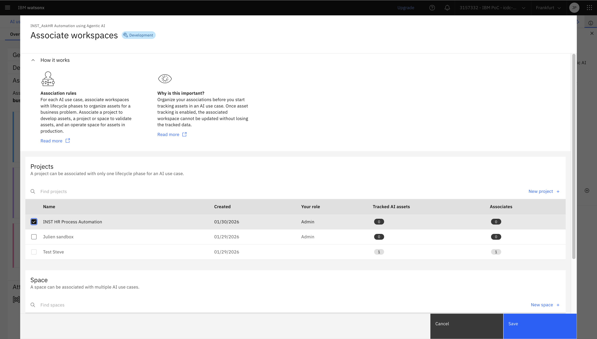

10. Back to the **Associated workspaces** section and Select **Validation** phase and click on **Associate Workspace**:

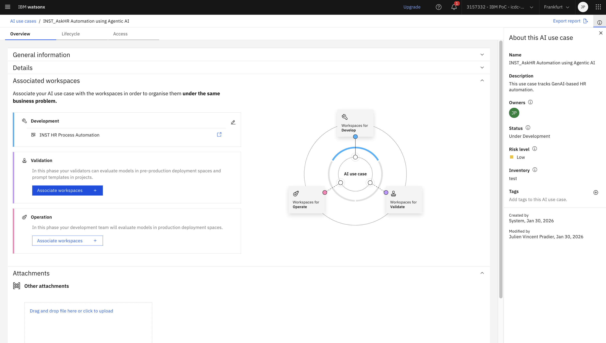

11. Here select the **Bootcamp Validation Space**  or if not created Click on **+New Space** and follow [Deployment Creation Steps](../../instructor/deploy-project.md) these steps for creating deployment space for **Testing** Deployment stage. Click on Save:

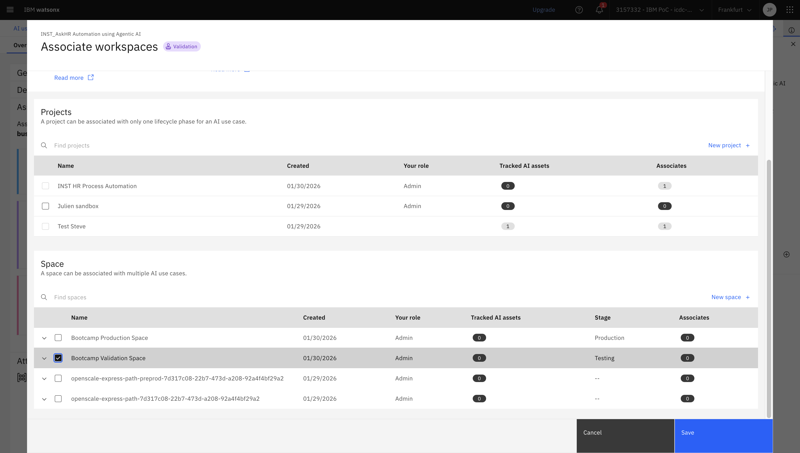

12.  Back to the **Associated workspaces** section and Select **Operation** phase and click on **Associate Workspace**:

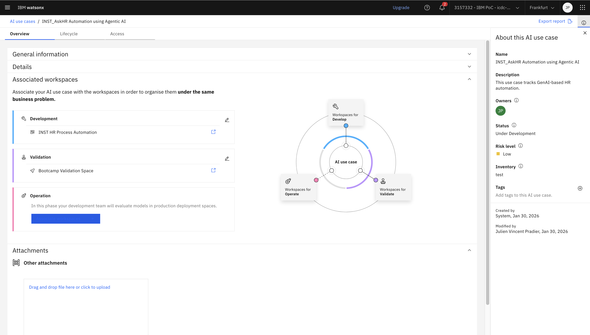

13. Here select the **Bootcamp Production Space**  or if not created Click on **+New Space** and follow [Deployment Creation Steps](../../instructor/deploy-project.md) these steps for creating deployment space for **Production** Deployment stage. Click on Save:

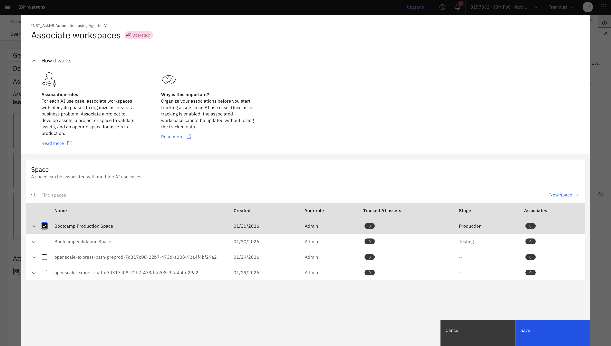

14. Back to the **AI Use case** now you can see the associated workspaces in all three phases :

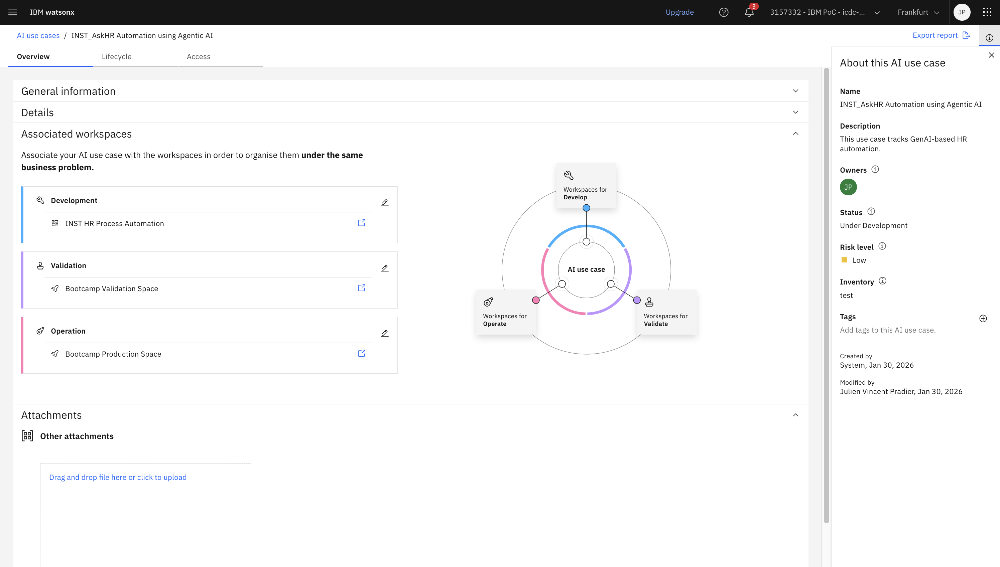

15. Now **AI Use case** is associated to **project** and **deployment space**. In **Associated Workspaces** Section Click on Arrow beside **your project** under **Development** phase:

16. In project go to **Assets** tab select **Agentic RAG testing** asset and click on three dot then select **Go to AI factsheet**:

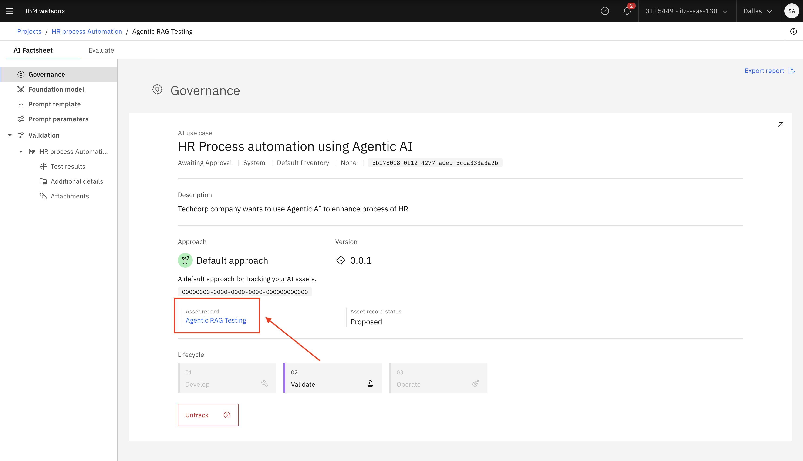    

12. Now **AI Use case** is getting tracked in **Development** phase so Click on **Track in AI Use case**:

13. Select Approach set as **Default Approach** or click on **+New Approach** for defining one path for solving the goal of the use case. Click on **Next**:

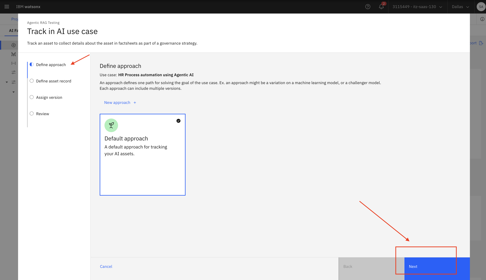

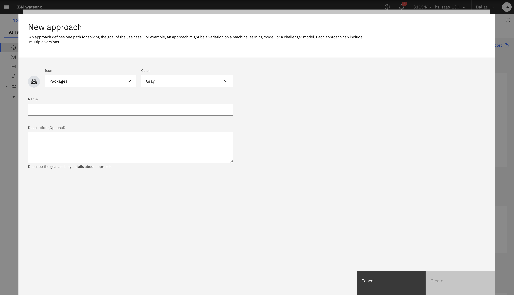

14. Associate the **asset** with an existing model record or create a new model record in OpenPages. This will sync the tracked model facts between Model inventory and OpenPages.Click on **Next**.

15. Choose the starting point for this approach(Experimental,Stable,Custom) any one of them for **version** tracking. Click on **Next**:

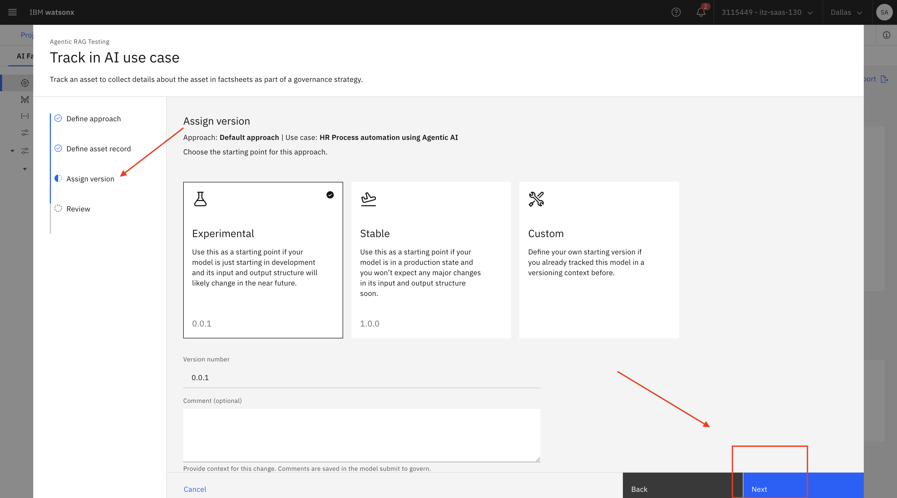

16. Review to make sure that your detached prompt template is stable before you track it in an **AI use case**. Click on **Track Asset**:

    

Finally **Agentic RAG** getting tracked in **AI Use case**. Click on **Agentic RAG Testing** under asset record to view it in **Governance Console**

 

 

17. Now go back to the [Model Developer Tasks Guide](../step3/model-developer-tasks.md) to finish the developement declaration and start the validation process.

> [!Note]
> Model Developer has developed **Agentic RAG Detached prompt template** and Also onboarded it to **AI Use case**

---

## Prerequisites

- IBM Cloud account with access to watsonx.governance
- Access to the pre-deployed Agentic RAG model
- Permissions to create and manage projects in Watsonx Studio

## Resources

- [IBM Cloud Platform](https://cloud.ibm.com/login)
- [Project Creation Steps](../../instructor/create-project.md)
- [Create API key](../../instructor/api_key_setup.md)
- [Agentic RAG Notebook - Dallas](./notebook/agentic-rag.ipynb)
- [Agentic RAG Notebook - Frankfurt](./notebook/agentic-rag-eu-de.ipynb)

---

[← Back to mode developer task on OpenPages MRG](./model-developer-tasks.md) 
[← Back to directory](../../guides-directory.md)

