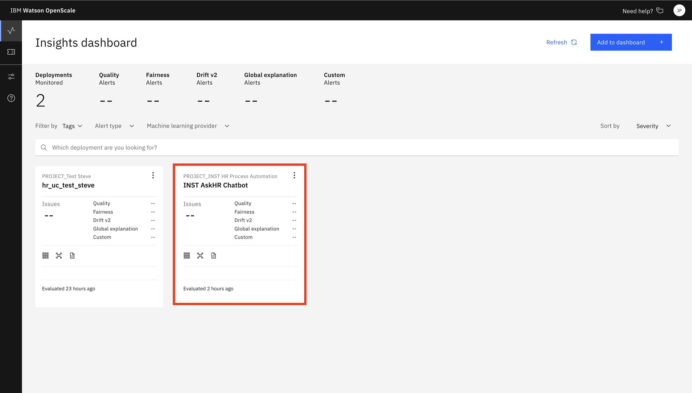
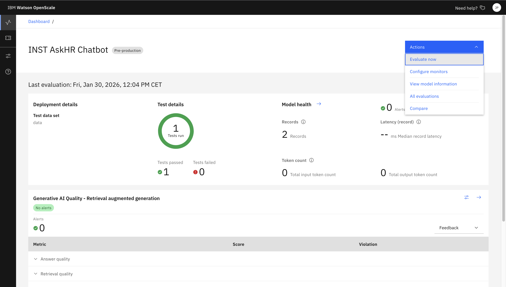
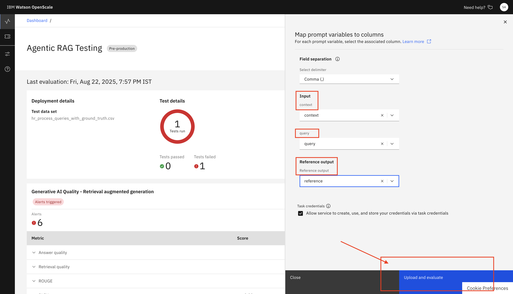
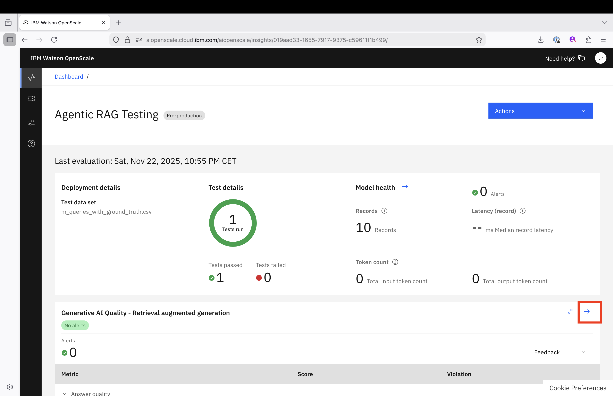

# 🧑‍🔬 Model Validator – Agentic RAG Performance & Quality Validation

> ⚠️ **Note:** Log in with the **Model Validator** role before accessing validation tools.

---

## 🔑 Accessing watsonx.governance ModelManagement Validation Tools

1. Log in to IBM Cloud.
2. From the **Hamburger Menu (☰)**, navigate to **Resource list**.
3. Type **gov** in the filter by name search bar 
4. Select **gov-xxxxxxxxxxxxx**.
   

5. Select **Launch in Watson Openscale**
   

7.  In the IBM Watson OpenScale dashboard, click on the filter at the right of **Machine learning provider** to select your project
   

  then select your detached prompt template, **Agentic RAG Testing**
  

---

## 🎯 Validation Responsibilities

As a Model Validator, your primary role is to ensure **Agentic RAG** meet performance, fairness, and quality standards, focusing on:

* **Fairness**
  Monitor and validate fairness metrics to detect bias against sensitive groups.

* **Alerts and Violations**
  Review alerts triggered by the system to investigate potential issues.

* **Quality Metrics**
  Assess overall **detached RAG prompt quality**, including precision, recall, and other key indicators.

* **Drift Detection**
  Track data, output, and prediction drift to ensure **detached RAG prompt stability** over time.

* **Global Explanation**
  Understand feature importance to validate **detached RAG prompt decision rationale**.

* **detached RAG prompt Performance Evaluation**
  Upload test datasets to evaluate **prompt outputs** against ground truth.

---

## 🔍 Validation Areas

### Fairness Validation

* Evaluate alerts related to fairness metrics (e.g., Disparate Impact, Statistical Parity Difference).
* Check alerts for sensitive groups (e.g., gender-based fairness).
* Investigate any violations flagged.

### Quality and Alerts

* Review alerts on quality metrics such as Precision, Recall, Accuracy, F1-Measure.
* Identify and address violations affecting **detached RAG prompt performance**.

### Drift Monitoring

* Observe drift alerts indicating changes in input data or **detached RAG prompt outputs**.
* Take action if drift impacts reliability.

### Generative AI Quality – Retrieval Augmented Generation (RAG)

* Assess alerts on answer quality and retrieval accuracy.
* Monitor content analysis metrics and data safety concerns.
* Investigate alerts indicating quality or safety issues in generated responses.
  
## Perform the technical assessment of the model

For this assessment, you will need to access IBM Watson OpenScale Dashboard.

Follow the link depending on your region:
- Dallas: [https://aiopenscale.cloud.ibm.com/](https://aiopenscale.cloud.ibm.com/)
- Frankfurt: [https://eu-de.aiopenscale.cloud.ibm.com](https://eu-de.aiopenscale.cloud.ibm.com/)

Locate your project and click on it:

### Detached RAG prompt Performance Evaluation Using Test Data

At this stage, you should have the latest evaluation from development with only 2 records.
You are going to perform a more complete evaluation using a larger test dataset (10 records)

1. In the OpenScale dashboard, click **Actions** > **Evaluate Now**.

   

2. Upload this [dataset](./assets/hr_queries_with_ground_truth.csv) that includes input features and expected output (ground truth).

   * Including **Agentic RAG sample outputs**.
   * File constraints: Max size 8 MB, min 10 records, max 1000 records.

  
 

3. Map all required fields from your uploaded csv.Click **Upload and Evaluate**.

.  

4. Wait for evaluation to complete and review the results for accuracy and other metrics.

   
 

---

## ✅ Summary

Your validation work helps ensure that **Agentic RAG prompts**:

* Operate fairly without bias.
* Maintain high-quality performance.
* Adapt safely to changing data distributions.
* Generate reliable and compliant outputs.
* Meet expected performance benchmarks via test dataset evaluation.

---

## 🎉 Great Job!

By performing thorough validation, including test data evaluation, you support trustworthy, transparent, and ethical AI deployments!

---

[← Back to main guide on OpenPages MRG](./model-validator-tasks.md) 
[← Back to directory](../../guides-directory.md)

