# 📊 Incident Management in OpenPages - Use Case Owner Guide

⚠️ **Login Note:** Before starting, ensure you are logged into IBM OpenPages with the **Use Case Owner** role. This is required to manage incidents, mitigate risks, and update stakeholders.

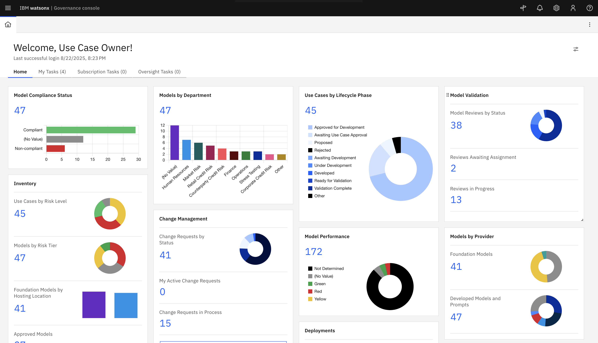

---

## 📌 What is Incident Management?
Incident Management in IBM OpenPages allows **Use Case Owners** to track, assess, mitigate, and communicate risks associated with model use cases or business processes through the management of **Issues**. It provides a structured workflow for logging issues, assigning responsibilities, and ensuring timely resolution.

---

## 🎯 Why Manage Incidents?
- Mitigate risks efficiently.
- Keep stakeholders informed.
- Maintain audit-ready documentation.
- Ensure compliance and governance of AI/ML assets.

---

### 0️⃣ When and Who Creates an Issue

Issues can be created by a variety of personas based on who is the original identifier of the issue. There are various optional routes of how to create issues, and each of these options cover the same items such as:

- **Who creates the Issue:**  
  - For seamless monitoring of AI assets, issues can be **created automatically** and assigned to the correct stakeholder when a model metric is in breach.
  - They can also be create by a **Use Case Owner**, **Risk Owner**, or other authorized personnel with access to the Use Case or model asset.  
  - In some organizations, issues may also be created by **auditors** or **compliance officers** if they identify a risk.
- **When the Issue is created:**  
  - When a **risk, incident, or non-compliance event** is identified related to a Use Case or model.  
  - Examples include:  
    - Model performance deviation  
    - Regulatory compliance breach  
    - Data quality or integrity issues  
  - The issue is logged to **track mitigation steps and notify stakeholders**.

In this lab, we will focus on a Model metric performance breach. The metric will be the **Answer Relevance** Metric.

---

## 🛠️ Step-by-Step Guide

First, you need to generate the metric value that will trigger the incident creation.
This can be done in one of the following ways:

### 1️⃣ Option 1a: Run an evaluation on a deployed model using Model Management
--> Refer to this [guide](./model-management-evals.md)

### 1️⃣ Option 1b: Publish metrics from an external Evaluations application
--> Refer to this [guide](./integrating-external-evals.md).

### 1️⃣ Option 1c: Create a metric values manually 

Navigate to the **Metrics** section of your Use Case, you should have one metric in breach:

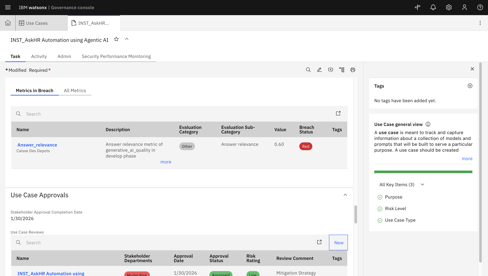

This should create an issue automatically assigned to the Use Case Owner. If the issue is not created automatically, use the following instructions to manually create your Issue.

### Optional: Creating an Issue

- From your homepage, access the hamburger menu on the top left and choose **Remediation** > **Issues**
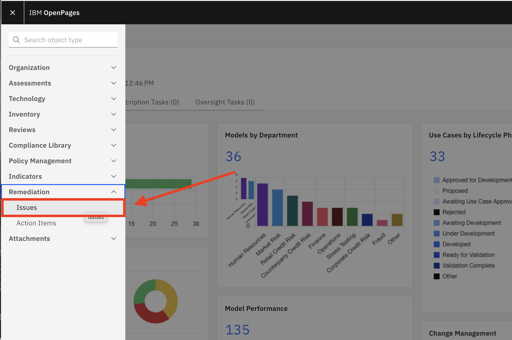

- Click on the button which says **New +**
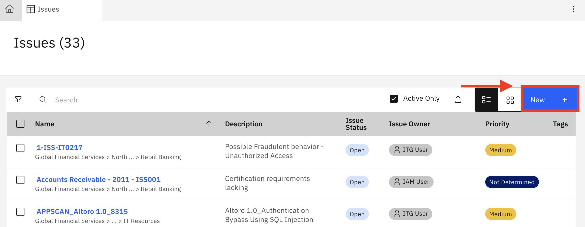

- Fill out the details of the new Issue, including:
* Issue Name - This should be uniquely identifiable
* Issue Owner - Assign yourself so that you gain the resulting tasks of the issue
* Parent Entity - Assign your parent business entity to which this issue will relate.

Once you create the issue, you can proceed to your assigned tasks to begin remediation of the issue.

### 2️⃣ Navigate to your assigned tasks

- Click on the **My Tasks** tab when logged in to IBM OpenPages as **Use Case Owner**.

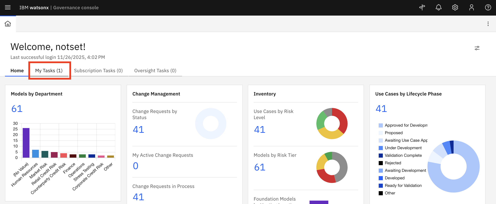

- Select an **issue** to remediate.

 
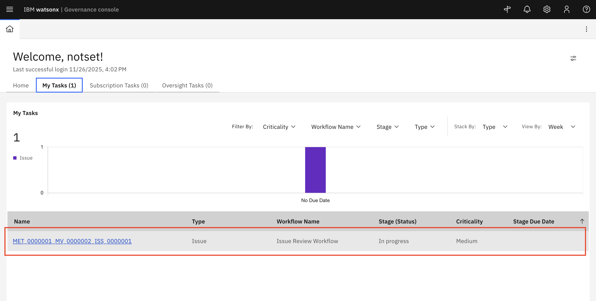

---

### 3️⃣ Assess Risk and Add Mitigation Actions
- Review the incident details.
- Determine the **Issue Type**, **Issue Status**, **Who Identified the Issue**, **Priority**

***Note***: You can view the related metric in the **Issue Context** section at the bottom of the Issue card.

  
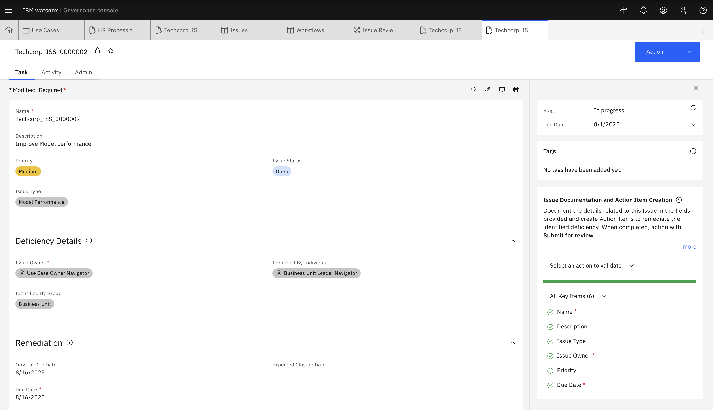

- Create Action Items to remediate the identified deficiency by clicking on **New Action Item**

  
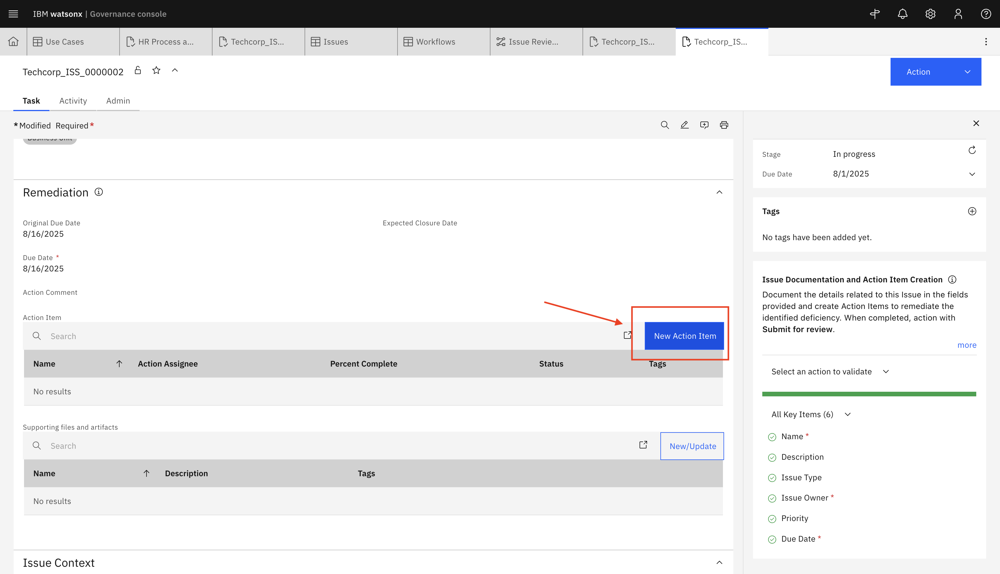

- Fill out all key details and click on **Save**

  
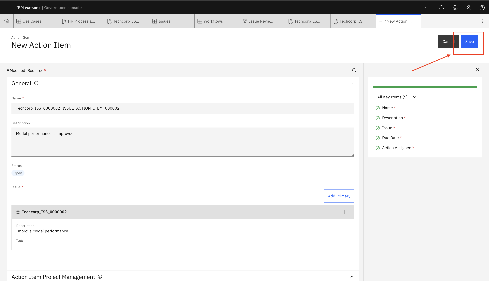

- Action has been created.

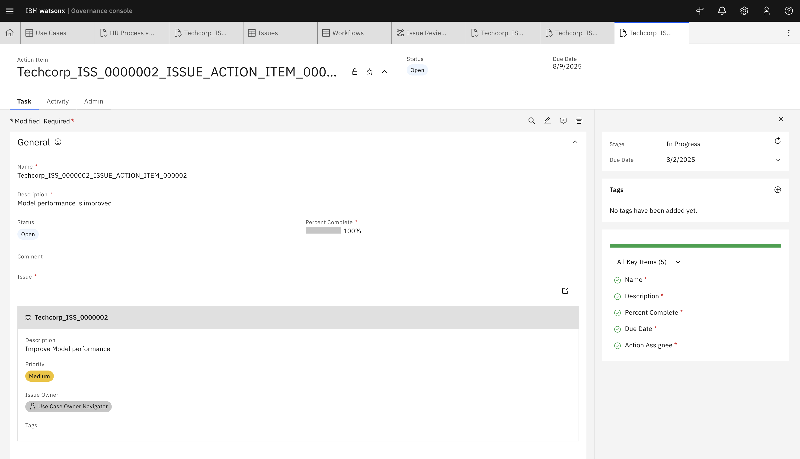

- Document the remediation steps undertaken, then clok on **Action** > **Submit for approval**

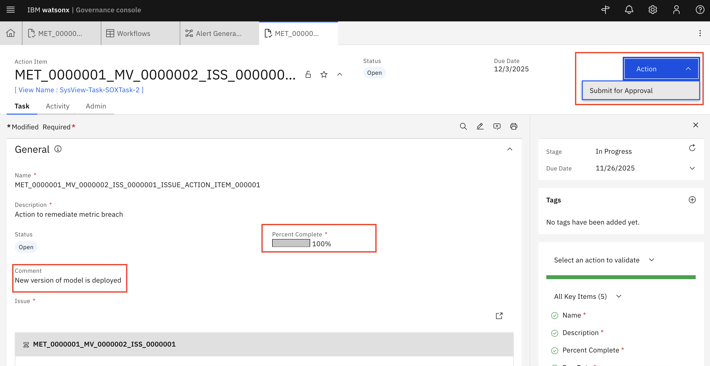

- Click on **Action** > **Approve** to approve the action item.

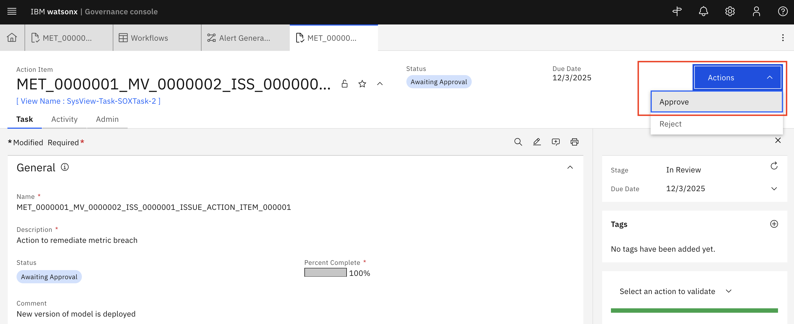
---

### 4️⃣ Submit for Review
- Navigate to the **Issue** tab:
- On the **Actions** tab, Click on **Submit for Review**

  
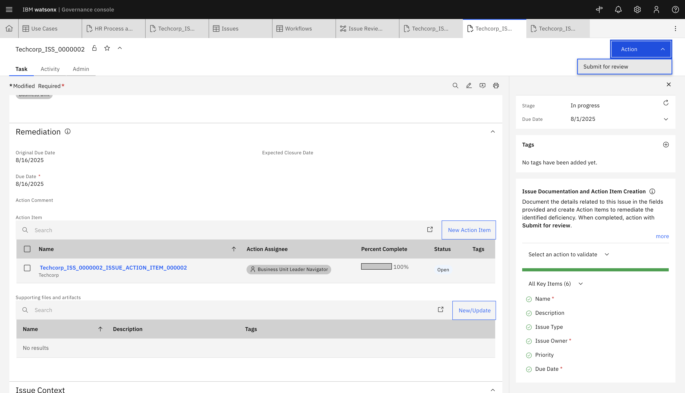

---

### 5️⃣ Close the Incident
- Go through the remaning steps of the workflow to close the incident via the **Actions** button:
  - Click on **Actions** > **Approve**, then click **Continue**
  - Click on **Actions** > **Close**, then click **Continue**
    
 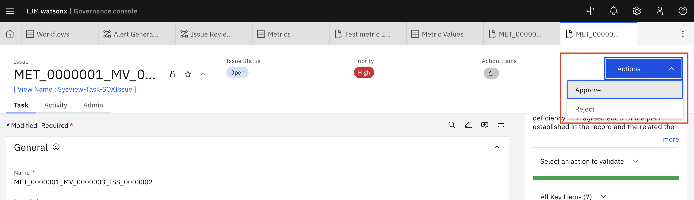

The issue is now marked as **Closed**

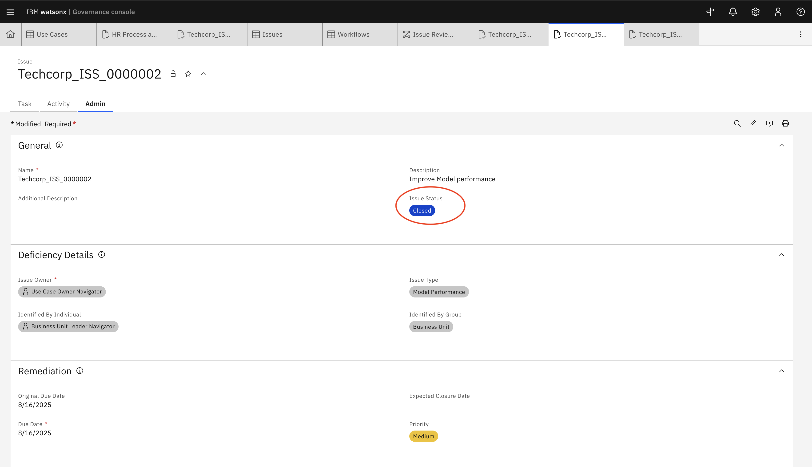

---

### ✅ Notes
- Always document each step for audit purposes.
- Use the remediation workflow to ensure accountability and traceability.
- Ensure all stakeholders are regularly updated on high-risk incidents.

---

[← Back to main guide on OpenPages MRG](../../README.md#hands-on-lab) 
[← Back to directory](../../guides-directory.md)

