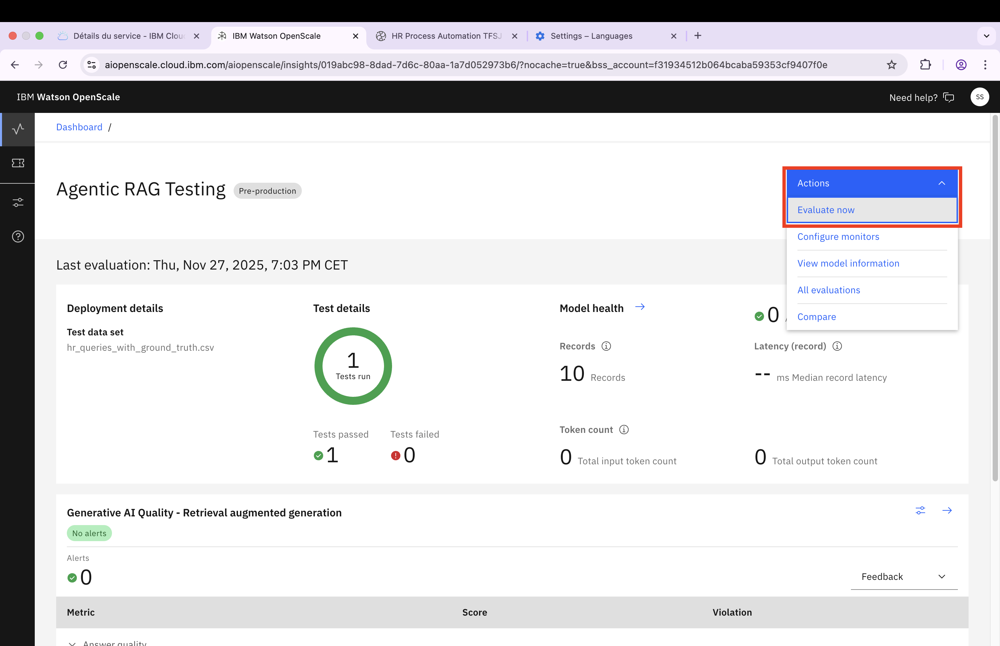
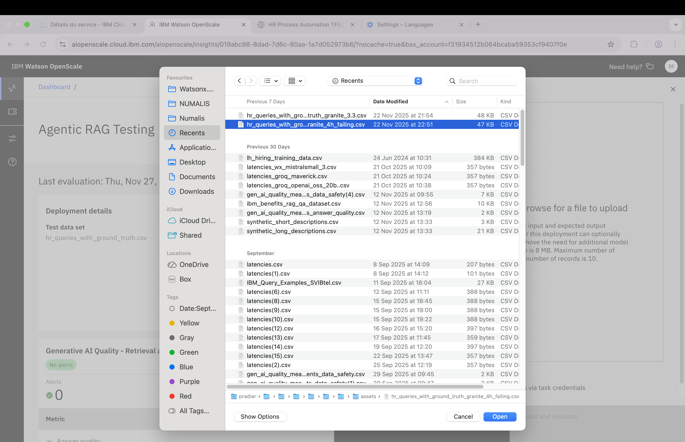
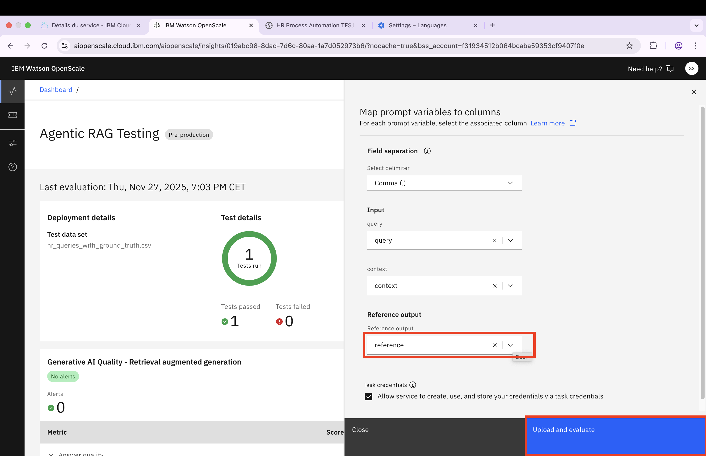
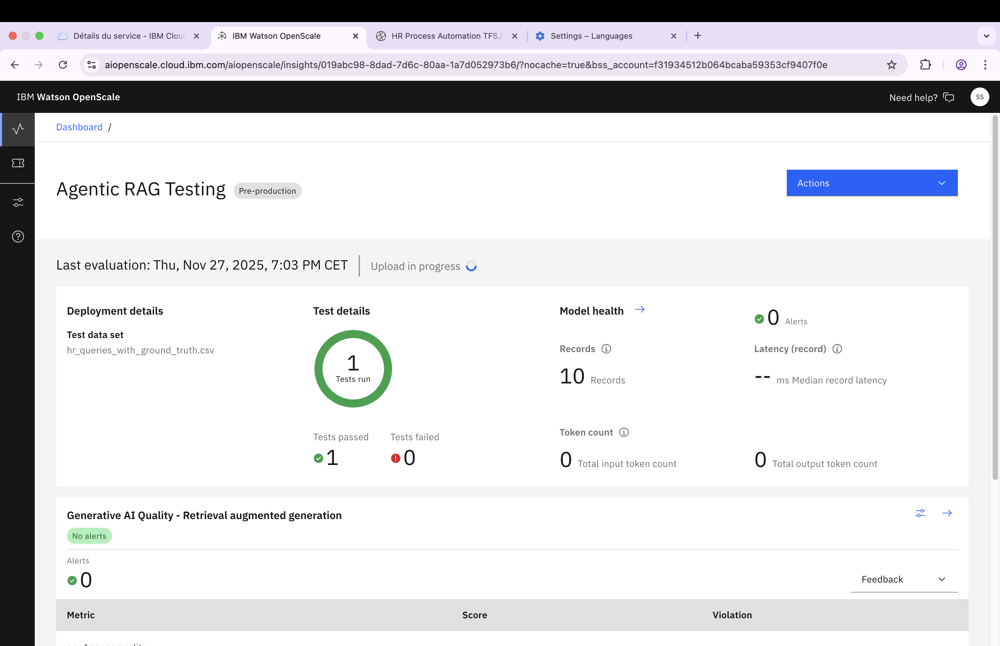
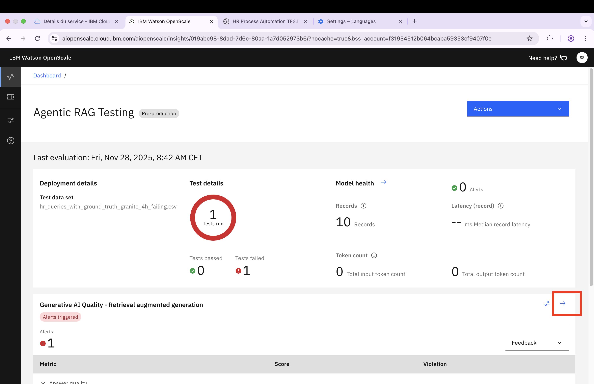
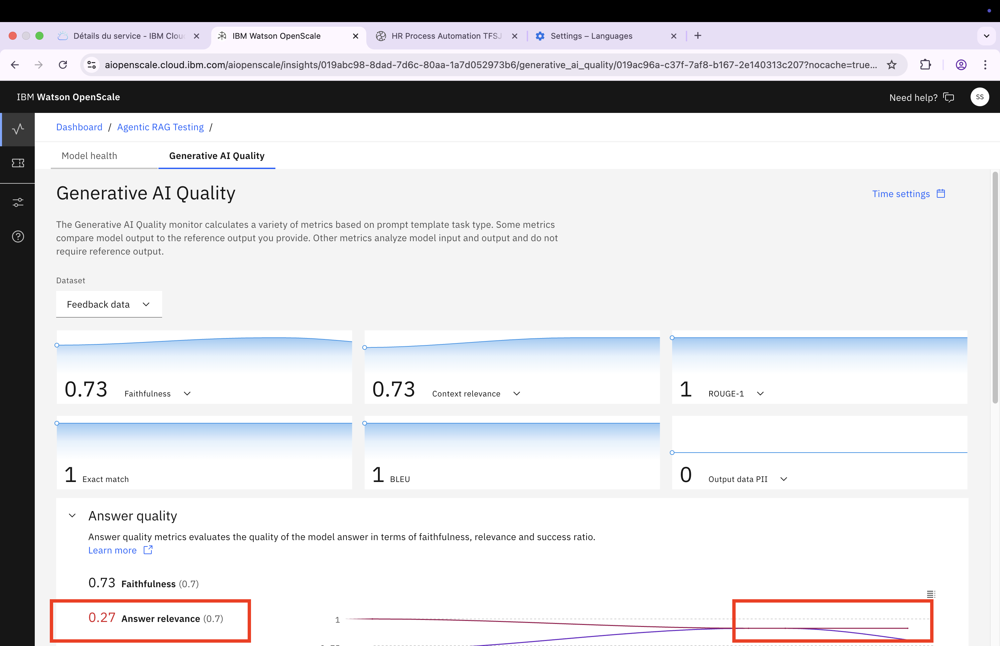
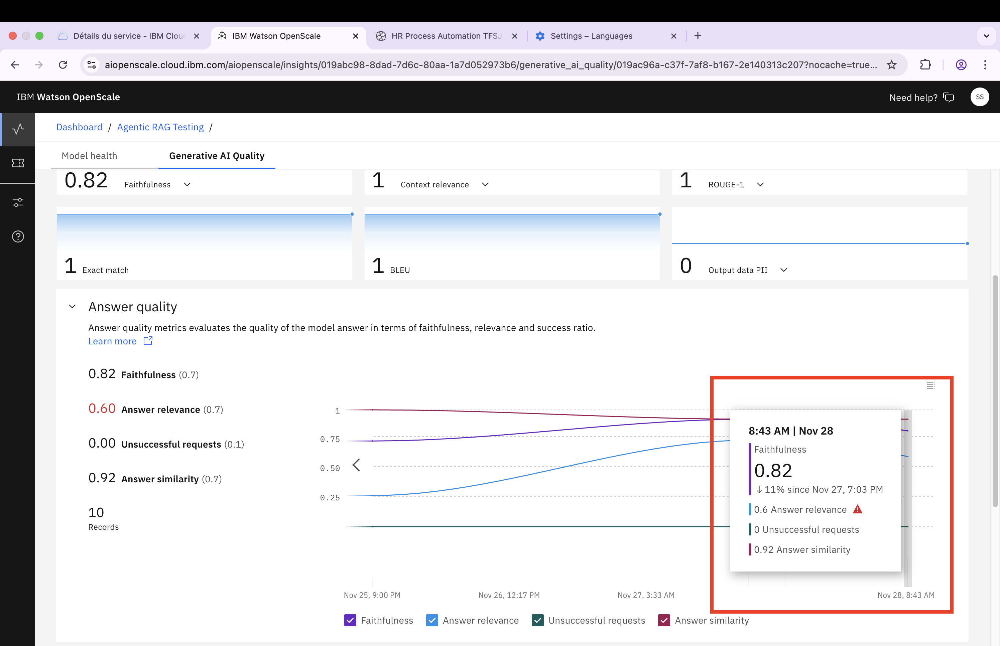
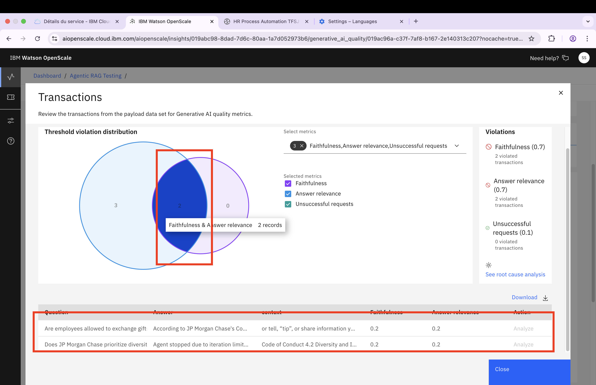
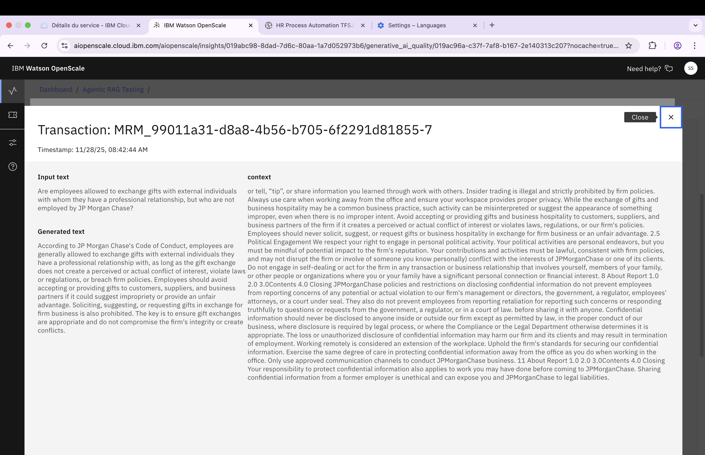

# Running Evaluations of your Production AI System using Model Management

At this stage, your AI System (in this example, a simple Chatbot) is live and users in your organization are starting to use it. This step simulates incoming traffic and demonstrates how to identify and respond to metric anomalies.

1. **Review Monitoring Data:** Go to the OpenScale console and navigate to the Test deployment. (Note: Production monitoring may have issues at this time.) Verify that monitoring data is flowing in correctly and check that all indicators are green.

 

2. **Simulate a Failure:** Simulate a chatbot failure by clicking **Evaluate Now**. This allows you to upload a dataset with sample inferences directly to the console.

 

3. **Upload Test Dataset:** Upload the file [hr_queries_with_ground_truth_granite_4h_failing.csv](../step4/assets/hr_queries_with_ground_truth_granite_4h_failing.csv), which contains sample failing inferences from a real system.

 

4. **Set Reference Output:** Configure the **Reference Output** and click **Upload and Evaluate**.

 

5. **Wait for Metric Computation:** Allow a few minutes for OpenScale (Model Management) to compute all metrics for the 10 uploaded inferences.

 

6. **Investigate Issues:** Once processing is complete, an issue indicator should appear. Click the arrow on the Generative AI Metric Group to investigate.

 

7. **Review Metric Details:** The issue is with the **Answer Relevancy** metric, which is below the threshold.

 

8. **Examine Evaluation Results:** Hover over the graph at the last evaluation point to view more details, then click on it to access the full evaluation data.

 

9. **Identify Problematic Transactions:** Access the 10 transactions from the failing evaluation. Click on the 2 problematic transactions to view their details.

 

10. **Analyze Root Cause:** Click on one of the problematic transactions to analyze the Answer Relevancy issue in detail.

 

## Next Steps: Incident Management

Congratulations! You have successfully:
- ✓ Analyzed a detected issue
- ✓ Drilled down to the transaction level to identify root causes

**Important Note:** While you can perform this analysis, your primary role as an AI System Deployer is to set up and maintain monitoring. Once monitoring is operational, alerts like the one above are automatically surfaced as Issues in the Governance Console, and the GRC team is notified.

### Expected GRC Team Actions

Depending on the severity and nature of the issue, the GRC team may request that you:
- Remove the AI System from production
- Deploy a newer version of the AI System
- Implement additional safeguards

**Key Takeaway:** You do not need to monitor the Model Management dashboard continuously. The system alerts you when action is required.

[← Back to main guide on OpenPages MRG](./mitigating-incidents.md) 
[← Back to directory](../../guides-directory.md)
